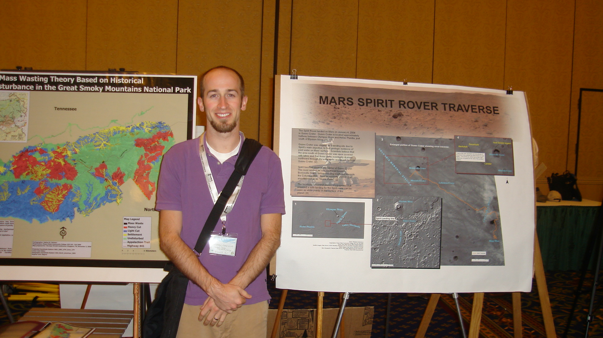

{fig-alt="Michael Camponovo standing beside his Mars SPIRIT Rover traverse poster at a regional GIS conference in Kingsport, Tennessee, in 2008." width="420"}

## About This Portfolio

This site is a reconstructed portfolio of GIS, cartography, research, volunteer, and professional-service work from my time as a student and early-career GIS professional.

It includes projects completed while earning a GIS certificate at Roane State Community College, pursuing graduate study at the University of New Mexico, volunteering with community and professional organizations, and beginning my career in applied geospatial work.

The portfolio is not intended to present every project as polished by current professional standards. Its purpose is to show how skills, judgment, confidence, and professional awareness developed over time.

Some of the work is technically strong. Some of it is rough. Some projects are incomplete because only part of the original material survived. Together, however, they show a much more realistic learning process than a collection containing only finished professional work.

## Why I Built It

I created this portfolio primarily as an example for students in **GEOG 499**, the capstone course for the Geographic Information Science and Technology program at the University of Tennessee Knoxville.

Students are often asked to build a portfolio near the end of a degree program, but many have never seen a realistic example of what one can contain. They may assume that every project must be visually perfect, technically advanced, or completed for a major employer before it deserves to be included.

My own experience suggests otherwise.

Course projects, independent studies, conference posters, volunteer work, newsletters, presentations, and early professional assignments can all demonstrate useful skills when they are carefully documented and placed in context.

A strong portfolio does more than display final products. It explains:

- the problem being addressed;
- the audience or partner;
- the data and methods;
- the decisions made during the process;
- the result or recommendation;
- the limitations of the work;
- what the author learned;
- what the author would do differently today.

This site is intended to model that kind of reflection.

## What Is Included

The portfolio currently brings together several kinds of work.

### Roane State Community College

Projects from my GIS certificate program document the beginning of my formal geospatial education. They include cartography, suitability analysis, field and outdoor-recreation projects, natural-hazards work, and independent GIS assignments.

### University of New Mexico

Graduate coursework and research show the next stage of development, including cartographic design, web mapping, spatial analysis, research, and applied geospatial problem solving.

### Volunteer and Community GIS

Several projects were completed for schools, nonprofit organizations, and professional associations. These experiences helped me build practical skills and a professional network before I had accumulated much paid GIS experience.

### Conferences and Professional Service

Conference participation, map galleries, presentations, association service, and newsletter production helped me become part of the professional GIS community. These experiences were central to my career development and are included alongside the technical projects.

### Early-Career Applied Work

Some projects reflect my transition from student work into applied research, natural-hazards planning, outreach, and project management.

## How the Work Was Reconstructed

Most of these projects were created long before I had a consistent digital-archiving system.

The materials were recovered from:

- old hard drives;
- course folders;
- exported maps;
- PowerPoint presentations;
- PDF newsletters;
- ArcMap documents;
- conference photographs;
- reports and written assignments;
- partial project folders;
- files preserved by former employers, instructors, or collaborators.

In several cases, I imported old ArcMap documents into ArcGIS Pro so I could inspect the original layers and recover usable outputs. In other cases, only a presentation slide or low-resolution export survived.

The reconstruction process required several decisions:

- preserve the historical work rather than redesigning it to look current;
- explain missing files or incomplete documentation honestly;
- distinguish historical analysis from present-day conditions;
- identify when original data sources could no longer be verified;
- obscure or omit sensitive information;
- convert image-based explanations into accessible webpage text;
- retain enough context that a reader can understand why the work mattered.

This process also reinforced an important practical lesson: **keep copies of projects, deliverables, source files, and supporting documentation where you can reliably access them, and catalog them as you go.** Reconstructing years of work all at once is slow and uncertain. A simple archive with consistent filenames, dates, project descriptions, thumbnails, and notes about collaborators or data sources can save enormous effort later.

## What Students Should Notice

### Early Work Does Not Need to Look Like Current Professional Work

The purpose of an early portfolio is not to prove that you already had years of experience. It is to show what you were learning, how you approached problems, and how your work improved.

### Context Matters

A map or graphic by itself may reveal very little about the person who created it. Explaining the assignment, audience, constraints, and decisions makes the work much more meaningful.

### Reflection Is Part of the Evidence

Being able to identify limitations is not a weakness. It demonstrates professional judgment.

A thoughtful explanation of what you would change today can be more valuable than pretending an older project is flawless.

### Course Projects Can Demonstrate Real Skills

A classroom assignment may still show:

- data preparation;
- spatial analysis;
- cartographic design;
- research;
- technical troubleshooting;
- writing;
- presentation;
- project organization;
- decision making.

The setting does not determine whether the skill is valuable.

### Volunteer Work Counts

Volunteer projects can provide experience with real partners, real constraints, and real consequences. They can also help students learn how organizations describe problems before those problems have been translated into GIS tasks.

### Professional Participation Matters

Conferences, map galleries, student organizations, professional associations, and committee work create opportunities to learn from other people and make your own work visible.

These experiences may become as important to a career as the projects completed for a grade.

### Preservation Is a Professional Skill

A project is much easier to reuse when the files, data sources, methods, final products, permissions, and lessons learned have been documented.

Archiving work should be part of the project—not something postponed until years later.

## About Me

I began my professional life as a public-school teacher. In 2008, I left teaching and enrolled in the GIS certificate program at Roane State Community College.

That decision started a career transition that included:

- joining the Tennessee Geographic Information Council as a student;
- volunteering at GIS conferences;
- submitting student maps to professional map galleries;
- completing volunteer GIS projects;
- earning a master’s degree in geography at the University of New Mexico;
- working at the Earth Data Analysis Center;
- supporting FEMA Risk MAP and natural-hazards projects across New Mexico;
- returning to Tennessee in 2016;
- joining the University of Tennessee as a GIS outreach coordinator and instructor.

Today, I work at the intersection of GIS education, outreach, cartography, uncrewed aerial systems, community-engaged projects, and student mentoring.

My current professional portfolio documents that work. This site serves a different purpose: it preserves the earlier work that helped me become the professional and educator I am now.

## How to Use This Portfolio

Visitors can approach the site in several ways:

- explore the [featured projects](projects.qmd);
- follow the chronological story on the [Learning Path](learning-path.qmd);
- review volunteer and community-based projects;
- examine how older work has been contextualized;
- compare projects from different stages of technical development.

Students may find it useful to focus less on the appearance of any single product and more on how the project pages explain the work.

## Related Portfolio

My current professional work is documented in a separate portfolio:

[Visit my professional portfolio](https://mcampono.github.io/)

## Looking Back

Reconstructing this portfolio has reminded me how much useful evidence can be lost when projects are not preserved and documented.

It has also confirmed that professional growth is easier to see across time than within a single finished product.

The early maps, volunteer projects, graduate assignments, conference experiences, and applied work represented here were not part of a carefully planned sequence. They were responses to immediate opportunities, interests, problems, and relationships.

Together, they became a career.
