## Course Overview

**GEOG 584: Applications of Remote Sensing** built on introductory remote-sensing theory through digital image processing, image classification, and interpretation of non-visible electromagnetic radiation.

The course used **ERDAS Imagine** and **IDRISI Selva** and covered:

- image display and enhancement;
- radiometric and geometric correction;
- ground-control points and image registration;
- spatial filtering and texture;
- spectral signatures;
- supervised and unsupervised classification;
- post-classification processing;
- accuracy and error;
- multitemporal analysis;
- thermal, hyperspectral, and radar remote sensing.

Most labs were completed as a three-person team with **Sam Thompson**, **Tommy Thompson**, and me. The final project was completed individually.

## Image Display and Contrast

The first lab focused on image histograms, autoscaling, digital-number ranges, and the relationship between stored pixel values and display values.

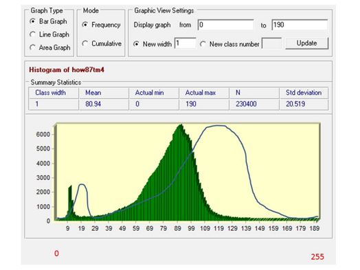{.lightbox group="remote-sensing" fig-alt="Histogram of a remote-sensing image with black, medium gray, and white display positions marked along the output palette range."}

The exercise showed that an image may contain a wide range of digital numbers without using the full display palette effectively. It also emphasized that adding isolated minimum and maximum values does not necessarily improve the contrast of the remaining pixels.

## Geometric Correction and Image Registration

Lab 3 focused on registering an unreferenced UAV image to a georeferenced reference image.

The workflow included:

- comparing image coordinates with projected coordinates;
- selecting ground-control points;
- evaluating RMS error;
- considering the spatial distribution of control points;
- visually checking registration;
- creating a red-and-cyan layer stack to reveal misalignment.

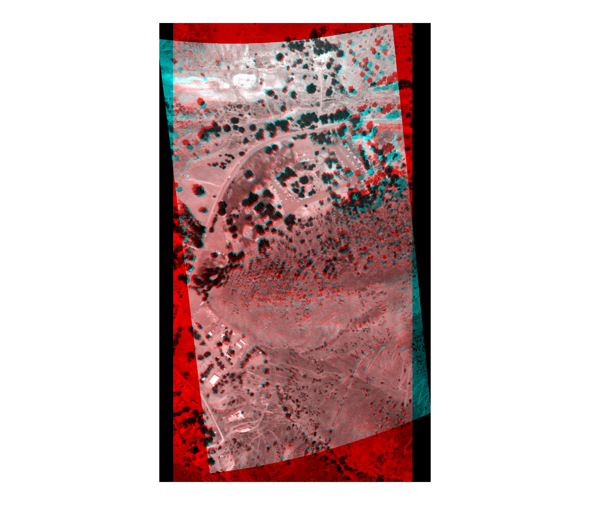{.lightbox group="remote-sensing" fig-alt="Layer-stack comparison of a UAV image and a georeferenced image, with red and cyan offsets showing misregistration and gray areas showing close alignment."}

Gray areas indicate close alignment. Red and cyan areas show displacement between the two images. The comparison also demonstrated that RMS error should be interpreted alongside visual alignment across the entire image.

## Spatial Filtering and Texture

Lab 4 examined how convolution filters change image appearance and information content.

### Edge Enhancement

A 3 × 3 edge-enhancement filter sharpened boundaries while retaining much of the original image.

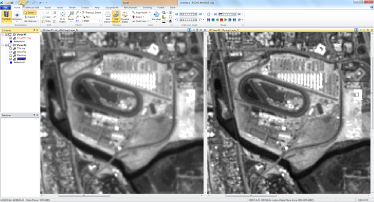{.lightbox group="remote-sensing" fig-alt="Side-by-side remote-sensing images comparing an original grayscale image with a sharpened edge-enhancement result."}

### Edge Detection and High-Pass Filtering

Edge-detection and high-pass filters emphasized abrupt local changes while suppressing much of the original grayscale information.

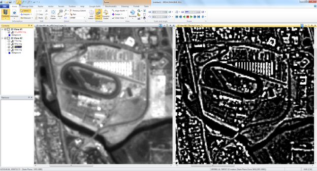{.lightbox group="remote-sensing" fig-alt="Remote-sensing image comparisons showing edge-detection and high-pass results that emphasize boundaries and local contrast."}

### Low-Pass Filtering

A 7 × 7 low-pass filter smoothed the image and reduced fine detail.

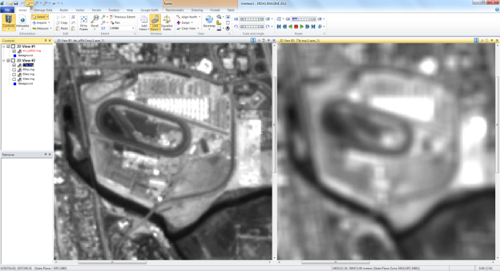{.lightbox group="remote-sensing" fig-alt="Side-by-side comparison of an original image and a heavily smoothed low-pass filtered version."}

### Directional Filters

Horizontal and vertical Sobel filters isolated edges with different orientations.

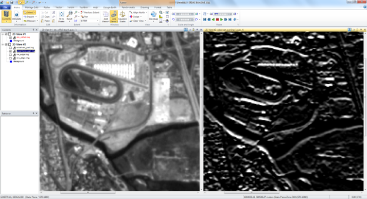{.lightbox group="remote-sensing" fig-alt="Comparisons showing how horizontal and vertical Sobel filters isolate edges aligned in different directions."}

These filters could support tasks such as sharpening image detail, detecting roads and buildings, emphasizing linear features, smoothing noise, and examining texture.

## Supervised Classification

Lab 5 introduced supervised land-cover classification using training signatures for:

- herbaceous vegetation;
- chaparral;
- conifer;
- hardwood.

The lab examined spectral profiles, training areas, class histograms, feature-space plots, image alarms, distance images, and iterative refinement.

### Feature-Space Analysis

Feature-space plots showed how training signatures overlapped under different band combinations.

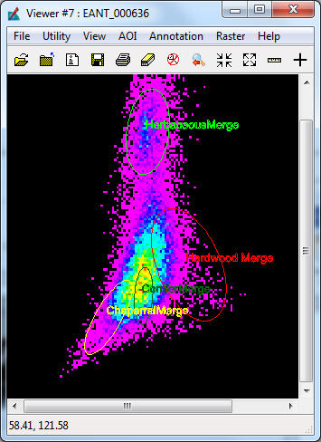{.lightbox group="remote-sensing" fig-alt="ERDAS Imagine feature-space plot showing overlapping spectral signatures for hardwood, conifer, herbaceous vegetation, and chaparral."}

The plots demonstrated that class separability depends on the selected bands and that visually distinct land-cover classes may still overlap spectrally.

The team also concluded that a single pixel was not enough to represent a class because it might be atypical or fail to capture within-class variability.

## Unsupervised Classification

Lab 6 compared unsupervised spectral clusters with a reference vegetation map.

The workflow included:

- generating clusters;
- comparing clustering approaches;
- cross-tabulating raster results;
- assigning labels;
- comparing supervised and unsupervised classes;
- evaluating agreement and disagreement.

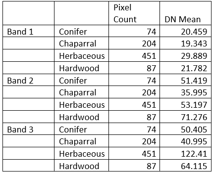{.lightbox group="remote-sensing" fig-alt="Cross-tabulation table comparing unsupervised raster clusters with reference vegetation classes."}

The results showed that a single vegetation class could correspond to several spectral clusters and that spectral clusters did not automatically translate into meaningful ecological categories.

## Post-Classification Processing

Lab 7 focused on cleaning classification outputs with:

- 3 × 3 and 5 × 5 majority filters;
- clumping;
- sieving;
- reclassification;
- removal of small isolated pixel groups.

A larger majority kernel produced more generalized and contiguous regions, while smaller kernels retained more local detail.

The exercise also compared supervised and unsupervised estimates of a meadow-related class. The two methods differed by approximately 404 square meters.

The team identified several practical consequences of classification error:

- preserving the wrong habitat;
- overlooking actual habitat;
- wasting time, money, and equipment;
- compounding error in later analyses.

## Independent Final Project

## Comparing Asserted and Authoritative Haiti Earthquake Data

The individual final project was titled:

> *A Comparison of Asserted and Authoritative Data for the Haiti Earthquake of January 2010*

The project assessed data describing internally displaced persons camps in Port-au-Prince after the January 2010 earthquake.

It compared volunteered Ushahidi data with remotely sensed imagery and maps produced by international relief and mapping organizations.

The research focused on three components of geospatial data quality:

- completeness;
- positional accuracy;
- temporal accuracy.

## Data Sources

### Volunteered Geographic Information

The original Ushahidi dataset contained approximately 4,600 records. For this project, I selected records from the first two weeks after the earthquake and retained 185 records categorized as internally displaced persons camps.

### Remote-Sensing Data

| Source | Spatial resolution | Date | Spectral characteristics |
|---|---:|---|---|
| QuickBird | 0.64 m | September 22, 2009 | Panchromatic |
| GeoEye-1 | 0.5 m | January 13, 2010 | True-color RGB |
| World Bank aerial orthophoto | 0.3 m | January 15–28, 2010 | True-color RGB |

The pre-event QuickBird image helped distinguish post-earthquake camps from rubble, existing clearings, and development.

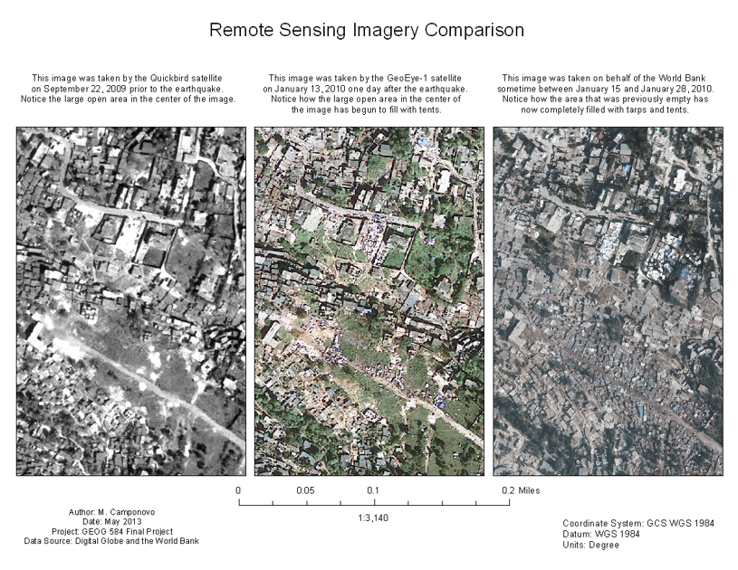{.lightbox group="remote-sensing" fig-alt="Three-panel comparison of pre-earthquake QuickBird imagery, post-earthquake GeoEye imagery, and post-earthquake aerial orthophotography in Port-au-Prince."}

### Authoritative Maps

The project also used four georeferenced maps:

- Pacific Disaster Center;
- UNOSAT Port-au-Prince;
- UNOSAT overview;
- UN Cartographic Section.

## Sampling Design

A 500 × 500 meter fishnet was created over the Port-au-Prince study area.

Thirteen cells were randomly selected. Each cell had to:

- fall completely within the study area;
- avoid water;
- be primarily urban.

The selected cells covered approximately 13.37% of the full study area and 15.16% of its urban portion.

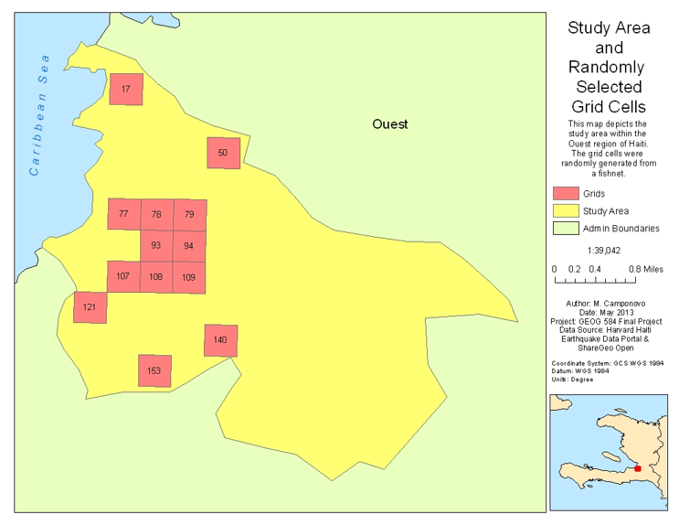{.lightbox group="remote-sensing" fig-alt="Map of the Port-au-Prince study area showing thirteen randomly selected 500 by 500 meter grid cells."}

## Data Extraction and Comparison

The workflow included:

1. digitizing IDP camp points from each GeoPDF;
2. joining the points to the selected grid cells;
3. digitizing visible camp polygons from GeoEye imagery;
4. digitizing visible camp polygons from the orthophoto;
5. comparing post-event imagery with pre-event QuickBird imagery;
6. comparing point and polygon counts by grid cell;
7. calculating distance from each polygon to its nearest mapped point;
8. comparing when each source became available.

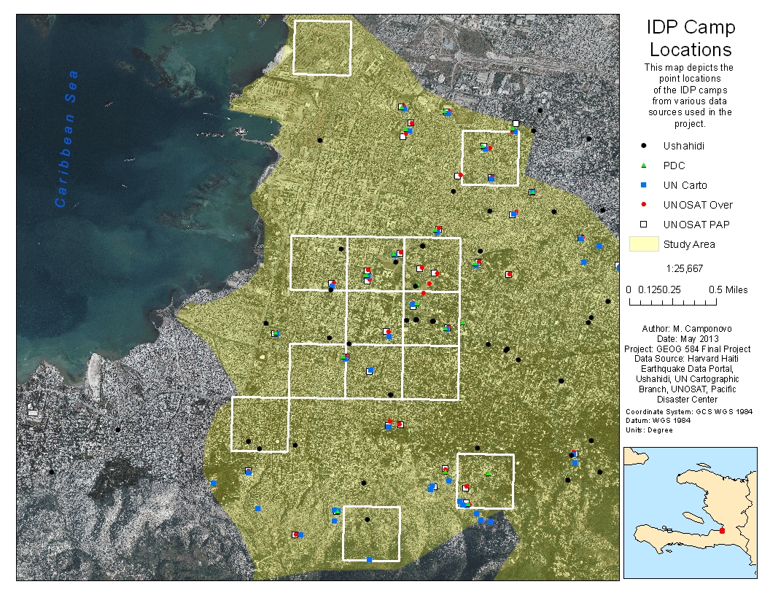{.lightbox group="remote-sensing" fig-alt="Map showing internally displaced persons camp points from Ushahidi and several authoritative map sources within selected Port-au-Prince grid cells."}

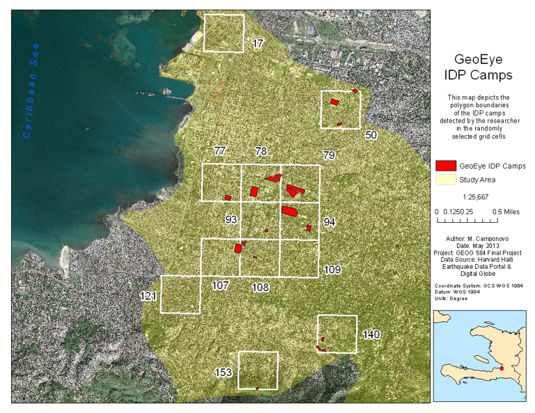{.lightbox group="remote-sensing" fig-alt="Map showing internally displaced persons camp polygons interpreted from GeoEye satellite imagery."}

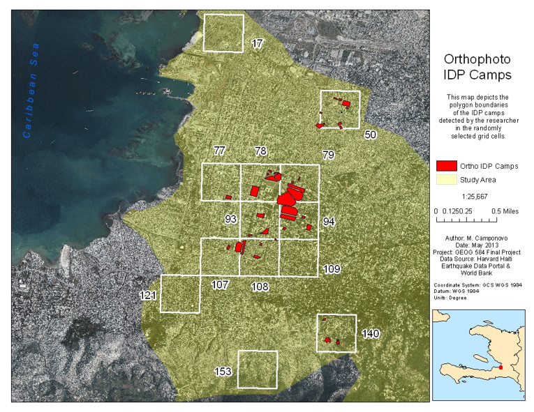{.lightbox group="remote-sensing" fig-alt="Map showing internally displaced persons camp polygons interpreted from post-earthquake aerial orthophotography."}

## Completeness

No dataset could be treated as a definitive inventory of all IDP camps.

The Ushahidi dataset contained approximately the same number of camp points in the full study area as several UN-derived maps and more points within the selected grid cells. However, its longer time span meant that higher counts were expected.

The orthophoto interpretation produced more camp polygons than the GeoEye interpretation, but the orthophoto represented imagery collected later and over a longer period.

## Positional Accuracy

Because the camps lacked unique identifiers, individual points could not be matched confidently with individual polygons.

Distance to the nearest interpreted camp polygon was therefore used as a proxy.

Very few Ushahidi points fell inside or within 20 meters of an interpreted camp polygon. The authoritative map points were generally closer, which was expected because those maps were derived from the same or similar imagery.

Even so, some authoritative points were more than 100 meters from the nearest interpreted camp polygon, suggesting disagreement among trained analysts and organizations.

## Temporal Accuracy

Ushahidi was the fastest source to begin reporting IDP camp information and the only source that appeared to be updated continuously through the study period.

Each Ushahidi record included a timestamp. Some authoritative products were published later, and one UN Cartographic map lacked a publication date.

This created an operational tradeoff between data of uncertain quality available immediately and data of assumed quality available later.

## Limitations

The project was exploratory rather than definitive.

Important limitations included:

- no statistical significance testing;
- a relatively small sampled area;
- urban sampling only;
- incomplete knowledge of orthophoto acquisition dates;
- uncertainty about what constituted an IDP camp;
- no gold-standard dataset;
- possible disagreement among analysts;
- additional available datasets that were not included.

## What I Learned

The course reinforced that:

- image display is distinct from stored pixel values;
- geometric correction depends on both GCP quality and distribution;
- RMS error must be interpreted alongside visual alignment;
- filters emphasize different kinds of image information;
- spectral classes and meaningful land-cover classes are not always the same;
- training data must represent within-class variation;
- supervised classification depends heavily on analyst decisions;
- unsupervised classification still requires interpretation;
- post-classification processing can improve appearance while removing detail;
- classification error has real management consequences;
- remote sensing can provide rapid information after disasters;
- authoritative data can also contain uncertainty;
- timeliness, completeness, and positional accuracy may conflict.

## Looking Back

This course combined technical image processing with questions about evidence, interpretation, and uncertainty.

The team labs moved from image display through correction, filtering, classification, and post-processing. The final project then applied those ideas to a disaster-response problem where no source could be assumed to be perfectly correct.

A modern version would likely use ArcGIS Pro, current ERDAS Imagine tools, Python or R notebooks, cloud platforms, machine-learning classification, object-based image analysis, and reproducible accuracy assessment.

The most important lesson remains that remote sensing is not simply extracting information from imagery. It is a process of selecting methods, interpreting uncertainty, validating results, and understanding how data quality affects decisions.
