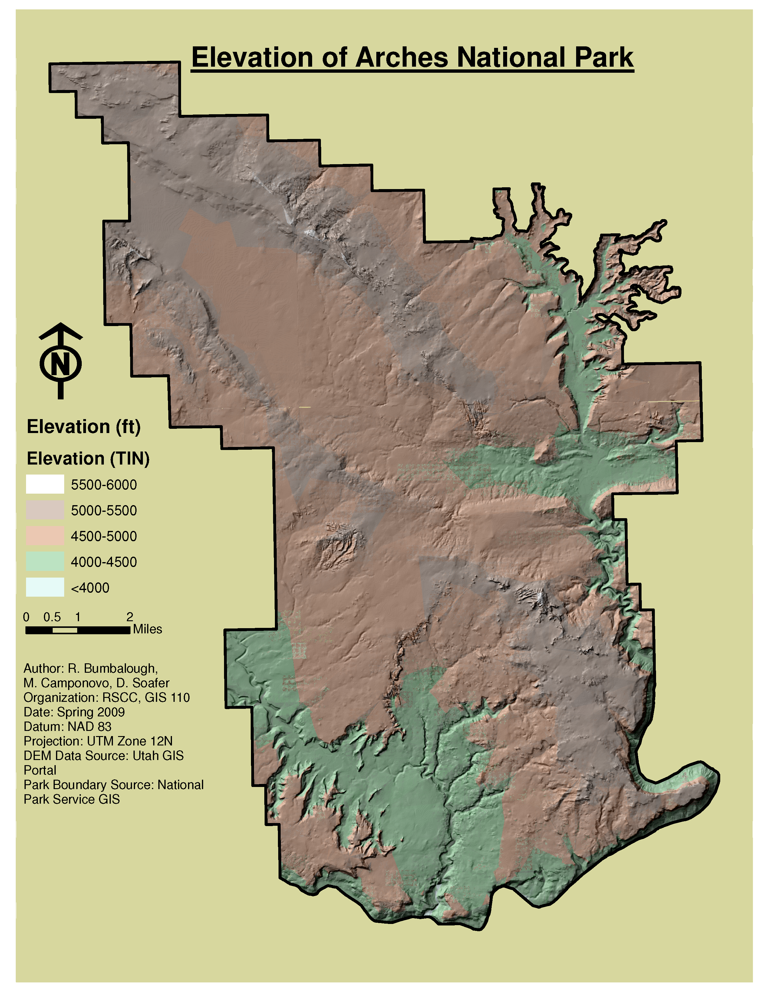
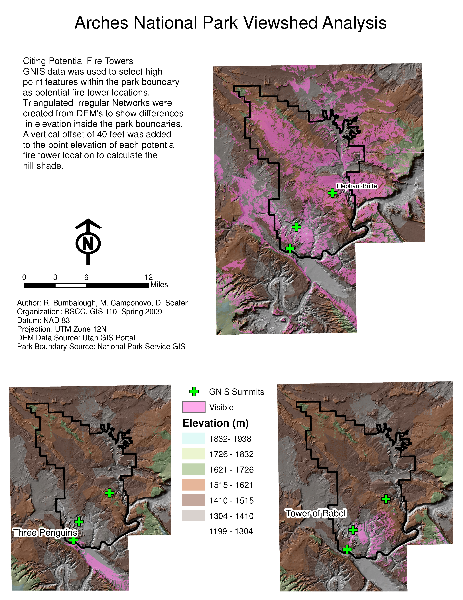
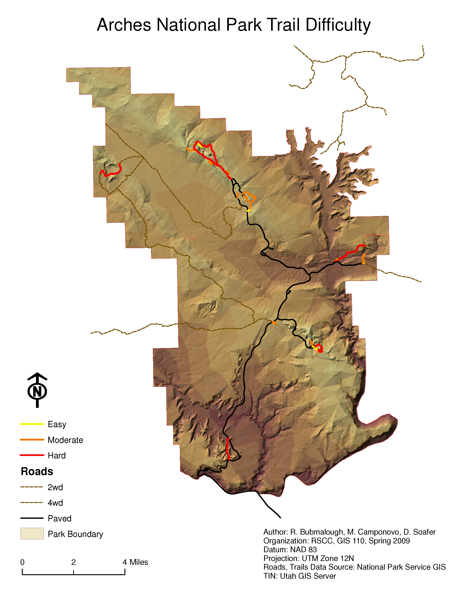
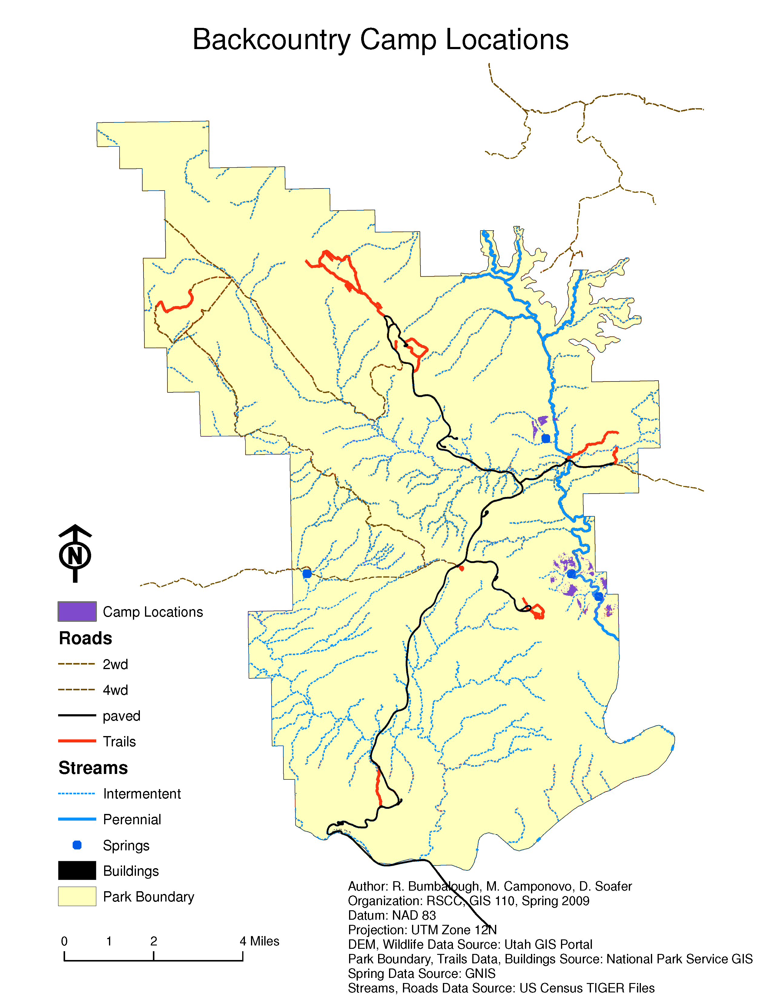
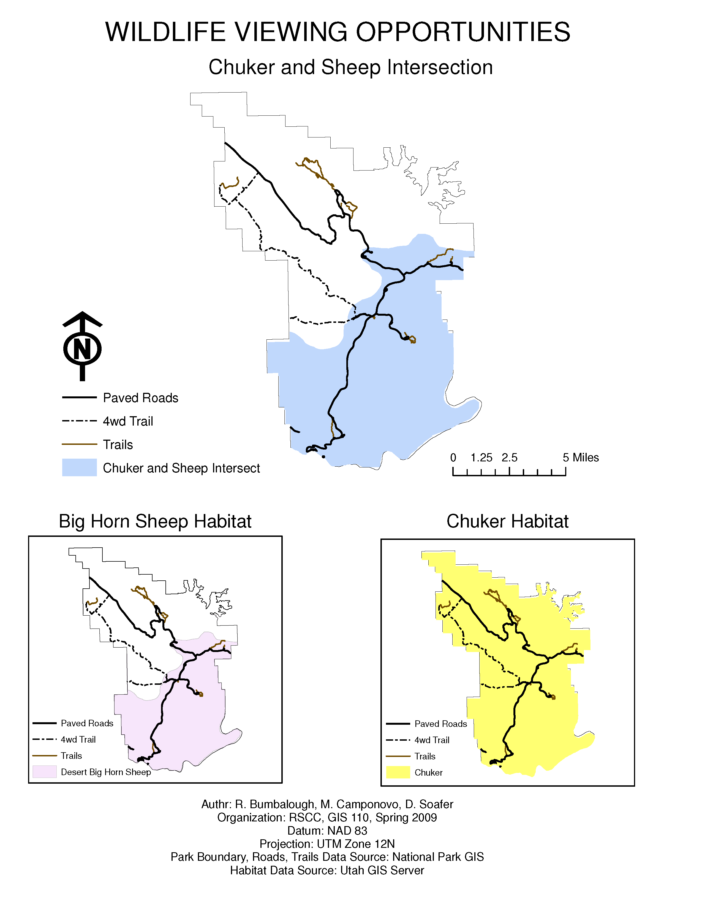
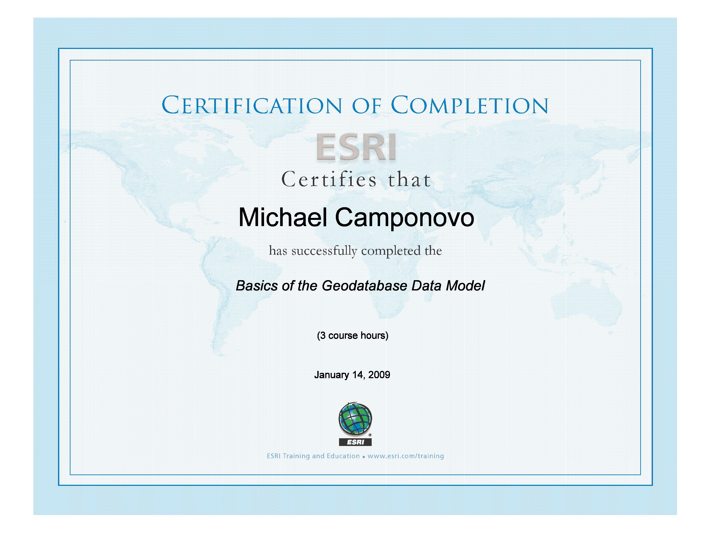

## Project Overview

This group project was completed for **GIS 110: Geodatabase** at Roane State Community College during spring 2009.

The project combined geodatabase preparation, resource-management analysis, cartography, raster modeling, vector analysis, demographic assessment, and 3D visualization to evaluate whether land within or adjacent to **Arches National Park** should be considered for wilderness designation.

The original assignment instructions have not survived. The purpose and workflow described here were reconstructed from the group report, a 91-slide presentation, project notes, maps, animations, and training records.

The project was completed by:

- R. Bumbalough;
- M. Camponovo;
- D. Soafer.

The final recommendation was that neither the existing park nor adjacent land was a strong candidate for wilderness designation because of roads, trails, heavy visitation, surrounding infrastructure, terrain, access limitations, and conflicts with established recreation.

## Reconstructing the Assignment

Though the original project prompt is no longer available, the surviving report and presentation make several things clear:

- the class focused on geodatabases and data management;
- the team selected Arches National Park as the study area;
- the work required locating, converting, documenting, and organizing GIS data;
- the group completed several environmental, recreation, infrastructure, and demographic analyses;
- the analyses were used to support a final wilderness-management recommendation.

The group selected Arches National Park because each member had visited the park and because GIS data were available through the National Park Service and the Utah GIS clearinghouse.

## Building and Managing the Data

Data preparation was a major part of the project.

The group collected data from sources including:

- the National Park Service GIS data server;
- the Utah GIS clearinghouse;
- the U.S. Census Bureau;
- Esri TIGER data;
- the Geographic Names Information System;
- the Federal Communications Commission;
- GIS Data Depot;
- other web-based GIS resources.

The team identified the appropriate 1:24,000 quadrangles, downloaded park and county data, reviewed metadata, checked coordinate systems, and organized the material into a usable project structure.

### Converting Legacy GIS Formats

Some National Park Service data were stored as ArcInfo interchange files with the `.e00` extension.

Because the group did not have access to ArcEditor or ArcInfo, the files were converted using:

- Esri Import 71;
- `ogr2ogr` through FWTools;
- instructions from Free Geography Tools.

This allowed the data to be used in ArcView and ArcMap.

### Metadata and Coordinate Systems

The project data used several coordinate systems, including:

- NAD 83;
- NAD 27;
- GCS Clarke 1866.

The team checked projections and metadata in ArcCatalog, imported XML metadata where necessary, and used **Define Projection** when coordinate-system information was missing.

The working notes document difficulties converting some coverage data because of software-license limitations. That problem became part of the project’s data-management learning process.

### Creating New Data

The team also created point data from tabular sources.

For example, FCC antenna records were collected in Microsoft Excel and converted from latitude and longitude into XY point data for possible viewshed analysis.

## Water and Terrain Assessment

### Hydrology

Hydrography data were downloaded from the National Park Service and converted from `.e00` format into shapefiles.

The team compared two sources:

- county hydrography, which contained stream names but less spatial detail;
- National Park Service hydrography, which contained more detailed geometry but lacked names.

To combine the strengths of both sources, the county stream labels were converted to annotation and then edited to align with the more detailed park hydrography.

The resulting maps distinguished perennial and intermittent streams and washes.

The assessment concluded that most mapped channels were dry washes or carried seasonal runoff after heavy rain or snowmelt. The Colorado River formed part of the park boundary but was not readily accessible from inside the park.

### DEM Preparation

Nine digital elevation model tiles were used to represent the park and surrounding area.

The workflow included:

1. identifying quadrangles intersecting the park;
2. downloading DEM files;
3. converting the source data;
4. mosaicking the DEMs;
5. clipping the mosaic to the park boundary;
6. creating hillshade, slope, aspect, and elevation derivatives.

The elevation raster was reclassified into 500-foot categories. Cell counts were converted into square meters and then acres, and the results were exported to Excel for charting.

{.lightbox group="arches-project" fig-alt="Map showing reclassified elevation categories within Arches National Park."}

## Fire Hazard Model

The group developed a fire-hazard model using four variables:

- slope;
- elevation;
- aspect;
- vegetation flammability.

The model parameters were informed by online research and an Oregon Forest Service fire-hazard approach.

### Slope

Slope was reclassified into three categories:

- 0–25%;
- 26–40%;
- greater than 40%.

### Elevation

Elevation was reclassified as:

- below 3,500 feet;
- 3,500–5,000 feet;
- above 5,000 feet.

### Aspect

Aspect was grouped into:

- flat;
- north, northwest, and northeast;
- east and west;
- south, southwest, and southeast.

### Vegetation

County vegetation data were clipped to the park boundary. Vegetation classes were assigned flammability ratings and converted from polygons to raster cells.

### Combining the Variables

The four reclassified rasters were summed in Raster Calculator.

The resulting values ranged from 4 to 10 and were then classified using the Jenks method into:

- low fire risk;
- medium fire risk;
- high fire risk.

{.lightbox group="arches-project" fig-alt="Final fire-hazard map created by combining slope, elevation, aspect, and vegetation flammability."}

## Viewshed and Fire-Tower Analysis

The group used the DEM and Geographic Names Information System summit data to evaluate possible fire-tower locations.

GNIS records were imported into Excel, processed, exported as a comma-delimited file, and converted into GIS points.

The team selected summits within Utah and then limited the analysis to summits inside the park boundary. Three candidate summits were identified.

A field was added to account for:

- ground elevation;
- a 40-foot vertical offset representing the height of a possible fire tower.

Three viewsheds were created and compared.

The analysis concluded that **Elephant Butte** provided the broadest visible area and was the strongest candidate location among the three summits.

{.lightbox group="arches-project" fig-alt="Viewshed comparison for three summit locations in Arches National Park, with Elephant Butte providing the greatest coverage."}

## Trails and Recreation

### Trail Mapping

Trail data were extracted from a transportation layer that also included paved roads and four-wheel-drive routes.

Because the park was too large to display clearly on one layout, the team divided it into three mapping sections:

- northeast;
- northwest;
- southeast.

Labels were converted to annotation and edited for readability.

### Trail Density

The Spatial Analyst density tool was used to calculate the concentration of trails across the park.

### Trail Difficulty

Trail difficulty was based on three weighted factors:

| Factor | Weight |
|---|---:|
| Trail length | 0.20 |
| Average slope | 0.30 |
| Total elevation gain | 0.50 |

Trail length was calculated in ArcMap.

To estimate elevation gain, the team:

1. interpolated trail lines using 3D Analyst;
2. created elevation profiles;
3. exported profile values;
4. calculated total elevation gain in Excel;
5. divided elevation gain by trail length to estimate average slope;
6. ranked each trail by the three factors;
7. calculated a weighted final rank;
8. returned the result to ArcMap;
9. classified trails as easy, moderate, or difficult.

{.lightbox group="arches-project" fig-alt="Map classifying Arches National Park trails as easy, moderate, or difficult based on length, average slope, and elevation gain."}

## Backcountry Campsite Suitability

The group developed a simple suitability analysis for potential backcountry campsites.

A suitable location needed to:

- be near water;
- have a slope below approximately 8 degrees;
- be away from roads and buildings;
- fall within a wildlife-viewing area.

The workflow included:

- buffering perennial streams and springs;
- buffering roads and buildings;
- reclassifying slope;
- intersecting water and wildlife-viewing areas;
- excluding locations overlapping roads and buildings;
- converting the remaining candidate area into raster form;
- using Raster Calculator to identify locations meeting the slope and suitability conditions.

{.lightbox group="arches-project" fig-alt="Suitability map identifying potential backcountry campsites based on water access, low slope, distance from infrastructure, and wildlife-viewing opportunities."}

## Wildlife Habitat and Viewing

The group identified two large wildlife species with mapped habitat intersecting the park:

- chukar;
- desert bighorn sheep.

Habitat shapefiles were downloaded from the Utah GIS clearinghouse, checked, and clipped to the park boundary.

The intersect tool was used to identify areas where both habitats overlapped. That combined area was used as a wildlife-viewing zone and contributed to the campsite-suitability analysis.

The overlap occurred primarily in the lower portion of the park.

{.lightbox group="arches-project" fig-alt="Map showing overlapping chukar and desert bighorn sheep habitat used to identify wildlife-viewing opportunities."}

## Demographics and Transportation

### Population Assessment

The team used 2008 TIGER files and Census Summary File 3 data to examine Grand County population characteristics.

The workflow included:

- downloading county and block-group boundaries;
- converting Summary File 3 data using Dr. Bruce Ralston’s `SF3toTablePro`;
- joining tabular data to Census geometry;
- calculating area;
- calculating population density;
- mapping total population;
- mapping population by sex;
- mapping population by race.

These maps were included as part of the broader regional context for the park.

### Roads and Access

Road data were analyzed both inside and outside the park.

Within the park, the transportation data were separated into:

- paved roads;
- four-wheel-drive roads;
- hiking trails.

County roads were classified into primary, secondary, and local categories using CFCC codes.

The team created maps of:

- highways and roads near the park;
- nearby railroad lines;
- road density surrounding the park;
- paved-road density inside the park;
- four-wheel-drive road density;
- combined road density.

The transportation analysis became one of the main inputs to the wilderness assessment.

## Wilderness Suitability Recommendation

The group evaluated three possible options:

1. designate the entire park as wilderness;
2. designate part of the park as wilderness;
3. acquire adjacent land and designate the expansion as wilderness.

### Entire Park

The group did not recommend designating the entire park.

The reasoning included:

- the park’s relatively small size;
- more than 60 miles of paved and unpaved vehicle routes;
- a dense trail network;
- heavy annual visitation;
- established visitor access and recreation.

### Part of the Park

The group also concluded that no large section within the existing boundary was well suited for designation.

The southern section included the visitor center and main park road. The northeastern section contained major roads, paved loops, and heavily visited arches. The northwestern section contained the main road, a four-wheel-drive route, and the park campground.

### Adjacent Land

The group did not recommend expanding the park to create a new wilderness area.

Constraints included:

- Interstate 70 to the north;
- Moab to the south;
- Highway 191 and a railroad to the west;
- the Colorado River gorge;
- the need for major bridge construction to cross the gorge;
- potential conflict with established mountain-biking areas and Moab’s recreation economy.

### Final Recommendation

The final recommendation was that **Arches National Park should remain managed as a national park rather than being converted, partially designated, or expanded for wilderness designation**.

## Group Work and Project Scope

This was a large group project with many individual analyses, maps, demonstrations, and presentation components.

I participated in the project’s data preparation, analysis, documentation, presentation, and geodatabase training, but the exact division of labor cannot be reconstructed with confidence from the available materials.

## Geodatabase Training

In order to bolster my geodatabase skills, I completed three Esri Virtual Campus training related to geodatabases outside of class.

The training covered:

- the geodatabase data model;
- creating, editing, and managing geodatabases for ArcGIS Desktop;
- geodatabase subtypes and domains.

One surviving certificate documents completion of **Basics of the Geodatabase Data Model**, a three-hour Esri course completed on January 14, 2009.

{.lightbox group="arches-project" fig-alt="Esri certificate showing completion of Basics of the Geodatabase Data Model on January 14, 2009."}

## Animations and 3D Visualization

The project also included short 3D animations and flyovers.

We created three animations using ArcScene and 3D Analyst:

- a southeast-corner flyover;
- a road flyover;
- 3D views of the park.

These animations helped communicate terrain, access, and landscape constraints in ways that were difficult to show in static maps.

## What I Learned

This project required a much broader workflow than a single map assignment.

It provided experience with:

- locating data from multiple clearinghouses;
- organizing a large group data collection;
- checking metadata and coordinate systems;
- converting legacy GIS formats;
- working within software-license limitations;
- creating data from tabular coordinates;
- mosaicking and clipping elevation data;
- deriving slope, aspect, hillshade, and elevation classes;
- building raster-overlay models;
- using viewshed analysis;
- calculating trail difficulty;
- combining vector and raster suitability criteria;
- creating and editing annotation;
- using 3D Analyst;
- communicating a final management recommendation.

The project also demonstrated that data preparation often consumes as much time as the visible analysis.

## Looking Back

This was one of the largest and most ambitious projects from my GIS certificate program.

Its scope was much broader than I would recommend for a single modern portfolio page, so this reconstruction focuses on the major workflows and representative outputs rather than reproducing every map and presentation slide.

Several limitations are clear in retrospect:

- the original assignment instructions are missing;
- the individual division of labor is not fully documented;
- some analytical criteria were simplified;
- several models relied on categorical ranks rather than validated predictive relationships;
- the demographic analysis included variables that were not central to the final wilderness question;
- some data sources and software tools are now obsolete;
- the wilderness recommendation reflected the project’s assumptions and available evidence rather than a formal National Park Service planning process.

Even with those limitations, the project remains valuable because it shows an early attempt to integrate data management, environmental analysis, recreation planning, cartography, and decision support within one coordinated GIS workflow.
