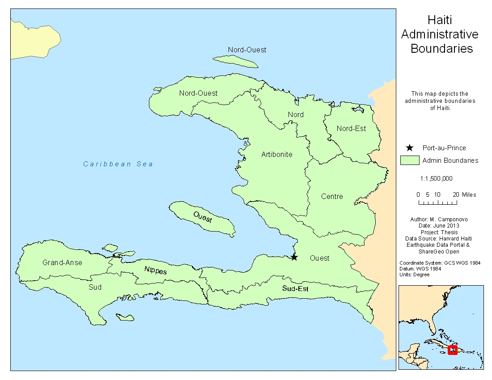
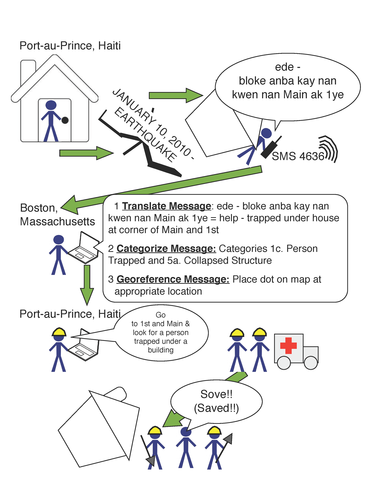
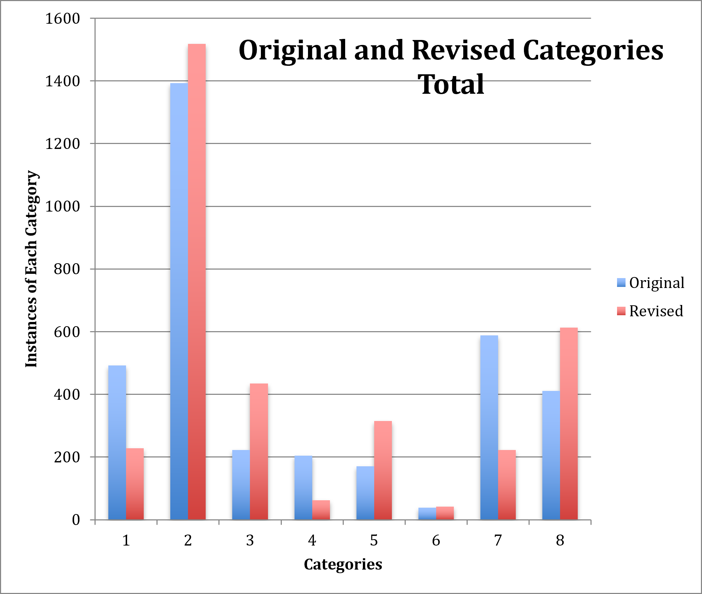
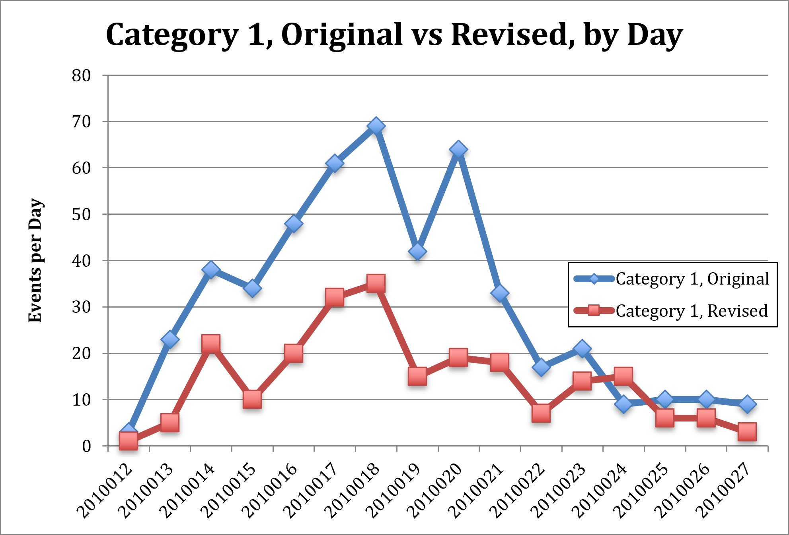

## Project Overview

My master's thesis examined uncertainty in volunteered geographic information produced through the Ushahidi platform after the January 2010 Haiti earthquake.

The project asked:

> What was the nature of uncertainty in the attribute data distributed through the Ushahidi geospatial platform?

Volunteers working remotely received messages, translated them, categorized them by emergency need, georeferenced them, and published them through a dynamic web map.

{.lightbox group="vgi-thesis" fig-alt="Map of Haiti showing departmental boundaries and the location of Port-au-Prince."}

## Why the Study Mattered

The spread of smartphones, GPS, broadband internet, social media, open-source software, and online mapping lowered the cost of creating and sharing geographic information.

This created an important opportunity during disasters. People affected by an event could report conditions directly and volunteers could help transform those reports into mapped information.

The same process raised concerns about consistency, credibility, accuracy, completeness, timeliness, interpretation, and fitness for use.

## The Ushahidi Workflow

{.lightbox group="vgi-thesis" fig-alt="Diagram showing a victim sending a message that is translated, categorized, georeferenced, mapped, and relayed to emergency responders."}

A message could pass through translation, interpretation, categorization, georeferencing, publication, and eventual use by responders.

The workflow was powerful because it connected people across great distances.

It was also vulnerable to uncertainty because each transformation depended on human judgment.

## Data

The research used the complete set of eligible records after removing duplicate records and records that did not meet the study criteria.

The analysis did **not** use a sample drawn from the eligible records. It used the full qualifying dataset.

The original CSV is preserved in the project archive but is not published directly because it contains raw event-report content and is not necessary for understanding the project.

## Methodology

### Data Preparation

The original data was cleaned and reorganized into a database suitable for comparison.

This included:

- removing duplicate records;
- identifying eligible records;
- standardizing date fields;
- preserving original category assignments;
- preparing fields for recategorization.

### Recategorization

I reread each eligible report and assigned categories using the available Ushahidi category definitions.

The original volunteer-assigned categories and revised categories were then compared.

### Category Structure

The deployment allowed reports to be assigned to:

- 8 main categories;
- 42 subcategories.

Some reports contained multiple needs and could receive multiple assignments.

### Automated Comparison

Python scripts compared the original and revised category assignments record by record.

The scripts produced agreement and disagreement values, category totals, subcategory totals, daily summaries, and files used to build charts and tables.

## Results

The study found substantial inconsistency between the content of the messages and the categories originally assigned by volunteers.

At the detailed category level, only **26.59%** of eligible reports were categorized consistently when compared with the revised dataset.

When subcategories were aggregated to their broader main categories, consistency increased to **49.88%**.

This suggests that volunteers often captured the general theme of a report even when the detailed subcategory assignment differed.

{.lightbox group="vgi-thesis" fig-alt="Chart comparing original volunteer-assigned main categories with revised main categories."}

{.lightbox group="vgi-thesis" fig-alt="Time-series chart comparing original and revised category assignments by day."}

## Interpreting the Findings

The findings did not mean that the volunteer response failed.

The Haiti deployment represented an important shift in emergency response because affected people could communicate needs through channels outside traditional systems.

The results instead showed that:

- rapid information production involves interpretation;
- category systems can introduce ambiguity;
- volunteers need clear definitions and training;
- categories may be too detailed for consistent use under pressure;
- broad categories may communicate needs more reliably;
- data consumers should understand how records were transformed before analysis.

## Limitations

The study focused on one component of data quality in one deployment.

Important limitations included:

- a single disaster;
- one VGI platform;
- ambiguity in category definitions;
- reports that could reasonably belong to multiple categories;
- differences between volunteer knowledge and researcher interpretation;
- inability to measure every component of data quality.

The project assessed consistency, not absolute truth.

## Defense and Revision

The defense included draft statistical material that was later removed.

The committee questioned the statistical technique and then asked about sample size. The analysis used the full population of eligible records rather than a sample.

Because no sample had been drawn from the qualifying dataset, the inferential statistical section was unnecessary and was omitted from the final thesis.

For this page, the submitted thesis and later publication are treated as the authoritative versions.

## From Thesis to Publication

The thesis was later revised with Dr. Scott Freundschuh into a journal article titled:

> *Assessing Uncertainty in VGI for Emergency Response*

The article condensed the larger thesis while retaining the central argument:

- VGI can provide important and timely information during disasters;
- volunteer-created attributes may contain substantial uncertainty;
- data quality should be evaluated in relation to intended use;
- uncertainty does not erase the broader value of citizen participation.

## Research Outputs

The project produced:

- a master's thesis;
- a thesis defense;
- a journal article;
- Python scripts;
- a cleaned and recategorized database;
- category-comparison tables;
- daily summaries;
- charts;
- a Haiti locator map;
- an Ushahidi workflow diagram.

## What I Learned

This project reinforced that data quality has multiple dimensions, attribute uncertainty can be as consequential as positional error, categories are analytical decisions rather than neutral labels, and rapid information can still be useful without being perfect.

The central lesson is not that volunteered geographic information should be rejected.

Its value depends on understanding how it was produced, what transformations occurred, and whether its quality is sufficient for the decision at hand.
