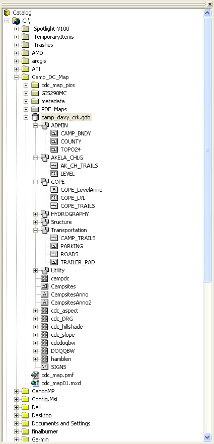
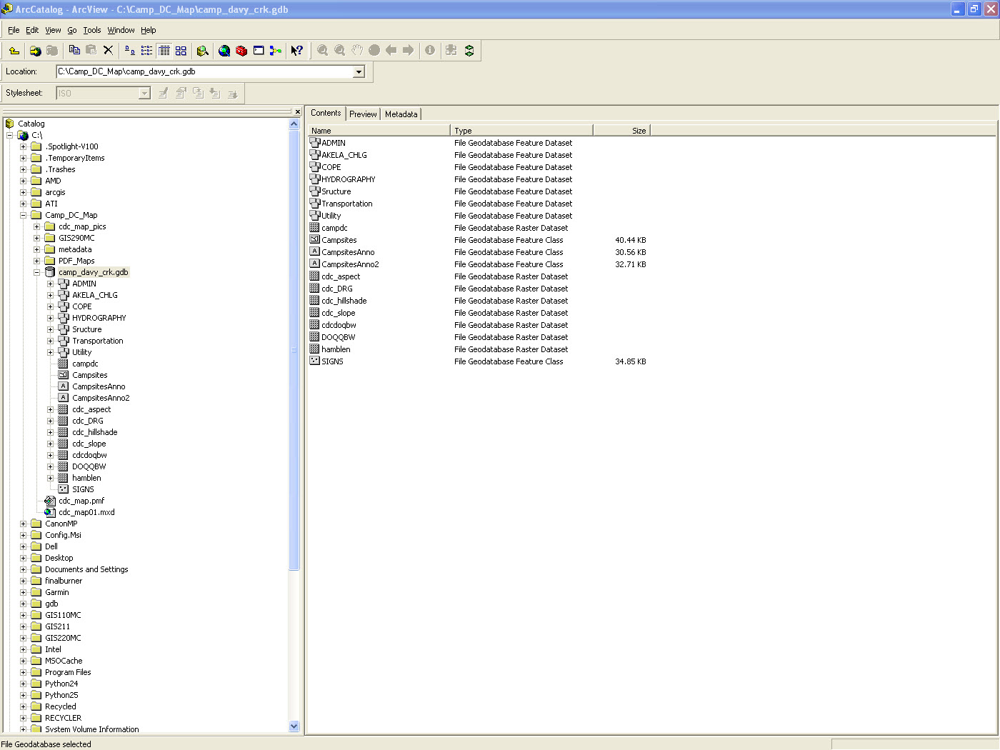
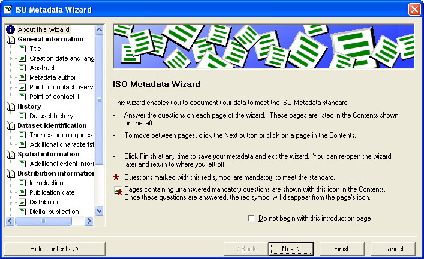
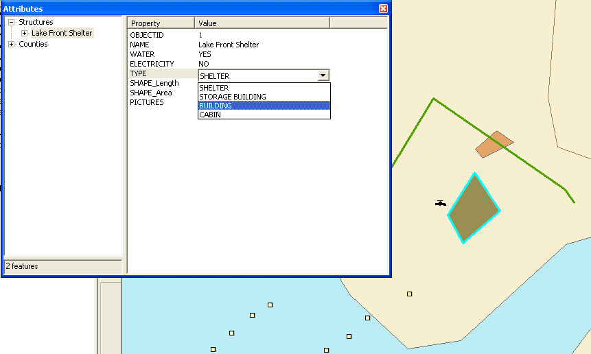
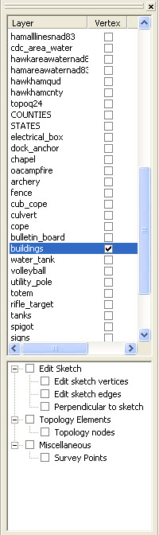
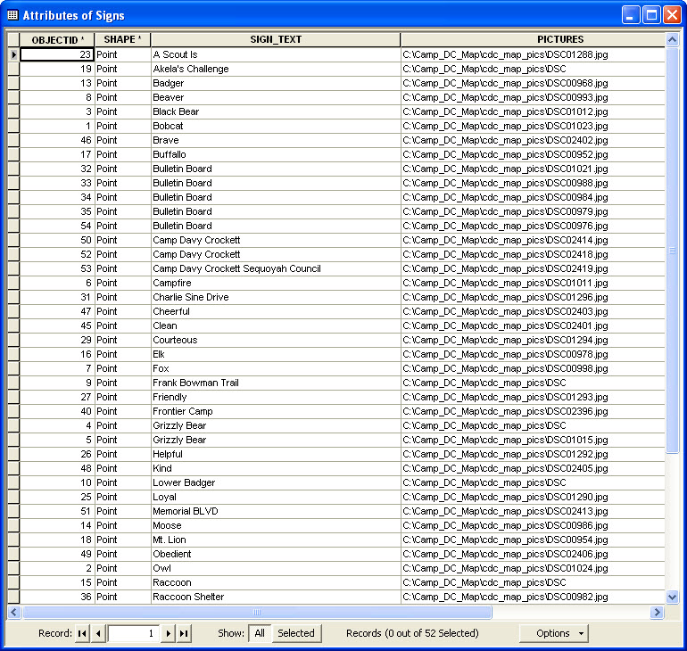
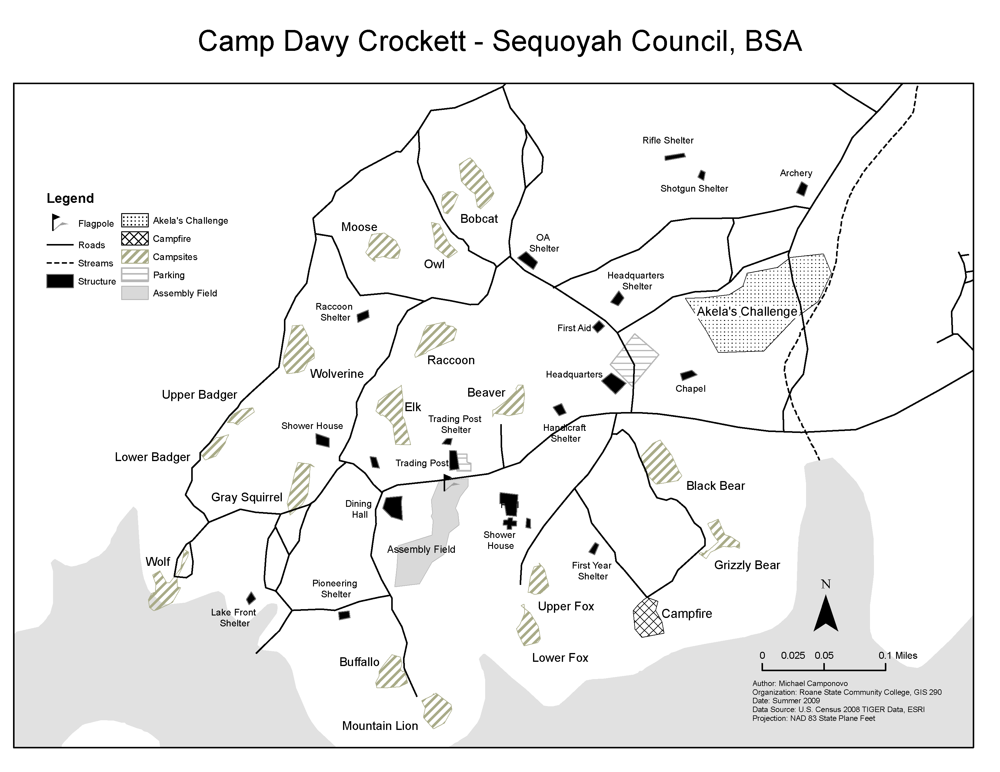
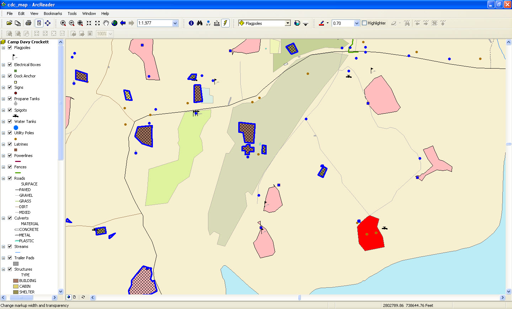
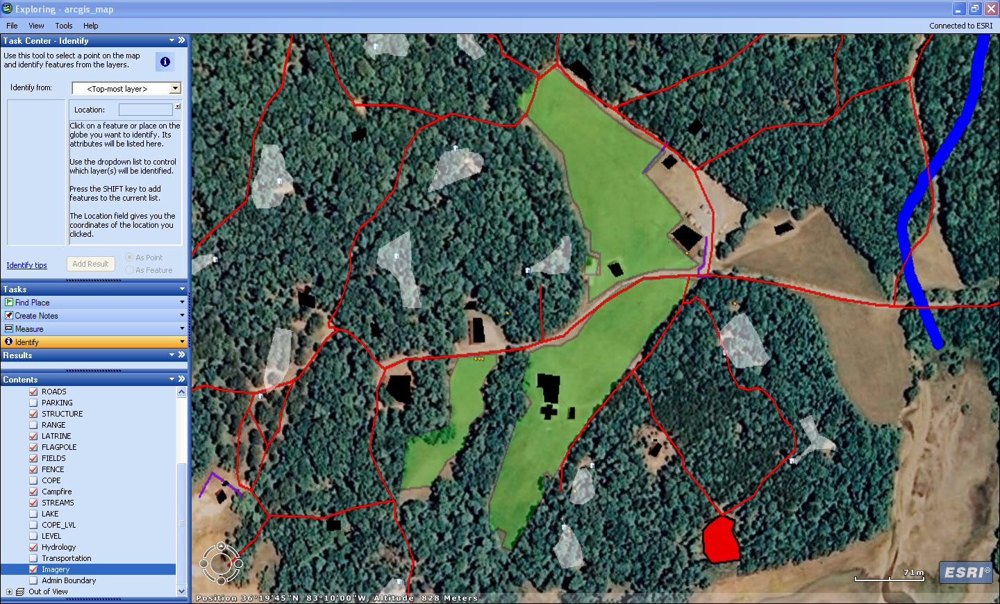

## Project Overview

This independent capstone project was completed for **GIS 290: Directed Research** at Roane State Community College during summer 2009.

Camp Davy Crockett, operated by the Sequoyah Council of the Boy Scouts of America, supports a wide range of summer activities, including lakefront recreation, shooting sports, rope courses, hiking, and traditional Scout programming. Operating those activities requires the camp to maintain numerous roads, buildings, shelters, utilities, campsites, fields, ranges, and other facilities.

The project was designed to support that work by creating a geodatabase and maps of manmade features throughout the camp.

The workflow included:

- field data collection with GPS;
- attribute collection and photography;
- geodatabase design;
- metadata creation;
- heads-up digitizing;
- subtypes and domains;
- terrain-data preparation;
- staff and visitor map production;
- publication for use in free Esri viewing applications.

This was my final project in the Roane State GIS certificate program and was completed independently.

{.lightbox group="camp-davy-crockett" fig-alt="Detailed color facilities map of Camp Davy Crockett showing roads, campsites, buildings, shelters, utilities, fields, ranges, water features, and other camp infrastructure."}

## Project Goals

The project had four primary goals:

1. create a geodatabase of manmade features within the camp;
2. create a detailed map for camp staff;
3. create a simplified map for campers and visitors that reproduced well when copied;
4. convert the data into formats compatible with free Esri viewing software and, where practical, Google Earth.

These goals required more than creating a single map. The project needed to produce a structured and maintainable dataset that could support future camp operations.

## Field Data Collection

### Equipment and Records

Field data were collected using:

- a Garmin eTrex Legend HCx GPS receiver;
- a field notebook;
- a digital camera;
- a tape measure.

The GPS was used to collect point, line, and polygon features. Attribute information was recorded in a notebook and added to the geodatabase later. Photographs were taken to document many mapped features.

### Point Features

Point locations were averaged for approximately ten seconds per feature.

Examples included:

- flagpoles;
- electrical boxes;
- dock anchors;
- propane tanks;
- spigots;
- water tanks;
- utility poles;
- signs.

### Line Features

Linear features were walked or driven twice with GPS tracking enabled. The two tracks were then used as a reference when digitizing a representative centerline.

Examples included:

- roads;
- trails;
- fences;
- powerlines;
- streams.

### Polygon Features

Polygon vertices were collected as GPS points and averaged for approximately ten seconds each. The polygons were later digitized in ArcMap using snapping.

Large features visible in aerial imagery, including some fields and structures, were digitized directly from the imagery.

## Designing the Geodatabase

A file geodatabase was selected because it offered more flexibility than a personal geodatabase and could store both vector and raster datasets.

The geodatabase was planned around feature datasets and classes representing the major categories of camp infrastructure.

{.lightbox group="camp-davy-crockett" fig-alt="Diagram showing the planned Camp Davy Crockett geodatabase structure, including administrative, utility, structure, transportation, campsite, sign, hydrography, campfire, range, field, COPE, and Akela's Challenge datasets."}

The primary categories included:

- administrative boundaries;
- utilities;
- structures;
- transportation;
- campsites;
- signs;
- hydrography;
- campfire areas;
- shooting ranges;
- activity fields;
- COPE facilities;
- Akela’s Challenge facilities.

The structure was intended to make the database understandable and maintainable rather than placing every feature into an unorganized collection.

### Example Feature Classes

The geodatabase included features such as:

- buildings, cabins, shelters, and storage buildings;
- roads, parking areas, trailer pads, and trails;
- electrical boxes, utility poles, tanks, and spigots;
- campsites and campfire areas;
- rifle, shotgun, and archery ranges;
- assembly, volleyball, pool, and headquarters fields;
- signs and bulletin boards;
- lake and stream features.

{.lightbox group="camp-davy-crockett" fig-alt="ArcCatalog window displaying the Camp Davy Crockett file geodatabase, feature datasets, feature classes, raster datasets, and project files."}

## Data Preparation and Metadata

Background data were collected from several sources.

These included:

- Digital Ortho Quarter Quadrangles from the Tennessee Spatial Data Server;
- Digital Raster Graphics;
- Digital Elevation Models;
- 2008 TIGER shapefiles from the U.S. Census Bureau;
- administrative boundaries from Esri;
- Geographic Names Information System records;
- Esri World Imagery and US Topographic Map services.

Downloaded data were checked in ArcCatalog for coordinate systems and metadata. Most data were converted to **NAD 83 Tennessee State Plane feet** to reduce alignment problems.

### ISO Metadata

Metadata were created using the ISO Metadata Wizard in ArcCatalog.

A reusable XML template was created and then adapted for:

- each feature class;
- each feature dataset;
- the complete file geodatabase.

{.lightbox group="camp-davy-crockett" fig-alt="ArcCatalog ISO Metadata Wizard showing sections for general information, dataset identification, spatial information, and distribution information."}

The metadata workflow was important because the project was intended to remain useful after the original fieldwork was complete.

## Subtypes and Domains

Subtypes and domains were created where appropriate to improve consistency during data entry.

For example, structure features could be assigned controlled values such as:

- building;
- cabin;
- shelter;
- storage building.

{.lightbox group="camp-davy-crockett" fig-alt="ArcMap attribute editor showing a controlled list of structure types including shelter, storage building, building, and cabin."}

Using controlled values reduced spelling differences and made the data easier to symbolize, query, and maintain.

## Digitizing and Editing

ArcMap was used to digitize and edit line and polygon features.

Snapping tolerances helped ensure that newly digitized geometry aligned with collected vertices and nearby features.

{.lightbox group="camp-davy-crockett" fig-alt="ArcMap editing interface showing snapping enabled for a building layer while digitizing polygon geometry."}

The workflow varied by feature type:

- points were imported directly from GPS data;
- lines were digitized using repeated GPS tracks as reference;
- polygons were digitized from collected vertices;
- large visible features were digitized from aerial imagery.

Attribute information collected in the field was added after the spatial features were created.

## Photos and Feature Documentation

Photographs were linked to mapped features through paths stored in the attribute table.

The signs layer, for example, included the sign text and the location of its associated photograph.

{.lightbox group="camp-davy-crockett" fig-alt="ArcMap attribute table showing sign descriptions and file paths to associated digital photographs."}

This allowed users to move beyond a symbol on the map and review an image of the actual facility or sign.

The approach anticipated later field-inventory systems in which mapped assets are connected to photographs and descriptive records.

## Staff and Visitor Maps

Two final maps were designed for different audiences.

### Detailed Staff Map

The staff map was a full-color, large-format product containing the most complete representation of the camp’s facilities and infrastructure.

It included features such as:

- structures and shelters;
- campsites;
- roads and parking;
- utilities;
- ranges and activity areas;
- signs;
- streams and lake features;
- COPE and Akela’s Challenge areas.

{.lightbox group="camp-davy-crockett" fig-alt="Large-format color map created for Camp Davy Crockett staff, showing detailed facilities, roads, utilities, campsites, structures, fields, ranges, and water features."}

The map was intended to support camp management and maintenance rather than function only as a visitor guide.

### Simplified Visitor Map

The visitor map was simplified for legibility and grayscale reproduction on letter-size paper.

It emphasized:

- roads;
- streams;
- major structures;
- campsites;
- parking;
- Akela’s Challenge;
- the main campfire area;
- the assembly field.

{.lightbox group="camp-davy-crockett" fig-alt="Simplified grayscale visitor map of Camp Davy Crockett showing roads, streams, principal structures, campsites, parking, Akela's Challenge, the campfire area, and the assembly field."}

Producing separate maps acknowledged that camp staff and visitors needed different levels of detail. The same database supported both products, but the information hierarchy and visual design changed with the audience.

## Publishing for Free Esri Viewers

A goal of the project was to make the data usable without requiring camp staff to own a full ArcGIS Desktop license.

The project was tested in free Esri applications, including ArcReader or ArcExplorer and ArcGIS Explorer.

{.lightbox group="camp-davy-crockett" fig-alt="Published Camp Davy Crockett map displayed in a free Esri desktop viewer with selectable layers for signs, utilities, roads, structures, and other facilities."}

The published map preserved a detailed layer list and symbology while preventing users from accidentally editing the source data.

### ArcGIS Explorer

The project was also reviewed in ArcGIS Explorer.

{.lightbox group="camp-davy-crockett" fig-alt="Camp Davy Crockett facilities displayed over aerial imagery in ArcGIS Explorer, including roads, structures, fields, streams, and other features."}

ArcGIS Explorer provided a more visually appealing 3D and imagery-based environment, but the original assessment noted that it performed better with a high-speed internet connection.

## Terrain Analysis

Digital Elevation Model data were used to create:

- hillshade;
- slope;
- aspect;
- a Triangulated Irregular Network.

The hillshade was useful as a cartographic background.

The slope, aspect, and TIN analyses had more limited value because an accurate camp property boundary could not be obtained during the project. Without a reliable boundary, calculations could not be confidently restricted to the camp property.

The terrain products were retained so that they could support later analysis once an authoritative boundary became available.

## Deliverables

The completed project included:

- a project proposal;
- a final report;
- a file geodatabase;
- a detailed camp-staff map;
- a simplified visitor map;
- color and grayscale map versions;
- a published map for free Esri viewing software;
- project documentation;
- a PowerPoint presentation.

The large-format map could not be plotted during the project because the available plotter was not working, but the digital map was completed.

## Limitations and Future Work

### Camp Boundary

The main limitation was the lack of an authoritative camp boundary.

The property assessor initially supplied incomplete data and then became unavailable for several weeks. As a result, the project could not confidently calculate terrain characteristics or other measurements strictly within the camp property.

### Verification and Maintenance

The report recommended that future work include:

- verifying existing locations and attributes;
- collecting missing photographs;
- adding newly constructed facilities;
- updating the geodatabase as the camp changed.

Features identified for future collection included:

- the perimeter fence;
- nature and interpretive trails;
- informal footpaths;
- individual COPE course obstacles;
- individual Akela’s Challenge obstacles;
- new campsites;
- a Frisbee golf course;
- a new frontier camp;
- a new campfire area.

This maintenance plan was important because a facilities inventory begins to lose value when it is not updated.

## What I Learned

This project combined many of the skills developed across the GIS certificate program.

It provided experience with:

- planning an independent GIS project;
- working with an organizational partner;
- designing a field-data collection strategy;
- collecting point, line, and polygon features with GPS;
- recording field attributes and photographs;
- designing a file geodatabase;
- creating subtypes and domains;
- documenting data with ISO metadata;
- managing projections;
- heads-up digitizing with snapping;
- incorporating raster and vector data;
- designing products for different audiences;
- publishing GIS content for users without full desktop software;
- documenting limitations and future maintenance needs.

The most important lesson was that a useful organizational GIS project depends on more than accurate geometry. It also requires clear attributes, documentation, photographs, logical database organization, appropriate deliverables, and a plan for future updates.

## Looking Back

This project is one of the clearest early examples of the kind of applied GIS work that later became central to my professional practice.

Rather than beginning with a supplied dataset and a prescribed series of tools, I had to determine:

- what information the organization needed;
- how it could be collected;
- how it should be organized;
- how different audiences would use it;
- how the finished products could remain accessible after the project ended.

Several aspects would be handled differently today. A modern workflow might use mobile GIS applications, hosted feature layers, attachments rather than local photo paths, authoritative parcel services, and web maps instead of published desktop map files.

Even so, the project already contained the core elements of a modern facilities inventory: field collection, structured asset data, controlled attributes, photographs, metadata, multiple user products, and long-term maintenance planning.
