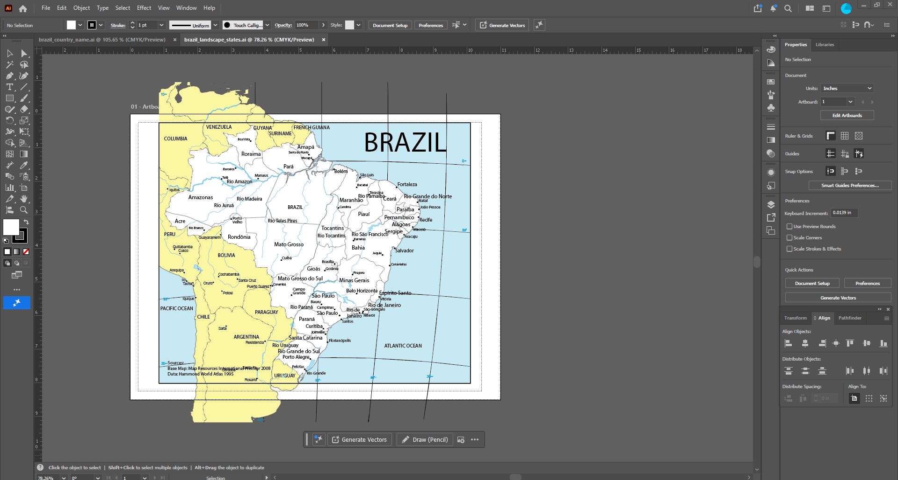
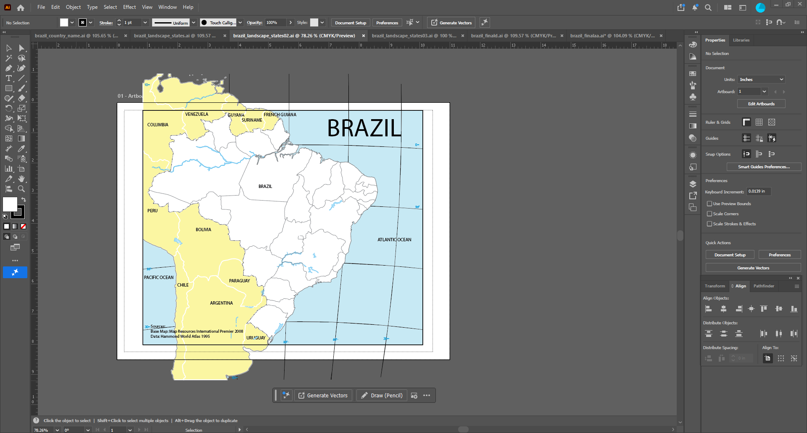
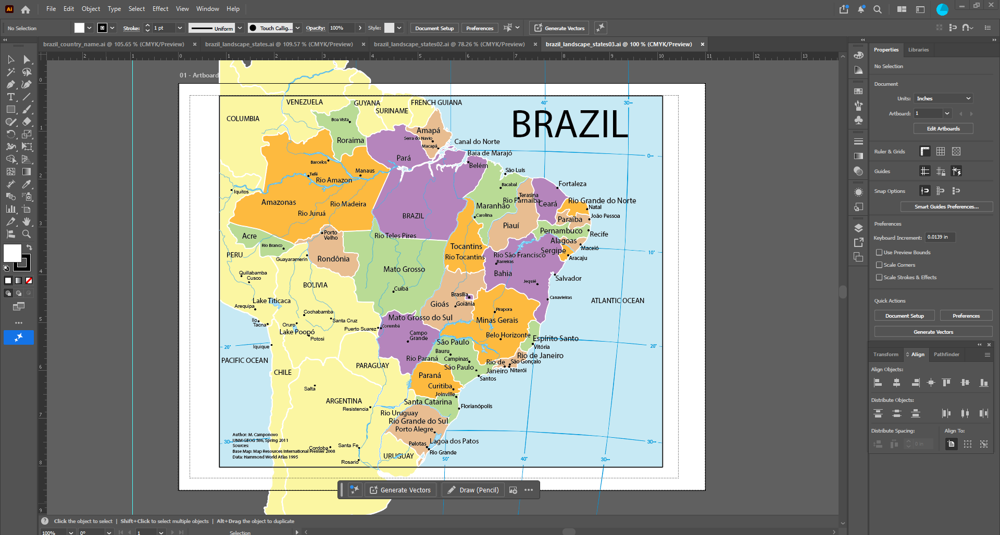
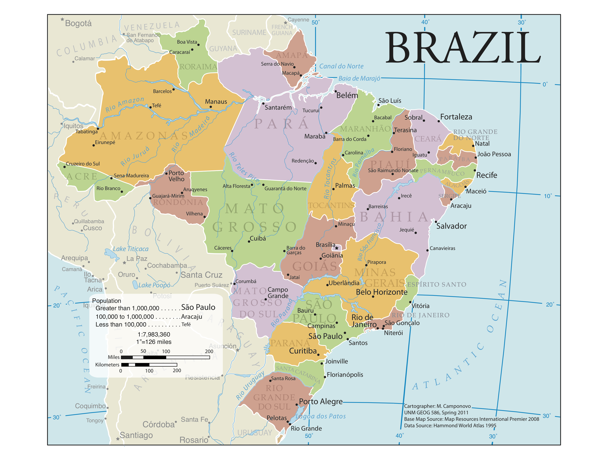
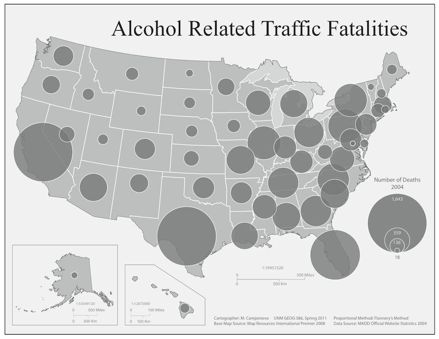
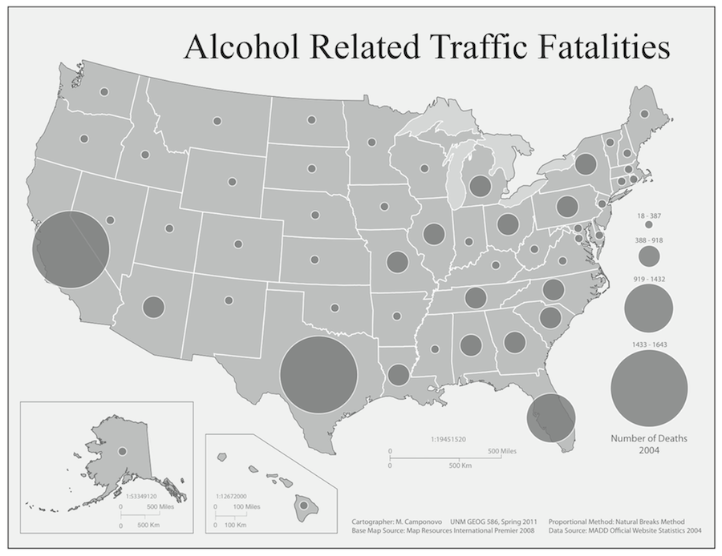
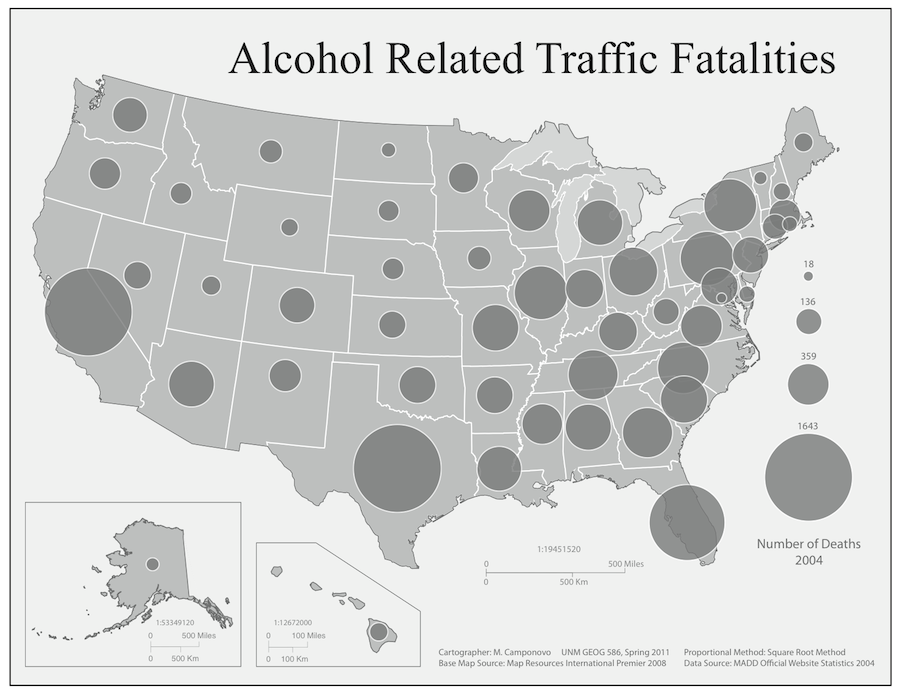
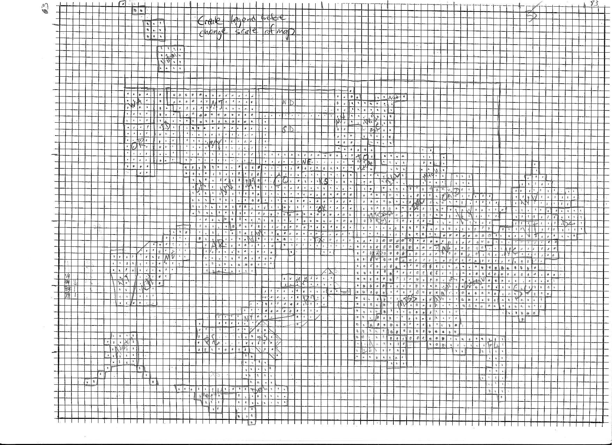
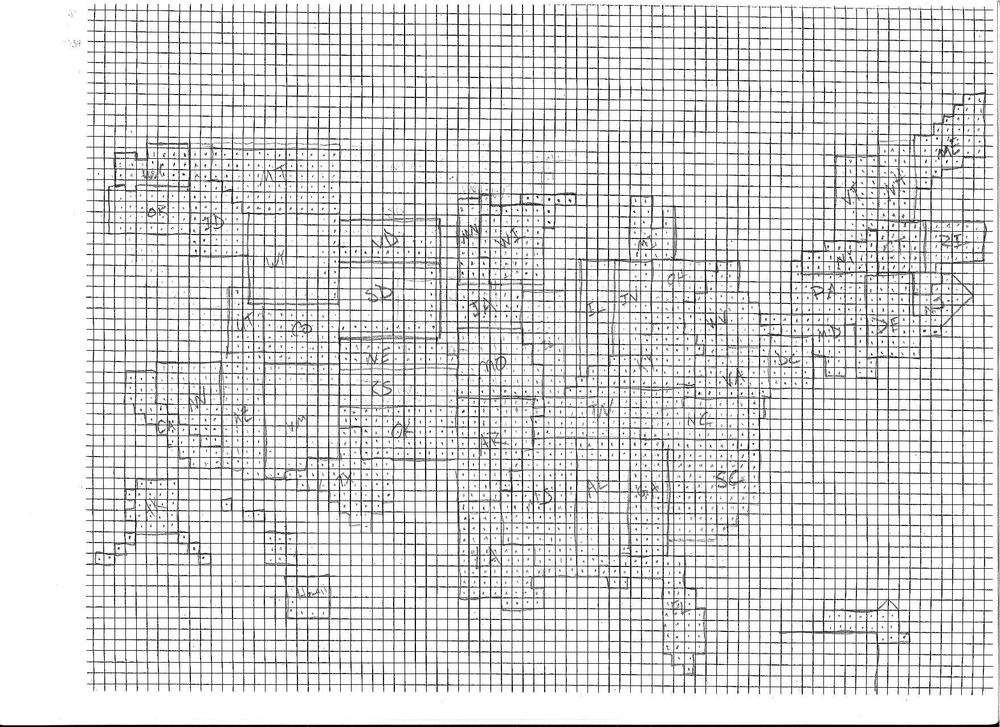
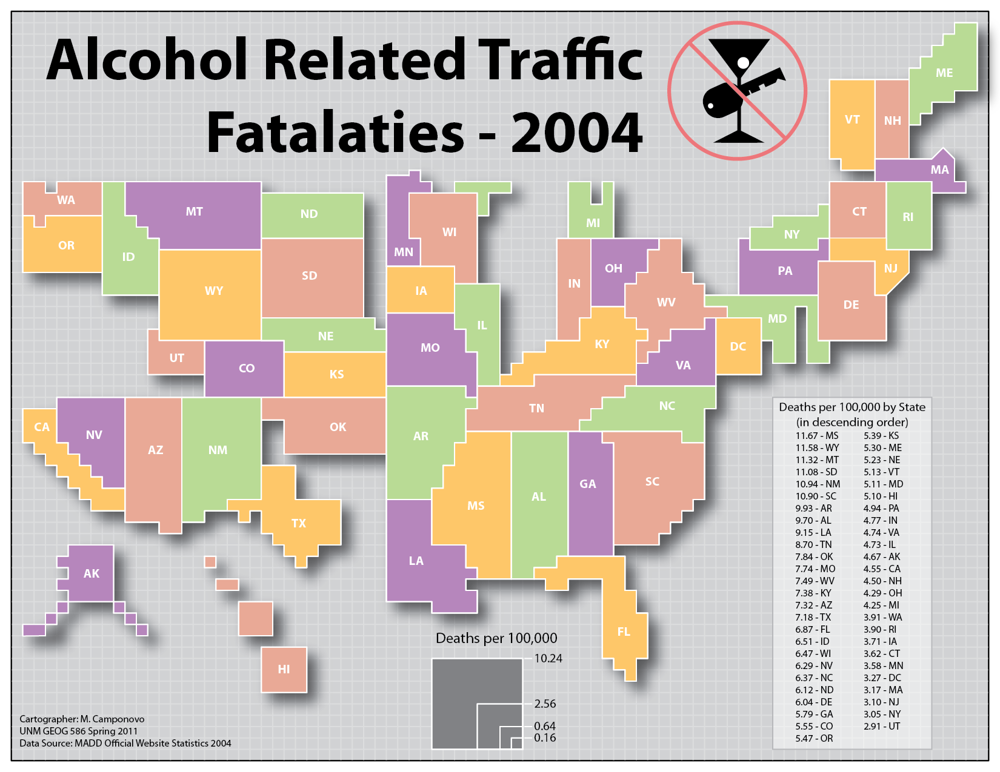

## Course Overview

This portfolio presents selected work from **GEOG 586**, a semester-long graduate cartography course that I completed at the University of New Mexico in spring 2011 with **Dr. Scott Freundschuh**.

Unlike most of my other geospatial coursework, the class did not use GIS software. The emphasis was on cartographic design, visual communication, and the deliberate construction of finished maps. We began projects with hand-drawn sketches and created the final maps in Adobe Illustrator. When calculations were required, such as determining alcohol-related traffic fatality rates or proportional-symbol sizes, I used Microsoft Excel.

Every symbol, label, legend component, and graphic element in Illustrator was placed and configured manually. This made the design process highly intentional and required close attention to visual hierarchy, typography, balance, figure-ground relationships, layout, and audience.

I particularly enjoyed the course because it allowed me to focus on the final visual product rather than the spatial-analysis process. Assignments often involved multiple iterations, critique, revision, and peer feedback. That experience helped me understand cartography not simply as the final step in GIS, but as a distinct discipline centered on clarity, communication, and visual storytelling.

## Design Process and Tools

The course emphasized iterative design rather than one-pass production. Projects typically moved through a sequence of sketching, construction, critique, revision, and final refinement.

The primary tools and methods included:

- hand-drawn sketches used to explore layout, proportion, and spatial relationships;
- Adobe Illustrator for manually constructing and refining final maps;
- Microsoft Excel for calculating rates, proportional-symbol sizes, and other numerical values;
- peer critique and instructor feedback to identify weaknesses and improve design decisions;
- repeated revision of typography, hierarchy, figure-ground contrast, balance, and map composition.

The selected projects below show both finished maps and intermediate stages where surviving materials are available.

## Brazil Reference Map

### Assignment and Design Goal

The Brazil reference-map project focused on building a clear and visually balanced regional map through a series of deliberate design decisions. I developed the map in stages, gradually adding geographic information, refining labels, and establishing a visual hierarchy among national, state, physical, and reference features.

The intermediate versions show how the composition changed as additional information was introduced. Each stage required reconsidering spacing, typography, line weight, contrast, feature emphasis, and the relationships among map elements. The final map was completed in Adobe Illustrator after several rounds of revision and feedback.

### Design Progression

::: {layout-ncol=2}

{.lightbox group="brazil-reference" fig-alt="Early design stage of a Brazil reference map created in Adobe Illustrator."}

{.lightbox group="brazil-reference" fig-alt="Intermediate Brazil reference map with additional labels and geographic information."}

{.lightbox group="brazil-reference" fig-alt="Later revision of the Brazil reference map with refined cartographic hierarchy."}

{.lightbox group="brazil-reference" fig-alt="Final Brazil reference map created manually in Adobe Illustrator."}

:::

### What I Learned

This project reinforced the value of building a map in stages. Adding more information did not simply mean placing more features on the page; each addition required reconsidering the entire visual hierarchy.

The progression also helped me see how typography, line weight, spacing, and contrast work together. The final map was not the product of a single design decision, but of many small revisions made across the full composition.

## Visualizing One Dataset in Multiple Ways

Several assignments used the same dataset—2004 alcohol-related traffic fatalities—to examine how different cartographic methods influence interpretation.

Across the sequence, I created proportional-symbol maps using three scaling methods, a choropleth map, and a contiguous-area cartogram. Although I have not located the choropleth map, the surviving work still documents the central purpose of the exercise: comparing how symbol size, classification, shading, and geographic distortion communicate the same underlying data differently.

Using a common dataset made it easier to focus on the strengths and limitations of each design method rather than on differences in subject matter.

## Comparing Proportional Symbol Methods

### Assignment and Design Goal

This assignment compared three methods for displaying the same dataset: 2004 alcohol-related traffic fatalities in the 50 states and the District of Columbia.

Each map was produced in grayscale and used proportional circles, but the circle sizes were determined using a different method:

- square-root scaling;
- Flannery scaling;
- range-graded natural breaks.

Creating the maps required more than changing symbol sizes. Each version had to function as a complete cartographic composition, including titles, legends, typography, figure-ground contrast, and balanced page layout. Because the symbols were constructed manually in Adobe Illustrator, the assignment also required careful calculation and consistent placement.

### Map Comparison

::: {layout-ncol=3}

{.lightbox group="proportional-symbols" fig-alt="Grayscale proportional-symbol map using Flannery scaling for alcohol-related traffic fatalities."}

{.lightbox group="proportional-symbols" fig-alt="Grayscale range-graded proportional-symbol map using natural breaks."}

{.lightbox group="proportional-symbols" fig-alt="Grayscale proportional-symbol map using square-root scaling for alcohol-related traffic fatalities."}

:::

### Evaluating the Methods

The three techniques created noticeably different impressions of the same data.

The range-graded natural-breaks method did not represent the variation especially well because a few high values acted as outliers and occupied two of the four classes. That compressed most of the remaining values into only two categories and concealed much of the detail present in the original data.

Square-root and Flannery scaling both preserved an individual symbol size for each value. Their primary limitation was perceptual: similarly sized circles could be difficult to distinguish, especially among the largest symbols.

Flannery scaling addressed that problem by enlarging the largest circles somewhat more aggressively while only slightly enlarging smaller circles. Based on that comparison, I concluded that the Flannery method communicated this dataset most effectively.

### What I Learned

This assignment showed that symbol scaling is not a neutral technical choice. Different methods can emphasize, compress, or obscure variation even when they use the same values.

It also reinforced the importance of matching the symbolization method to both the data distribution and the way people visually compare area.

## Contiguous-Area Cartogram

### Assignment and Design Goal

The contiguous-area cartogram used the rate of alcohol-related traffic fatalities per 100,000 people to resize the states. Instead of using shading or proportional symbols, the area of each state represented its value.

The assignment required two competing goals:

- state areas had to change enough to represent the data;
- geographic contiguity and recognizable state shapes had to be preserved as much as possible.

I first calculated the approximate area required for each state and then constructed the map by hand on graph paper.

### Sketching and Revision

The two sketches document the trial-and-error process of fitting the states together. I repeatedly adjusted their shapes and positions while trying to preserve neighboring relationships.

::: {layout-ncol=2}

{.lightbox group="cartogram" fig-alt="First hand-drawn graph-paper sketch for a contiguous-area cartogram of the United States."}

{.lightbox group="cartogram" fig-alt="Second hand-drawn graph-paper sketch refining state size, shape, and neighboring relationships."}

:::

After resolving the overall structure by hand, I recreated and refined the cartogram in Adobe Illustrator.

{.lightbox group="cartogram" fig-alt="Final contiguous-area cartogram of alcohol-related traffic fatality rates created in Adobe Illustrator."}

### What I Learned

This project demonstrated that a cartogram is not simply a distorted conventional map. It is a negotiated design in which statistical proportionality, geographic relationships, recognition, and visual legibility must all be balanced.

The hand-drawn process was especially useful because it forced me to work through contiguity and proportion before moving into digital production.

## Additional Course Work

The course included additional assignments that are not represented visually on this page.

One assignment used the same alcohol-related traffic fatality dataset to create a choropleth map, extending the comparison among proportional symbols, classified shading, and cartogram-based representation. I have not located a surviving copy of that map.

For the independent final project, I mapped socioeconomic and demographic indicators associated with gentrification in Santa Fe, New Mexico. Although I still have written materials related to that research, I have not found a copy of the final map suitable for inclusion here.

These missing artifacts are part of the course history, but this portfolio emphasizes the projects for which I can present both the finished work and meaningful evidence of the design process.

## What I Learned

Across the semester, I developed a stronger understanding of cartography as an iterative design discipline.

The course taught me to:

- begin with sketches rather than software;
- build visual hierarchy deliberately;
- treat typography as a central cartographic element;
- evaluate how symbolization methods shape interpretation;
- revise maps in response to critique;
- balance accuracy, legibility, and visual appeal;
- separate the design process from the analytical workflow;
- recognize that strong maps are constructed through repeated refinement.

The experience also gave me a lasting appreciation for slowing down the mapmaking process. Because every symbol and label had to be placed manually, each decision was visible and intentional.

## Looking Back

This course remains one of the most enjoyable and influential parts of my graduate education. It gave me space to concentrate on the final deliverable, experiment with multiple versions of the same idea, and receive detailed feedback from peers and the instructor.

The surviving projects document more than finished maps. They show a process of sketching, testing, revising, comparing, and refining. That process continues to shape how I approach cartography, visual communication, and the way I teach students to evaluate their own work.
