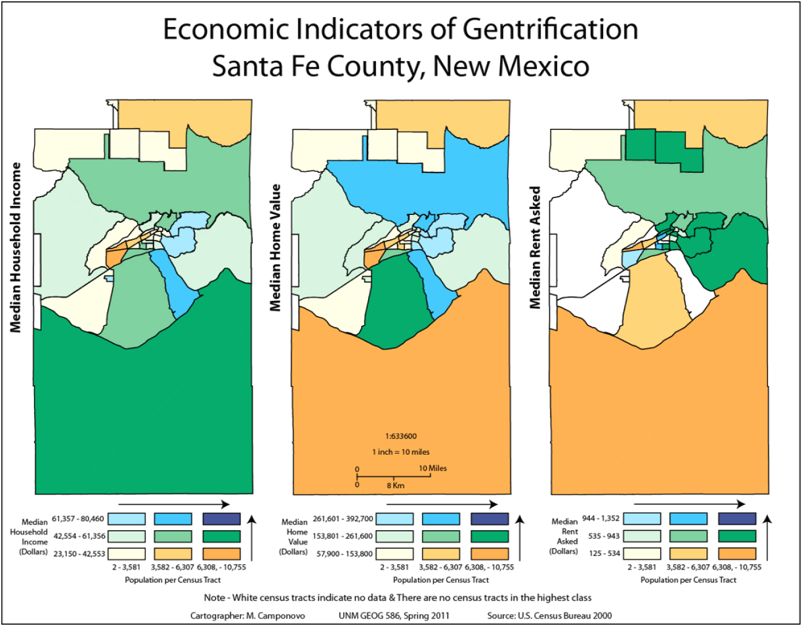
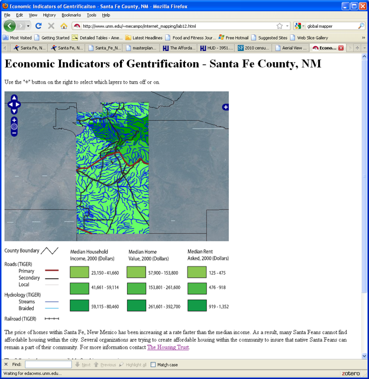
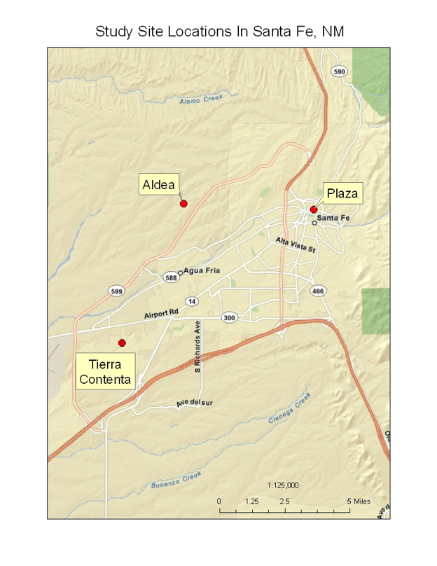

## Course Overview

**GEOG 566: The City as Human Environment** examined cities as lived social environments rather than only as collections of buildings, infrastructure, and mapped features.

The course was qualitative and field-based. Readings, discussions, observation exercises, and comparative field projects explored how urban spaces are shaped by:

- identity;
- race and ethnicity;
- socioeconomic difference;
- migration;
- housing;
- public space;
- tourism;
- planning;
- historical memory;
- cultural representation;
- formal and informal social control.

This course differed substantially from my GIS, remote-sensing, and spatial-analysis coursework. Instead of beginning with datasets and analytical tools, it began with people, places, behavior, interpretation, and the question of how cities are experienced.

## Reading Cities Qualitatively

The reading reflections considered cities through several overlapping perspectives.

Themes included:

- cities as products of social interaction;
- economic segregation and neighborhood effects;
- border identity and the construction of “the other”;
- public space and town centers;
- Santa Fe’s constructed image of authenticity;
- Native American identity and urban relocation;
- urban growth and sprawl;
- labor, gender, and violence in Ciudad Juárez.

The surviving reflections are not published here in full. Their value lies in documenting how I learned to move beyond summary and ask broader geographic questions:

- Who belongs in a place?
- Who is treated as an outsider?
- How does the built environment encourage or discourage interaction?
- How are identity and historical memory constructed?
- What role do policy, planning, and private development play in inequality?
- How do local spaces reflect wider social and economic systems?

## Field Observation as a Method

The field projects used a repeatable qualitative approach.

For each site, I documented:

1. who appeared to use the space;
2. how people arrived and moved through it;
3. what types of interaction occurred;
4. how architecture and scale affected behavior;
5. whether formal rules or informal design controlled use;
6. who appeared welcome, tolerated, discouraged, or excluded;
7. whether the space fulfilled its intended purpose;
8. how the site related to broader urban conditions.

The process required sustained observation rather than a quick visual inspection.

Original notes recorded practical details such as:

- date and time;
- weather;
- user groups;
- transportation modes;
- observed interactions;
- signage;
- security;
- seating;
- sidewalks;
- surrounding land uses;
- evidence of formal and informal social control.

This method taught me to treat ordinary urban spaces as evidence.

## Comparative Field Projects

## Bricklight District and ABQ Uptown

The first field project compared two commercial areas in Albuquerque:

- the mixed-use Bricklight District near the University of New Mexico;
- the privately managed ABQ Uptown shopping center.

The comparison focused on:

- surrounding housing;
- retail and restaurant price points;
- street width and traffic speed;
- parking;
- public transportation;
- pedestrian and bicycle access;
- private security;
- signage;
- formal and informal control.

The Bricklight District supported a wider mixture of users because it was accessible by foot, bicycle, bus, and automobile and was surrounded by housing at several price levels.

ABQ Uptown functioned more clearly as a destination for people arriving by private automobile and participating in a higher-cost retail environment.

The project demonstrated that commercial spaces do not merely attract different populations by accident. Transportation, zoning, design, pricing, and control help determine who can comfortably use them.

## Old Town and Civic Plaza

The second field project compared Albuquerque’s Old Town with Civic Plaza.

The observations were organized around five characteristics:

- human scale;
- natural versus manufactured materials;
- nearby facilities;
- formal social control;
- historical significance.

Old Town’s shaded plaza, smaller buildings, narrow streets, landscaping, historical associations, and relatively permissive atmosphere encouraged visitors to slow down.

Civic Plaza was more monumental, open, concrete-dominated, and regulated. It often functioned as a pedestrian passage rather than a place to remain.

The project connected physical form with social interaction. Old Town produced more visible conversations among strangers, while users of Civic Plaza tended to remain within their own groups or move through the space toward another destination.

## Cultural Centers and Institutional Voice

The third project compared:

- the Indian Pueblo Cultural Center;
- the National Hispanic Cultural Center.

Both institutions represented cultures that had often been described historically by outsiders, but they approached interpretation differently.

The Indian Pueblo Cultural Center was:

- easy for an unfamiliar visitor to navigate;
- oriented toward tourists, students, and researchers;
- explicit in explaining Pueblo history and culture;
- designed to present Pueblo history through a Pueblo institutional voice.

The National Hispanic Cultural Center functioned more like a campus and supported:

- genealogy;
- literary events;
- visual art;
- performance;
- education;
- continuing cultural production.

The comparison showed that cultural institutions communicate through more than their exhibits. Location, entrances, architecture, labels, programming, and assumptions about visitor knowledge all influence who feels prepared to enter and participate.

## Culminating Project: Affordable Housing in Santa Fe

The final field project became a mixed-method study of housing affordability in Santa Fe.

The project began as an attempt to demonstrate gentrification quantitatively. As the research developed, I recognized that the available evidence did not support a simple declaration that gentrification had or had not occurred.

I therefore shifted the focus toward:

- changing housing costs;
- the relationship between income and housing;
- affordable-housing policy;
- nonprofit housing assistance;
- mixed-income development;
- the lived characteristics of planned communities.

## Quantitative Evidence

The project used Census and spatial data to examine:

- median household income;
- median home value;
- median rent.

After adjusting values for inflation, I estimated that from 1980 to 2000:

- median household income increased by approximately 14%;
- median home value increased by approximately 30%;
- median rent increased by approximately 38%.

The analysis suggested that housing costs were increasing faster than local income.

{.lightbox group="city-human-environment" fig-alt="Three maps of Santa Fe County comparing median household income, median home value, and median rent by census geography."}

The project also produced an early web map allowing users to compare selected demographic and housing indicators.

{.lightbox group="city-human-environment" fig-alt="Early web map displaying economic indicators of gentrification in Santa Fe County, including income, home value, and rent."}

## Interview and Site Visits

I interviewed Justin Robison of the Santa Fe Housing Trust about:

- client education;
- financial readiness;
- down-payment assistance;
- mortgage assistance;
- rental support;
- nonprofit development;
- long-term affordability;
- assistance for essential workers and special-needs clients.

The interview was followed by visits to two planned communities:

- Tierra Contenta;
- Aldea.

{.lightbox group="city-human-environment" fig-alt="Map of Santa Fe showing the locations of Tierra Contenta, Aldea, and the central plaza."}

## Tierra Contenta

Tierra Contenta included:

- single-family homes;
- apartments;
- schools;
- parks;
- sidewalks;
- transit;
- neighborhood retail;
- housing for several income levels and client needs.

The community appeared active and used, but it also showed visible signs of conflict and repeated graffiti.

Its imperfections were part of what made it analytically valuable: it functioned as a lived neighborhood rather than as an idealized design diagram.

## Aldea

Aldea reflected New Urbanist planning principles:

- compact development;
- narrow streets;
- sidewalks;
- parks;
- trails;
- Pueblo-influenced architecture;
- market-rate and affordable housing.

Visually, the community appeared highly polished. During the field visit, however, the public spaces were nearly empty.

Its distance from ordinary services, commercial costs, homeowner-association obligations, and possible tensions between housing groups complicated the assumption that attractive physical design automatically creates active community life.

## What the Comparison Revealed

The comparison between Tierra Contenta and Aldea reinforced one of the course’s major lessons:

> A place that looks successful is not necessarily a place that functions successfully as a social environment.

Architecture and planning matter, but they do not alone determine whether people use public spaces, interact with neighbors, or feel that they belong.

The project also demonstrated the value of mixed methods.

Census data showed broad economic change. Maps revealed spatial patterns. Interviews explained institutional strategies. Field observations revealed how developments functioned on the ground.

None of those methods would have told the complete story by itself.

## What I Learned

This course changed how I observed cities.

I learned to recognize that:

- built form influences behavior;
- access is social as well as physical;
- public space is governed by both design and regulation;
- private spaces can imitate public environments while restricting who belongs;
- cultural institutions communicate through institutional voice and visitor expectations;
- authenticity can be created, marketed, and contested;
- housing affordability affects transportation, employment, family life, and community stability;
- attractive planning does not guarantee social interaction;
- observations should be connected to broader historical, cultural, and economic systems;
- qualitative evidence can reveal patterns that are difficult to represent in a GIS.

## Looking Back

GEOG 566 broadened my understanding of what geographic research could be.

Most of my graduate work involved quantitative data, maps, imagery, databases, and spatial analysis. This course asked me to slow down, remain in a place, observe carefully, compare experiences, speak with people, and consider how my own background affected what I noticed.

The course also influenced how I later approached applied GIS work.

Maps and spatial data are more meaningful when they are interpreted alongside:

- local knowledge;
- lived experience;
- institutional context;
- policy;
- history;
- the physical design of places.

The strongest outcome was learning to see cities not only as spatial arrangements, but as environments continually produced through human interaction, difference, memory, power, and everyday use.
