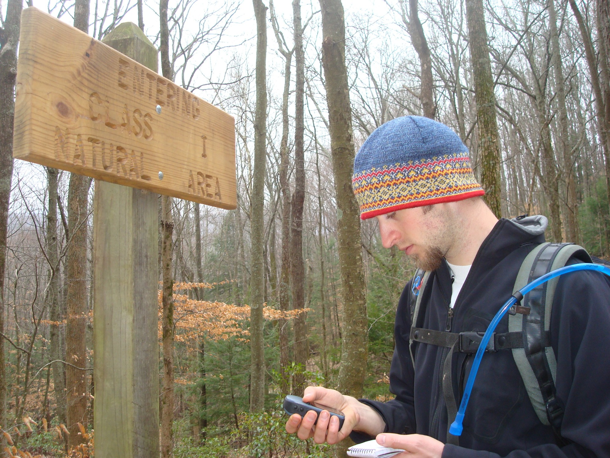
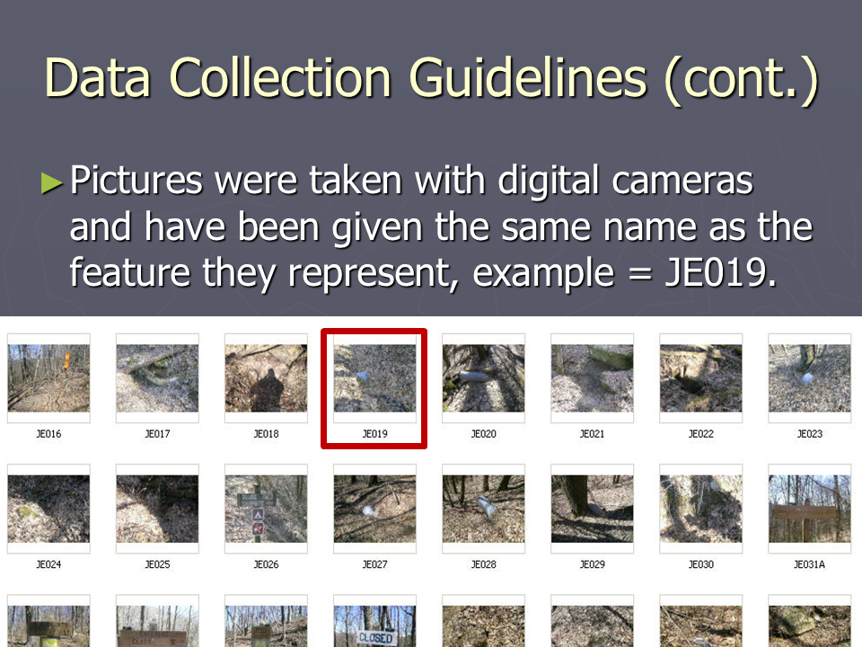
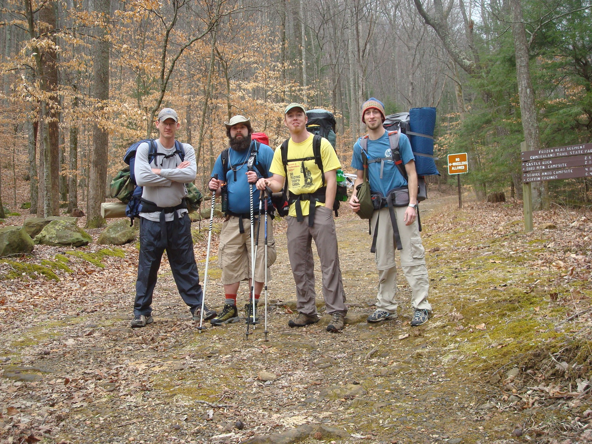
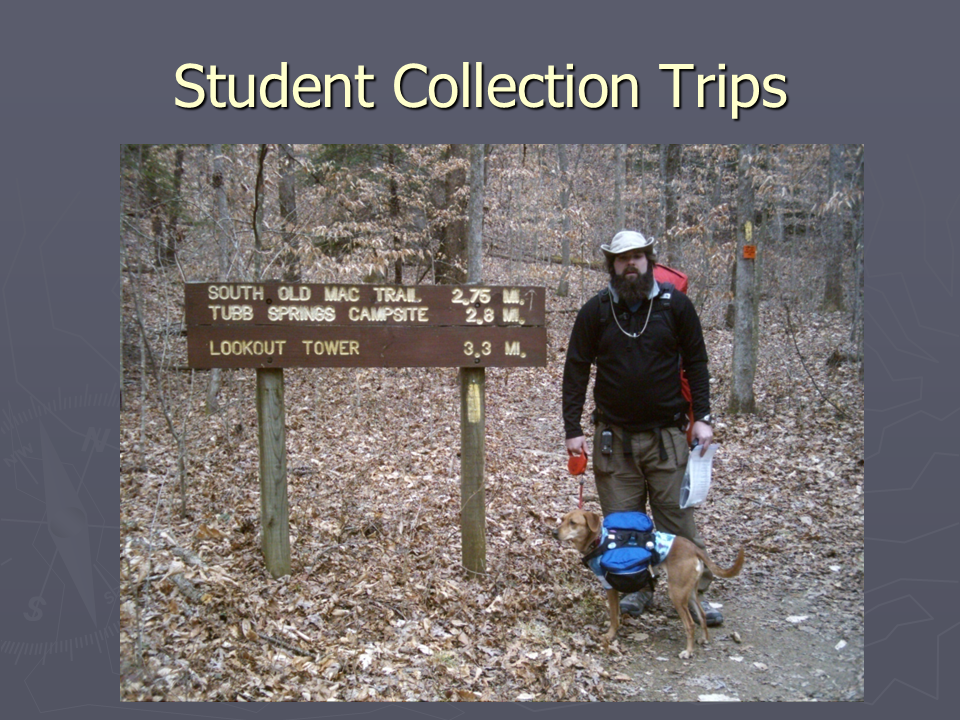
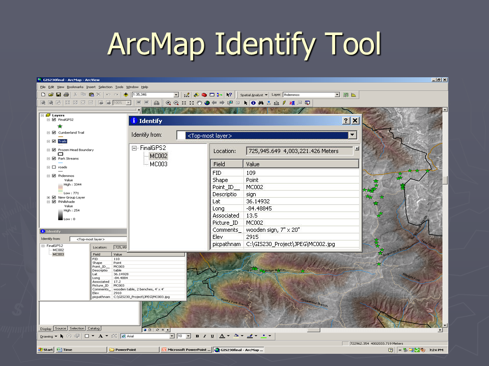
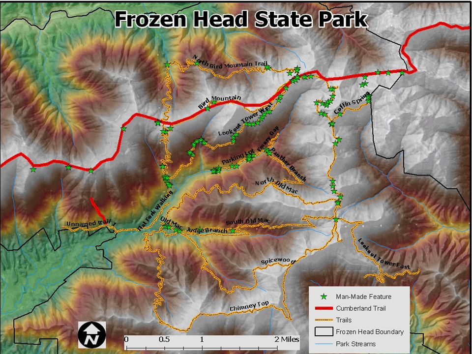

## Project Overview

This collaborative project was completed for **GIS 230: Project Management** at Roane State Community College during spring 2009.

The class worked with James Brannon of the Tennessee Department of Environment and Conservation to collect geographic data along trails in Frozen Head State Park. The work supported a larger effort to document and map the Cumberland Trail and related park infrastructure.

The project required the class to function as a coordinated GIS team rather than as a collection of students completing separate assignments.

The team:

- scoped the project;
- evaluated feasibility;
- assigned formal roles;
- created a schedule;
- standardized field procedures;
- conducted backpacking data-collection trips;
- collected GPS waypoints and photographs;
- documented attributes and measurements;
- imported and managed the data;
- tracked progress, hours, and costs;
- prepared metadata;
- conducted quality assurance;
- delivered project files, maps, reports, and a presentation.

My documented responsibilities included serving as a **report writer, secretary, feasibility-study lead, and GPS data collector**.

{.lightbox group="cumberland-trail" fig-alt="A student using a handheld GPS receiver and notebook beside a wooden trail sign in Frozen Head State Park."}

## Client and Project Need

Frozen Head State Park contains an extensive network of trails used by hikers, horseback riders, and mountain bikers.

The project client needed an inventory of infrastructure and natural features located along those trails. The data were intended to supplement an existing geodatabase maintained by park staff.

The planned inventory included:

- GPS locations;
- digital photographs;
- feature descriptions;
- measurements;
- elevation;
- positional error;
- comments and unusual observations;
- data suitable for transfer into the existing geodatabase.

The Cumberland Trail presented a particular challenge because portions shown on available maps were incomplete, closed, difficult to access, or not evident on the ground.

## Course and Project-Management Requirements

GIS 230 was designed to prepare students to complete independent work in GIS 290.

The course emphasized:

- planning and completing a real-world GIS project;
- project scoping;
- role assignment;
- scheduling;
- metadata documentation;
- 3D visualization;
- progress reporting;
- presentation and delivery.

The group assignment required:

- a team leader;
- documentation management;
- presentation development;
- report writing;
- quality assurance;
- GIS technical work;
- at least one spatial analysis;
- at least one 3D visualization;
- weekly progress reports;
- a final report;
- a PowerPoint presentation.

The project therefore evaluated both the GIS work and the team’s ability to manage time, responsibilities, data, and client expectations.

## Feasibility Study

One of my primary assignments was preparing the project feasibility study.

The study evaluated whether the team could realistically collect detailed data along the park’s trail network within the available semester.

### Main Constraints

The study identified several concerns:

- the park contained more than 80 miles of trails;
- the project began late because weather delayed the initial client meeting;
- wet winter and spring conditions could prevent photography;
- access by service road, ATV, or park vehicle was not available;
- all fieldwork had to be completed on foot;
- canopy cover could affect GPS collection;
- the semester allowed only a limited period for data collection and quality assurance.

The study concluded that collecting every trail was unlikely.

The recommended strategy was to:

1. prioritize trails;
2. begin fieldwork as quickly as possible;
3. document areas that were completed;
4. document trails still needing work;
5. avoid future duplication by preserving clear collection records.

This was an important project-management decision. The feasibility study did not simply ask whether the project was desirable; it assessed what could reasonably be completed with the available people, equipment, weather, access, and time.

## Team Organization

The class assigned formal roles during its first project meeting.

Roles included:

- project manager and accounting;
- GPS data collection;
- presentation development;
- report writing and secretarial work;
- analysis and quality assurance;
- record and data management;
- file storage and backup;
- internet data collection.

I served as:

- report writer;
- secretary;
- GPS data collector;
- lead writer for the feasibility study.

The project’s meeting records document these assignments and the way responsibilities changed as the work progressed.

## Meeting Minutes and Project Documentation

As secretary, I prepared meeting minutes documenting project decisions and progress.

The minutes recorded items such as:

- personnel assignments;
- client questions;
- available GPS receivers and cameras;
- file-management procedures;
- backup expectations;
- naming conventions;
- coordinate standards;
- pilot-study requirements;
- time sheets;
- budget totals;
- collection-trip plans;
- due dates;
- project-creep concerns;
- data-quality instructions.

The records show the project evolving from an initial assignment into a coordinated field operation.

For example, early meetings focused on defining responsibilities and preparing questions for the client. Later meetings addressed coordinate formatting, pilot data, quality assurance, cost tracking, and fieldwork progress.

## Field-Collection Standards

The team created a standardized procedure so that data collected by different crews and different GPS units could be combined.

### Coordinate and Projection Standards

GPS units were configured to use:

- NAD 83;
- decimal degrees.

Final data were projected to:

- NAD 83;
- Tennessee State Plane;
- FIPS 4100;
- feet.

### Point Collection

A waypoint was created for each manmade or natural feature included in the inventory.

Each waypoint was averaged for approximately 60 seconds when the GPS equipment supported point averaging.

### Naming Convention

Waypoint names used:

- the collector’s first and last initials;
- a three-digit sequential number.

Example:

```text
MC012
```

Photographs were assigned matching identifiers so they could be linked to the corresponding feature.

{.lightbox group="cumberland-trail" fig-alt="Folder of field photographs labeled with identifiers such as JE016 through JE031A, demonstrating the naming convention used to link photographs to mapped features."}

### Field Records

The standard collection sheet included:

- point ID;
- description;
- latitude;
- longitude;
- elevation;
- associated positional error;
- picture ID;
- measurements;
- comments.

The team was instructed to retain coordinate precision to five decimal places and to use positive and negative coordinate values rather than directional letters when preparing data for Excel and ArcMap.

Handwritten field notes were transferred into a standardized spreadsheet so records from different collection teams could be combined consistently.

{.lightbox group="cumberland-trail" fig-alt="Spreadsheet containing point identifiers, feature descriptions, latitude, longitude, elevation, estimated error, photograph identifiers, comments, and measurements for mapped trail features."}

## Backpacking Data-Collection Trips

The project required teams to hike and, in some cases, backpack along trails while carrying:

- GPS receivers;
- cameras;
- field sheets or notebooks;
- measuring equipment;
- normal hiking and overnight gear.

{.lightbox group="cumberland-trail" fig-alt="Four student field-team members with backpacks and hiking equipment standing at a Frozen Head State Park trail junction."}

{.lightbox group="cumberland-trail" fig-alt="A student field-team member wearing a backpack and standing with a dog beside a trail sign in Frozen Head State Park."}

The group photograph is an important record of the project because it shows that data collection was not limited to roadside features or a short laboratory exercise.

The field crews had to manage:

- trail distance;
- terrain;
- access;
- weather;
- equipment;
- limited daylight;
- feature documentation;
- travel time.

## GPS and Attribute Collection

The GPS photograph shows the workflow described in the project documentation: one team member collected and averaged the waypoint while also recording the feature information needed for later data entry.

{.lightbox group="cumberland-trail" fig-alt="A student using a handheld GPS receiver and recording notes beside a wooden sign identifying the Bird Mountain and Natural Area trails."}

The field data were compiled in Microsoft Excel.

DNR Garmin was used to transfer waypoints from the GPS receivers and export them for use in ArcMap.

{.lightbox group="cumberland-trail" fig-alt="ArcMap Identify window showing the attributes of a collected manmade trail feature, including point ID, description, coordinates, elevation, comments, and the path to its associated photograph."}

The project presentation states that:

- waypoint data were converted into shapefiles;
- field attributes were added to the feature table;
- photographs were linked to their mapped features.

## Data Management

The project relied on a shared network location for centralized storage.

The team created:

- a predefined folder structure;
- backup procedures;
- a backup log;
- an access and work log;
- data-transfer expectations;
- documentation procedures.

Data management proved more difficult than expected.

The final report notes that multiple people, collection crews, GPS models, file formats, and transfer steps created confusion. Ensuring that every crew delivered its files correctly and that all files were backed up required active coordination.

This became one of the project’s main lessons: collaborative GIS depends on clear data governance as much as field collection.

## Quality Assurance

Quality assurance was built into the work plan.

The team planned to:

- send a sample of collected data to the client;
- verify naming and coordinate formats;
- review imported field data;
- check for errors;
- associate metadata;
- link photographs;
- document collected and uncollected trails;
- conduct final corrections before delivery.

The pilot-data process gave the client an opportunity to review the collection format before the entire project was completed.

The meeting records also show continued refinement of standards, including coordinate notation, decimal precision, and treatment of multiple photographs at the same location.

## Metadata and 3D Analyst Training

Metadata documentation and 3D visualization were formal parts of GIS 230.

Outside the group fieldwork, I completed two Esri Virtual Campus courses:

- *Creating and Maintaining Metadata Using ArcGIS Desktop*;
- *Learning ArcGIS 3D Analyst*.

These courses supported the class objectives of documenting spatial data and creating 3D visualizations.

The project required metadata to be collected, preserved, and included with the final documentation.


## Schedule, Hours, and Budget

The feasibility study established milestones from January through the final presentation on April 28, 2009.

The schedule included:

- team formation;
- client consultation;
- project scoping;
- trail assignments;
- pilot collection;
- repeated field-collection and import periods;
- final data collection;
- analysis;
- quality assurance;
- presentation rehearsal;
- final delivery.

The project also treated student time as a project cost.

Meeting minutes tracked cumulative hours and a calculated project budget. This helped the class connect fieldwork and office work to the time and labor required for professional GIS services.

{.lightbox group="cumberland-trail" fig-alt="Project billing spreadsheet showing team hours, billed time, labor categories, estimated cost, project expenses, and a calculated fictional profit."}

As a project-management exercise, the class also created a fictitious professional budget based on recorded labor hours and assigned project tasks. The totals were instructional estimates rather than charges submitted to TDEC.

## Deliverables

The final project produced a combination of digital and printed materials.

### Digital Deliverables

The planned digital delivery included:

- field photographs;
- digital data-collection sheets;
- GPS point files;
- shapefiles of infrastructure and natural features;
- ArcMap project files;
- metadata;
- a PDF presentation map;
- the PowerPoint presentation.

### Printed Deliverables

Printed materials included:

- field notes;
- collection sheets;
- GPS text files;
- metadata;
- a presentation-quality map;
- a project binder containing supporting documentation.

The final materials were presented to the client on April 28, 2009.

## Final Map

The final map combined the collected manmade features with park trails, the Cumberland Trail, streams, the park boundary, hillshade, and elevation information.

{.lightbox group="cumberland-trail" fig-alt="Final map of Frozen Head State Park showing labeled trails, the Cumberland Trail, park streams, the park boundary, terrain and elevation, and green symbols representing collected manmade features."}

The map illustrates both the extent of the trail network and the distribution of features documented by the field crews.

## Problems Encountered

### Trails Missing or Incomplete

Some trails shown on park maps did not exist on the ground.

This was especially problematic for portions of the Cumberland Trail on the eastern and western sides of the park.

Crews spent additional time:

- searching for trail locations;
- verifying endpoints;
- determining whether trails were incomplete;
- learning that some areas were closed or under renovation.

### Limited Vehicle Access

Park officials did not authorize motorized collection access.

Some service roads were routinely traveled by park vehicles, but students had to reach those areas on foot.

This increased the time and physical effort needed for data collection.

### Multiple GPS Models

The class used personally owned and school-owned GPS receivers from different manufacturers and model generations.

Problems included:

- different setup procedures;
- different download hardware;
- inconsistent capabilities;
- some units lacking point averaging.

### Data Storage and Communication

Centralized data management became confusing because many team members were responsible for collection, transfer, storage, backup, and analysis.

The final report concluded that stronger early communication could have prevented some of those problems.

### Estimating Field Time

A pilot estimate of collection time per trail mile did not predict the full field effort accurately.

Each trail differed in:

- difficulty;
- access;
- number of mapped features;
- visibility;
- completion status;
- travel time.

### Weather and Travel

Weather affected both trail access and the ability to use cameras.

Some team members also faced long drives to reach the park, making efficient task assignment especially important.

## Lessons Learned

The final report identified several major project-management lessons.

### Leadership Matters

A strong project leader was essential for:

- defining goals;
- assigning work;
- tracking progress;
- addressing delays;
- taking on unassigned duties.

### Weekly Meetings Were Valuable

Regular progress meetings helped the group:

- identify schedule problems early;
- redistribute work;
- resolve confusion;
- track hours;
- maintain momentum.

### Communication Needed to Be Explicit

Some early data-management problems occurred because responsibilities were not understood consistently.

Clear ownership of storage, backup, analysis, and documentation should have been established and repeated more explicitly.

### Pre-Field Research Saves Time

A short conversation with park staff eventually clarified that some trails were incomplete or closed.

Conducting that research before field visits would have prevented wasted time and travel.

### Assignments Should Reflect Logistics

The final report recognized that team assignments could have better reflected:

- travel distance;
- interest in fieldwork;
- physical demands;
- availability;
- office responsibilities.

## My Contribution

Because this was a group project, the portfolio should distinguish the team’s shared outputs from my documented responsibilities.

My contributions included:

- participating in GPS field collection;
- helping collect photographs and written field records;
- serving as project secretary;
- preparing and submitting meeting minutes;
- writing the feasibility study;
- contributing to report writing;
- participating in planning and progress meetings;
- helping document project decisions and standards.

The surviving minutes and feasibility study provide unusually strong documentation of those responsibilities.

## What I Learned

This project provided experience with:

- planning a GIS project for a real client;
- evaluating project feasibility;
- defining scope;
- assigning team roles;
- building a project schedule;
- standardizing GPS collection;
- collecting field data in remote terrain;
- managing photographs and feature identifiers;
- importing data with DNR Garmin;
- preparing attribute tables;
- linking photographs to features;
- documenting metadata;
- coordinating shared files and backups;
- tracking labor and cost;
- conducting pilot quality assurance;
- preparing reports, minutes, and deliverables;
- responding to incomplete trails, access limitations, and schedule pressure.

The strongest lesson was that successful GIS work depends on coordination.

Even technically accurate data can become difficult to use when:

- naming conventions differ;
- equipment behaves inconsistently;
- file responsibilities are unclear;
- field crews document features differently;
- project scope exceeds available time.

## Looking Back

This project was one of my earliest experiences treating GIS as a managed professional service rather than only a technical classroom exercise.

The work involved:

- a client;
- a project scope;
- feasibility analysis;
- formal roles;
- field crews;
- deadlines;
- budgets;
- quality assurance;
- data standards;
- deliverables;
- incomplete information;
- changing conditions.

A modern version would likely use mobile GIS applications, hosted feature layers, shared field forms, automatic photo attachments, real-time synchronization, GNSS receivers with consistent settings, and cloud-based project dashboards.

Those tools would reduce some of the data-transfer and coordination problems, but they would not remove the need for:

- realistic scope;
- clear leadership;
- communication;
- field planning;
- quality standards;
- documentation.

The project remains valuable because it shows how those fundamentals were learned through a physically demanding, collaborative, real-world GIS assignment.
