## Project Overview

For this independent project in **GIS 220** at Roane State Community College, I was asked to select a hypothetical business, define the factors that would influence its location, find the necessary data, build a suitability model, and present a final recommendation.

I created a fictional outdoor guiding company called **Camponovo Adventure Travel**. The concept combined guided outdoor experiences with equipment, transportation, trained guides, first-aid knowledge, and trip documentation through photographs and video.

The analysis followed two stages:

1. compare four candidate cities and identify the strongest regional market;
2. conduct a more detailed site-selection analysis within the selected city.

The project ultimately recommended **Bend, Oregon**, then identified two commercially zoned areas within the city’s highest-ranked block groups.

## Defining the Business

The business concept reflected my own interest in outdoor recreation. Camponovo Adventure Travel was designed to make outdoor experiences easier for clients by reducing the amount of planning and equipment they would need to manage themselves.

::: {layout-ncol=2}

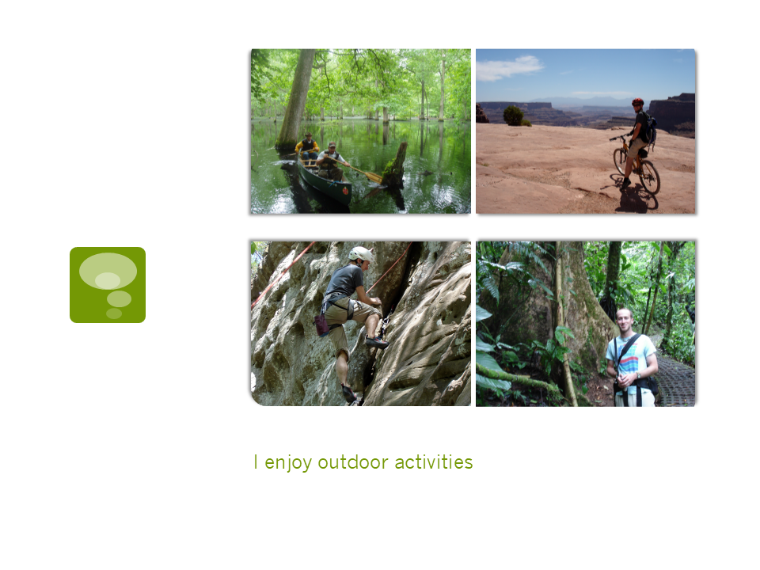{.lightbox group="business-concept" fig-alt="Presentation slide introducing the idea of selecting a location for an outdoor adventure business."}

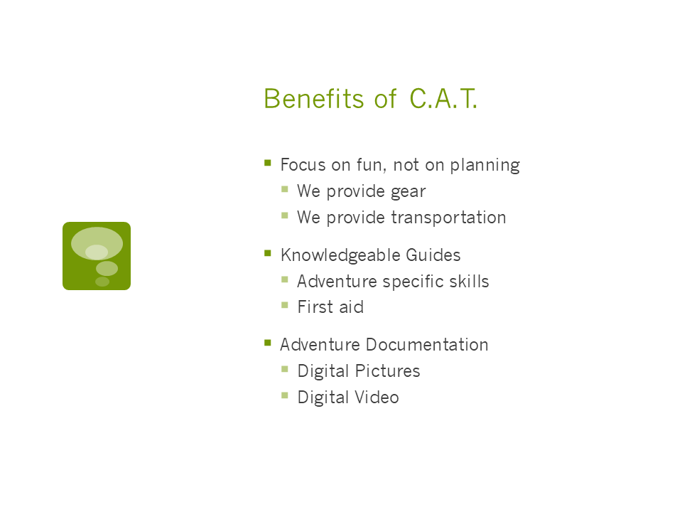{.lightbox group="business-concept" fig-alt="Presentation slide explaining that the outdoor guiding business concept grew from an interest in outdoor recreation."}

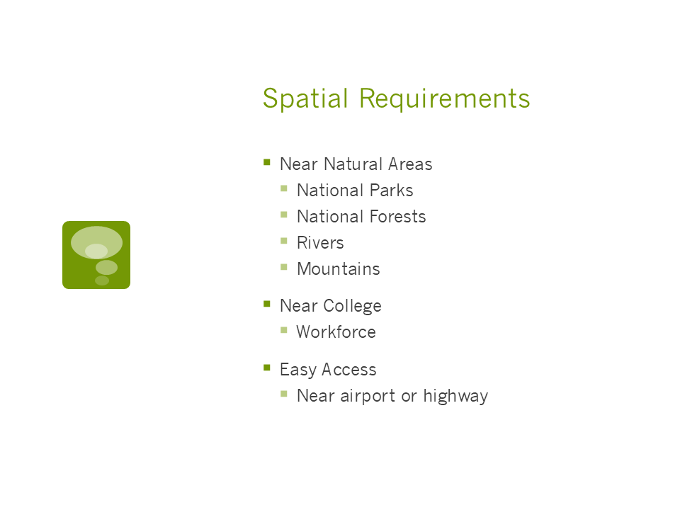{.lightbox group="business-concept" fig-alt="Presentation slide listing guided-trip benefits including gear, transportation, trained guides, first aid, and trip documentation."}

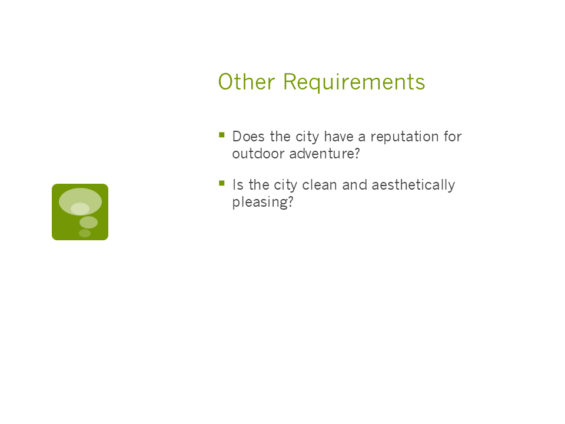{.lightbox group="business-concept" fig-alt="Presentation slide listing spatial requirements such as proximity to national parks, forests, rivers, mountains, colleges, airports, and highways."}

:::

## Building the Suitability Criteria

I developed the suitability criteria by combining market characteristics, workforce needs, accessibility, environmental setting, and quality-of-life measures.

The primary criteria included:

- a likely client population between approximately 45 and 60 years old;
- participation by both men and women;
- higher income and college education;
- proximity to national parks, national forests, rivers, mountains, and other outdoor amenities;
- access by airport or highway;
- proximity to a college that could provide a workforce;
- a reputation for outdoor recreation;
- a clean and visually appealing setting;
- relatively short commute times;
- manageable population size;
- lower pollution;
- reasonable cost of living.

The original presentation included highlighted excerpts from market-research sources describing adventure travelers as both men and women, generally ages 45–60, and college educated. I no longer have enough documentation to identify or verify those sources, so I treat those criteria as part of the project’s historical context rather than as current market evidence.

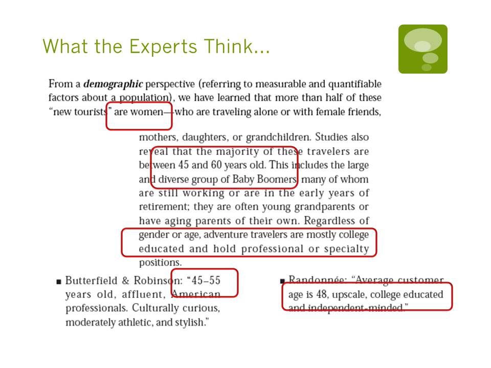{.lightbox group="business-concept" fig-alt="Slide with highlighted excerpts from unidentified historical sources describing adventure-travel participants as men and women, generally ages 45 to 60, with college education."}

## Selecting Candidate Cities

I used historical *Outside* magazine “Best Places to Live” lists to narrow the initial set of possibilities to four locations:

- Bend, Oregon;
- Bishop, California;
- Durango, Colorado;
- Knoxville, Tennessee, used as a comparison location.

Each location was evaluated through a combination of maps, demographic measures, transportation access, environmental characteristics, and outdoor-recreation context.

::: {layout-ncol=3}

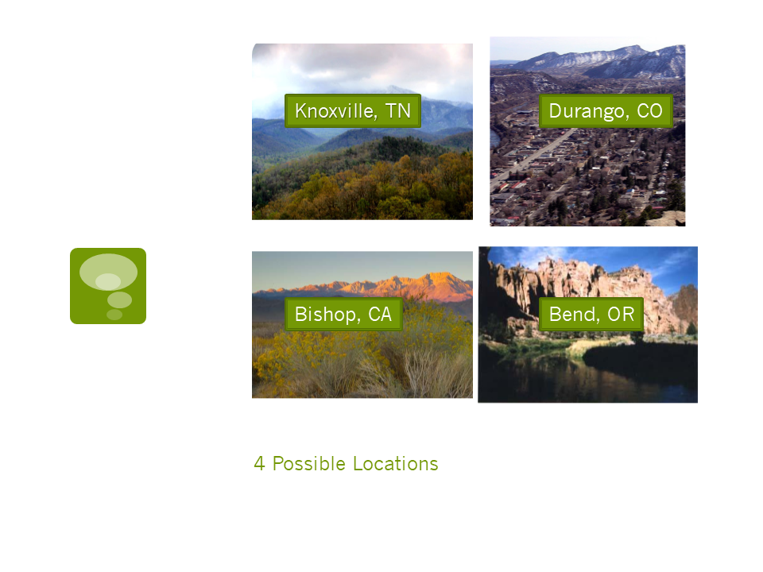{.lightbox group="candidate-cities" fig-alt="Presentation slide identifying Bend, Bishop, Durango, and Knoxville as the four candidate locations."}

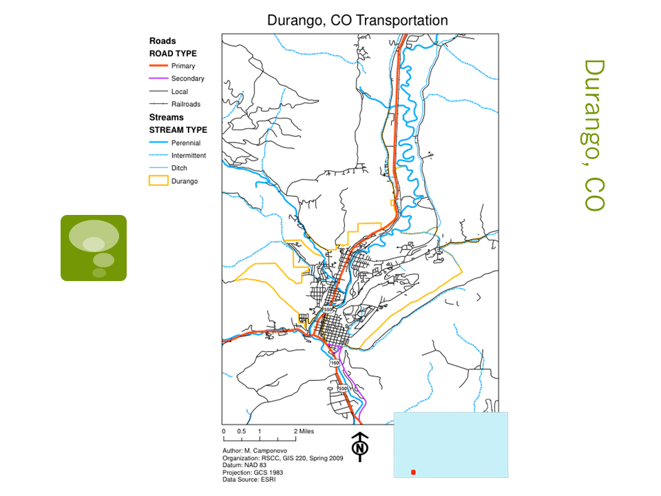{.lightbox group="candidate-cities" fig-alt="Map of Durango, Colorado, used in the outdoor business suitability comparison."}

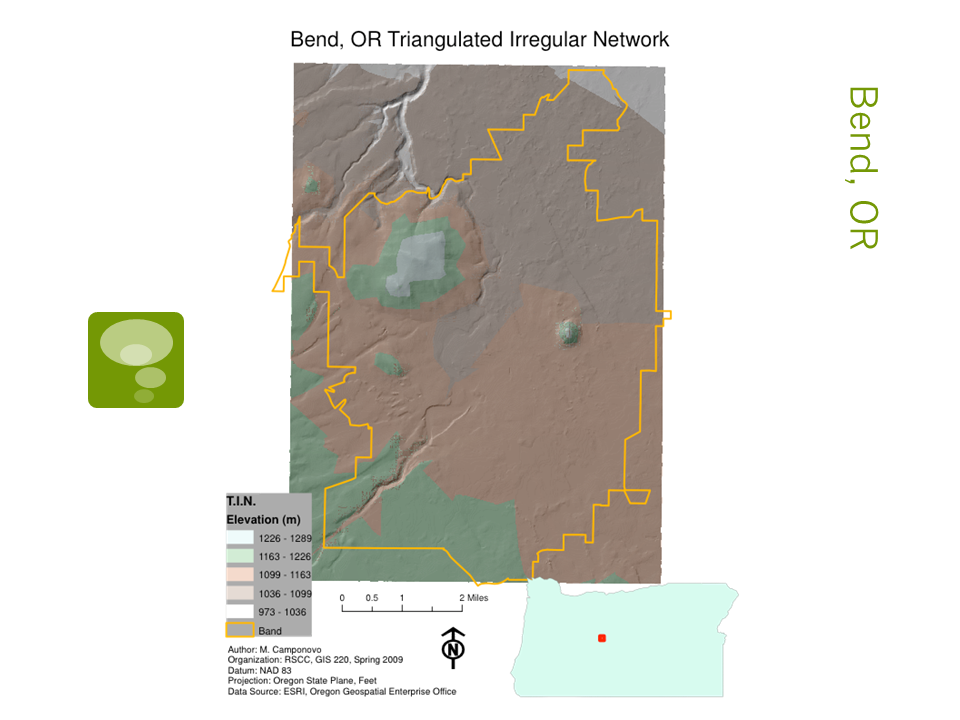{.lightbox group="candidate-cities" fig-alt="Map of Bend, Oregon, used in the outdoor business suitability comparison."}

:::

## Comparing the Cities

I created roughly a dozen maps for each candidate location. These maps highlighted natural features, transportation networks, aerial imagery, and other location characteristics.

I also compared demographic and quality-of-life measures using a simple ordinal scoring system. For most criteria, each city received a score from 1 to 4, with 4 representing the strongest result. I assigned negative values to measures where a higher value was considered a disadvantage, including total population and pollution.

The positive criteria included:

- percentage of workers commuting less than 30 minutes;
- household income;
- educational attainment;
- size of the potential employee pool;
- size of the potential client pool.

The negative criteria included:

- total population;
- pollution ranking.

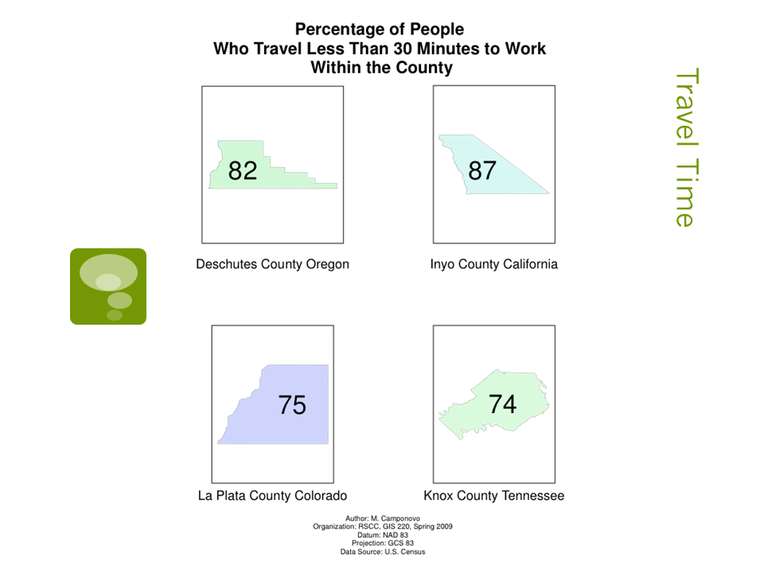{.lightbox group="city-comparison" fig-alt="Chart comparing the percentage of workers with commutes shorter than 30 minutes in the four candidate locations."}

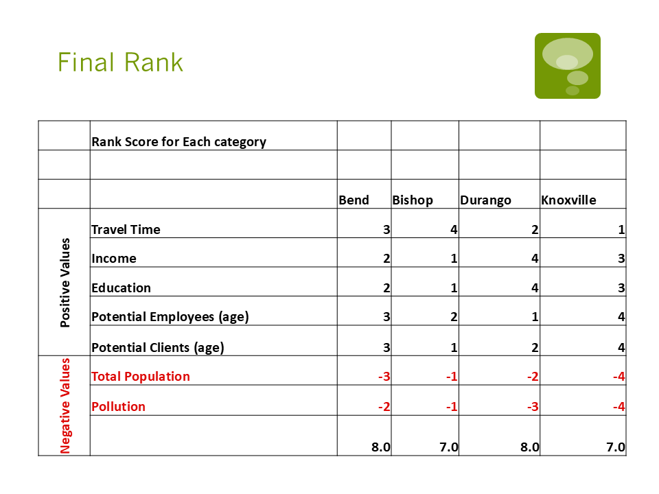{.lightbox group="city-comparison" fig-alt="Final ranking table comparing Bend, Bishop, Durango, and Knoxville across positive and negative suitability criteria."}

The final scores were:

| Location | Final score |
|---|---:|
| Bend, Oregon | 8 |
| Durango, Colorado | 8 |
| Bishop, California | 7 |
| Knoxville, Tennessee | 7 |

This was a straightforward ordinal ranking rather than a statistically calibrated weighted model. Every category contributed equally to the final score.

## Resolving the Bend–Durango Tie

Bend and Durango tied for the highest overall score, so I conducted an additional comparison.

I examined the visible amount of green and natural space surrounding each city and confirmed that both had nearby colleges with outdoor-recreation programs. Those programs could support a steady workforce while giving students opportunities to earn money and possibly receive academic credit.

The final tie-breaker was cost of living. At the time of the project:

- Durango was estimated to be 66% more expensive than Knoxville;
- Bend was estimated to be 42% more expensive than Knoxville.

Based on the lower relative cost of living, I selected **Bend, Oregon** as the strongest overall location.

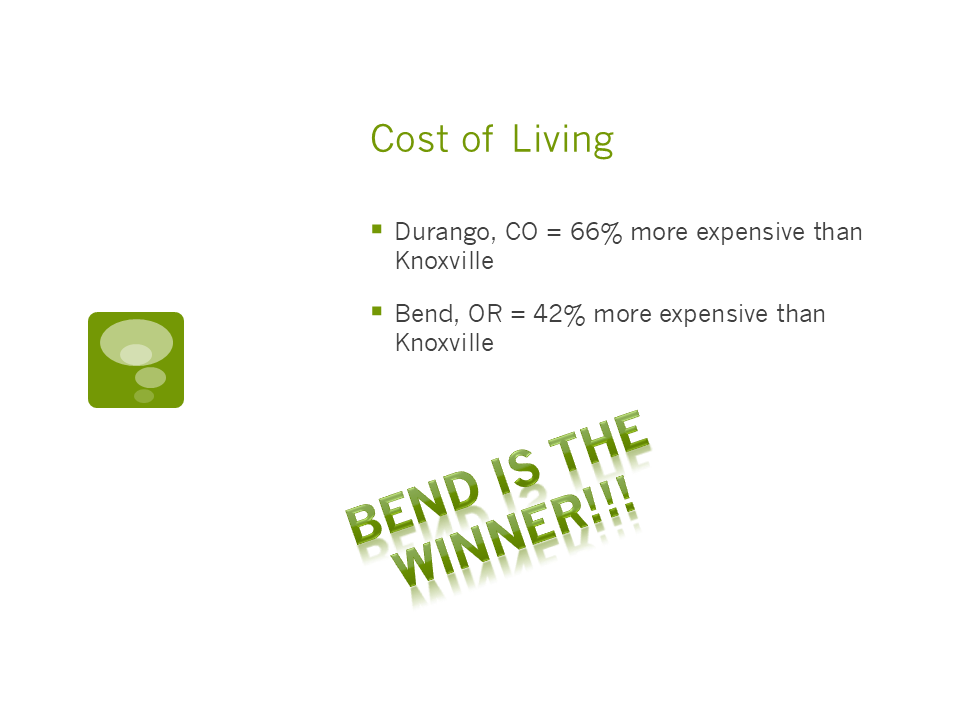{.lightbox group="bend-site-selection" fig-alt="Presentation slide comparing the cost of living in Bend and Durango relative to Knoxville and naming Bend as the preferred city."}

## Selecting a Site Within Bend

After choosing Bend, I conducted a second-stage analysis to identify suitable areas within the city.

I contacted the Bend GIS department and requested zoning data. I then combined that information with U.S. Census block-group data describing:

- household income;
- educational attainment;
- target client population.

I ranked the block groups using those demographic measures, identified the highest-ranked areas, and then compared them with commercial zoning.

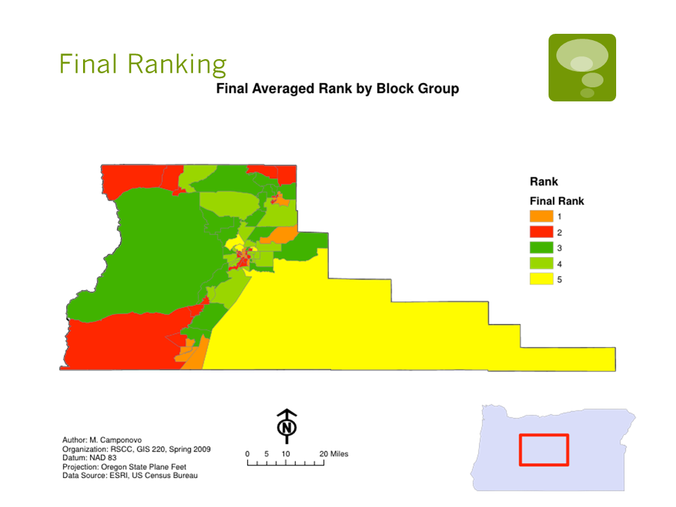{.lightbox group="bend-site-selection" fig-alt="Map showing the final demographic suitability ranking of Census block groups in Bend, Oregon."}

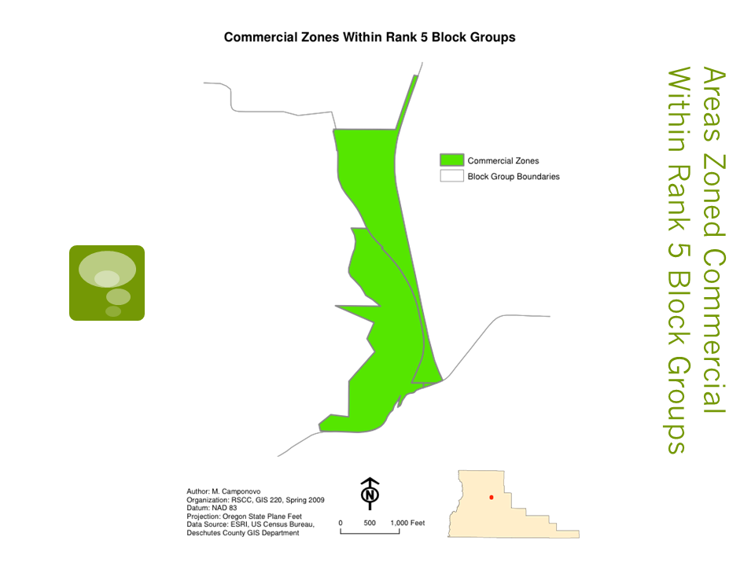{.lightbox group="bend-site-selection" fig-alt="Map showing commercially zoned areas within the top-ranked Census block groups in Bend, Oregon."}

This process identified two commercially zoned areas within the highest-ranked block groups as potential locations for Camponovo Adventure Travel.

## Final Recommendation

The analysis recommended **Bend, Oregon** as the strongest city for the hypothetical business.

Bend combined:

- access to outdoor amenities;
- a strong outdoor-recreation identity;
- a suitable client profile;
- access to a potential college-based workforce;
- reasonable transportation access;
- a lower estimated cost of living than Durango.

Within Bend, the second-stage analysis identified commercially zoned areas that also fell within the strongest demographic block groups.

## What I Learned

This project was my first experience developing an end-to-end suitability analysis around a self-defined business problem.

It required me to:

- translate a business idea into measurable spatial criteria;
- find and evaluate multiple external datasets;
- compare locations at regional and local scales;
- create maps for four candidate cities;
- develop a scoring system;
- resolve a tie using additional qualitative and quantitative criteria;
- contact a local government GIS office for data;
- combine demographic suitability with zoning;
- present a clear recommendation.

The project also showed me that suitability analysis involves more than producing a final ranked map. The analyst must decide which variables matter, how they should be measured, how they should be combined, and what limitations affect the recommendation.

## Looking Back

The project was ambitious for an early GIS course and successfully connected demographic analysis, business planning, cartography, and site selection. Its strongest feature was the two-stage workflow: first selecting a city, then narrowing the recommendation to commercially zoned areas within that city.

There are several things I would approach differently today:

- use more inclusive and better-documented market research;
- distinguish more carefully between county-, city-, block-group-, and parcel-level data;
- document the sources and dates of pollution and cost-of-living measures;
- apply explicit weights based on business priorities;
- test how sensitive the result is to changes in weights and rankings;
- validate the recommendation with current market and competitive data.

Even with those limitations, the project remains an important example of my early development as a GIS analyst. It shows the transition from making individual maps to designing a complete analytical workflow that supported a practical recommendation.
