## Project Overview

This individual final project was completed for **GIS 211: Internet Mapping** at Roane State Community College during spring 2009.

The project used Glacier National Park as a study area for exploring how the same GIS data could be prepared and delivered through several early internet-mapping environments:

- Esri ArcIMS;
- Esri ArcExplorer and ArcReader;
- Google Earth.

ArcMap was used to prepare shapefiles, raster layers, terrain products, and finished cartographic layouts. Those datasets were then adapted for use in desktop viewers, Google Earth, and a browser-based ArcIMS application.

The primary purpose was not simply to create maps of Glacier National Park. It was to compare how different platforms handled:

- map display;
- raster and vector performance;
- layer organization;
- symbology;
- navigation;
- feature identification;
- attribute access;
- spatial and attribute queries;
- public usability.

The project also produced a set of themed print layouts documenting the source cartography behind the internet maps.

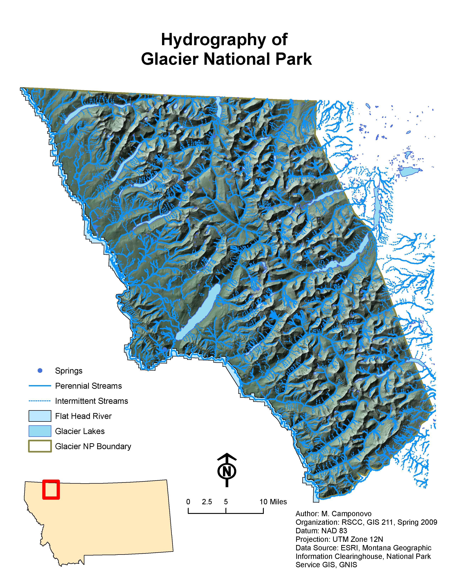{.lightbox group="glacier-project" fig-alt="Hydrography map of Glacier National Park showing springs, perennial and intermittent streams, the Flathead River, lakes, the park boundary, and shaded relief."}

## Project Context

Glacier National Park was selected because it offered a complex combination of:

- steep terrain;
- extensive hydrography;
- roads and trails;
- lodges, cabins, ranger stations, and campgrounds;
- wilderness areas;
- natural features;
- numerous raster and vector data sources.

That variety made the park a useful test case for comparing internet-mapping technologies.

The project also documented basic visitor information about the park, including its history, lodging, recreation opportunities, and seasonal access. That content provided context for the geographic features included in the maps.

## Data Collection

Data were assembled from several sources.

### Esri and U.S. Census Bureau

Esri basemap data were used for state and county boundaries.

TIGER shapefiles for Glacier and Flathead counties supplied:

- roads;
- hydrography;
- lakes;
- county boundaries.

### National Park Service GIS

More detailed park data came from the National Park Service GIS server.

The available layers included:

- park boundary;
- roads;
- trails;
- streams;
- lakes;
- wilderness areas;
- the Continental Divide.

Metadata files were downloaded when available.

### Geographic Names Information System

The National Park Service data did not include every point of interest needed for the project.

GNIS records were used to create layers for features such as:

- campgrounds;
- cabins;
- ranger stations;
- arches;
- springs;
- waterfalls;
- summits.

### Raster and Elevation Data

Raster and terrain data came from:

- GIS Data Depot;
- Montana Geographic Information Clearinghouse.

The collected raster products included:

- Digital Elevation Models;
- color Digital Orthophoto Quarter Quadrangles;
- Digital Raster Graphics.

## Preparing the Data

All downloaded files were organized within a predefined folder structure.

ArcCatalog was used to:

- check coordinate systems;
- define missing projections;
- import available metadata;
- rename files for clarity.

National Park Service data stored as ArcInfo `.e00` interchange files were converted into shapefiles using Esri Import 71.

### Merging County Data

TIGER datasets for Glacier and Flathead counties were merged to create seamless layers around the park.

Additional fields were added where needed to support symbology.

### Creating Point-of-Interest Layers

GNIS records were imported into Microsoft Excel, sorted by feature type, and cleaned of unnecessary fields.

The resulting tables were exported as CSV files and added to ArcMap as XY data.

**Select by Attribute** was then used to create separate shapefiles for the different feature classes.

### Coordinate System

Because the project data would ultimately be delivered through ArcIMS, the datasets were converted into a common coordinate system:

**NAD 83 UTM Zone 12N**

An identical folder structure was created for the projected copies.

## Raster Processing and Terrain Products

### Color DOQQ Imagery

Color DOQQ imagery for the park was merged in Global Mapper.

Attempts to clip the merged imagery to the park boundary repeatedly caused both Global Mapper and ArcMap to crash. The full mosaic was therefore retained for the project.

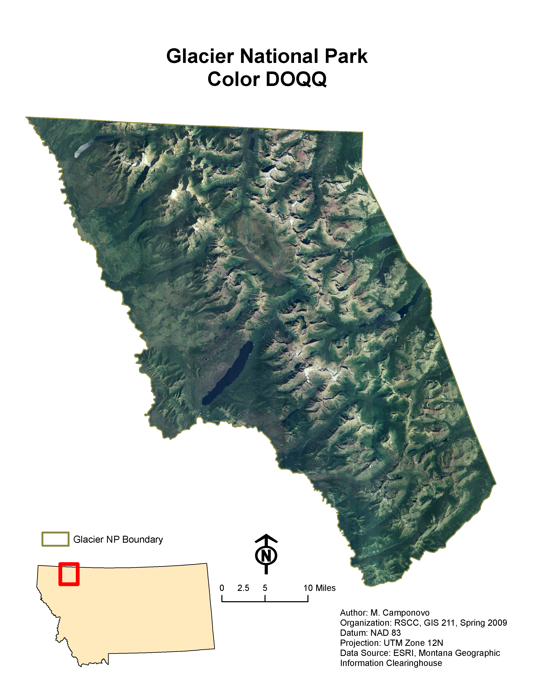{.lightbox group="glacier-project" fig-alt="Color aerial imagery mosaic covering Glacier National Park and clipped visually to the park boundary."}

### Digital Raster Graphics

Nearly 50 Digital Raster Graphics were used.

Although the files were described as collarless, they still included white borders. When displayed together, those borders covered neighboring quadrangles and created visible gaps.

Clipping each raster separately was not practical, so white was changed to **No Color** in ArcMap. That allowed adjacent quadrangles to display together, although it also made white map features transparent.

A white USGS quadrangle layer was placed beneath the DRGs to restore the appearance of white areas.

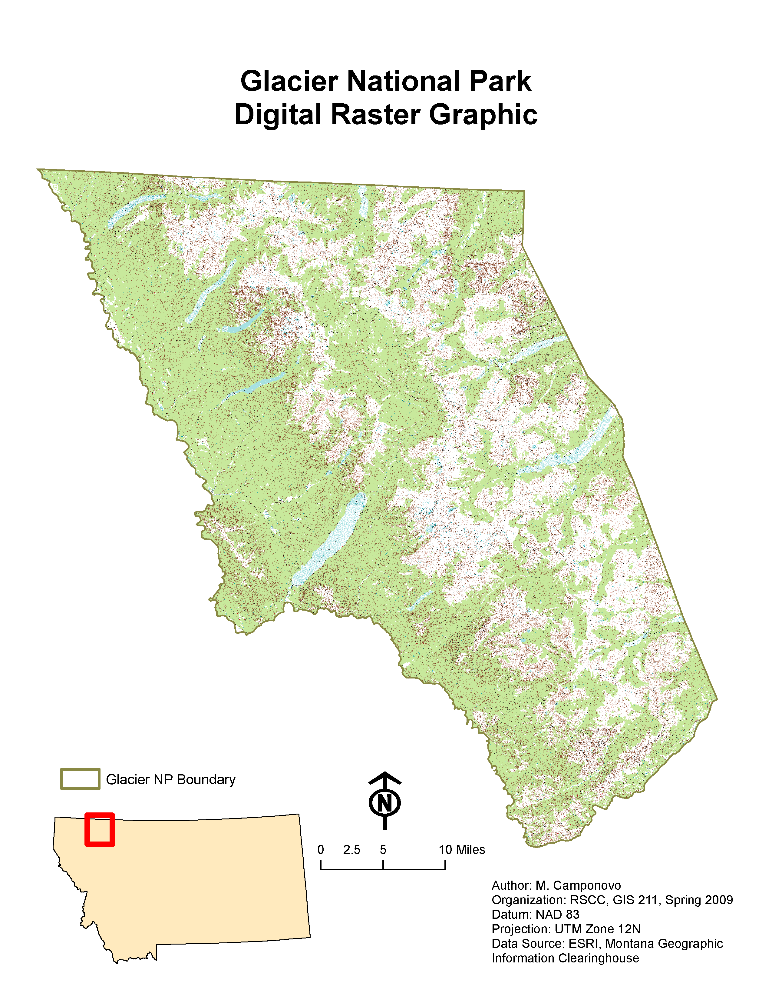{.lightbox group="glacier-project" fig-alt="Mosaic of digitized USGS topographic maps covering Glacier National Park."}

### Elevation Processing

DEM files were converted using the GIS Data Depot’s SDTS2DEM utility.

The DEMs were then:

1. mosaicked;
2. clipped to the park boundary;
3. processed with Spatial Analyst and 3D Analyst.

Derived products included:

- hillshade;
- Triangulated Irregular Network;
- 50-foot contours;
- 100-foot contours;
- 200-foot contours.

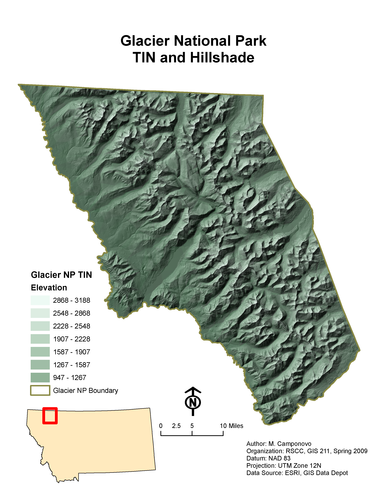{.lightbox group="glacier-project" fig-alt="Triangulated Irregular Network elevation classes displayed over hillshade for Glacier National Park."}

## Final Cartographic Layouts

Eight thematic layouts were planned using a consistent design.

Each layout included:

- title;
- main data frame;
- locator map;
- north arrow;
- scale bar;
- legend;
- author;
- date;
- organization;
- datum;
- projection;
- data sources.

The surviving final layouts document seven of those themes.

### Hydrography

The hydrography layout combined springs, perennial and intermittent streams, the Flathead River, park lakes, the park boundary, and shaded relief.

{.lightbox group="glacier-project" fig-alt="Hydrography map of Glacier National Park showing springs, perennial and intermittent streams, the Flathead River, lakes, the park boundary, and hillshade."}

### Roads and Railroads

The roads layout distinguished paved and unpaved roads and included nearby railroads.

Major routes were labeled, including:

- Going-to-the-Sun Road;
- Many Glacier Road;
- Chief Mountain Highway;
- Two Medicine Road;
- Camas Road;
- Inside North Fork Road;
- U.S. Highway 2;
- U.S. Highway 89.

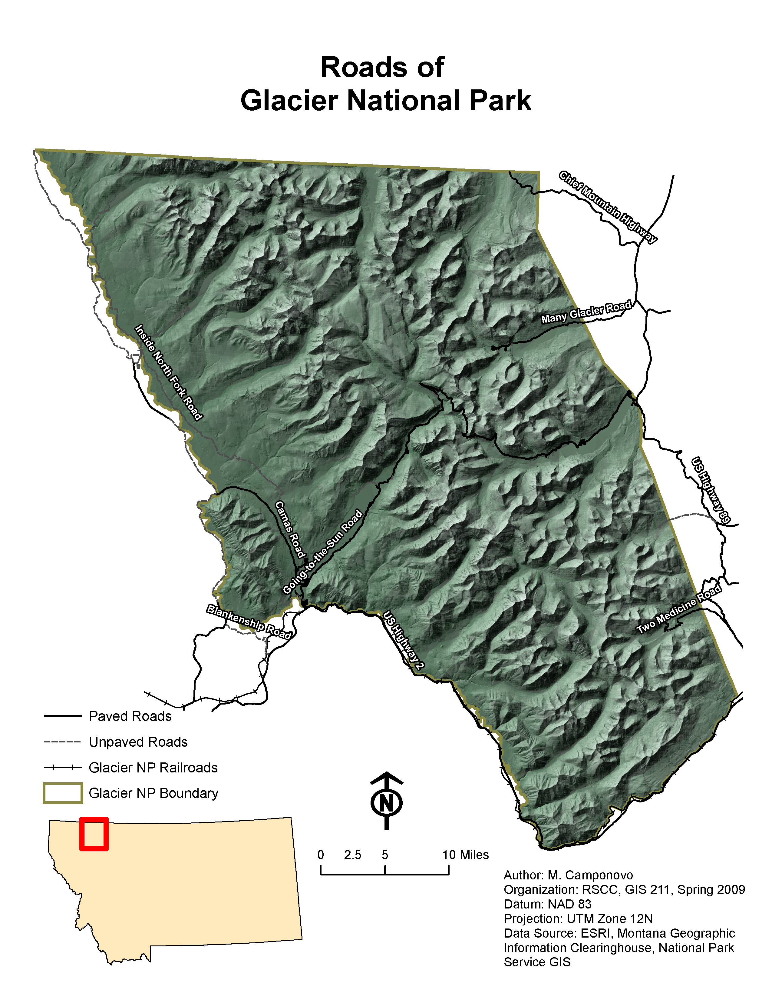{.lightbox group="glacier-project" fig-alt="Road map of Glacier National Park showing paved roads, unpaved roads, railroads, major road labels, the park boundary, and shaded relief."}

### Trails

The trails layout showed the distribution of the park’s extensive trail system over hillshade.

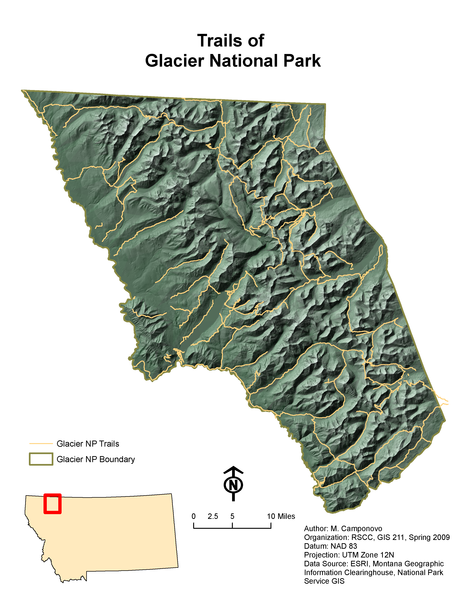{.lightbox group="glacier-project" fig-alt="Trail network of Glacier National Park displayed over shaded relief."}

### Buildings and Visitor Facilities

The buildings layout mapped ranger stations, campgrounds, and cabins.

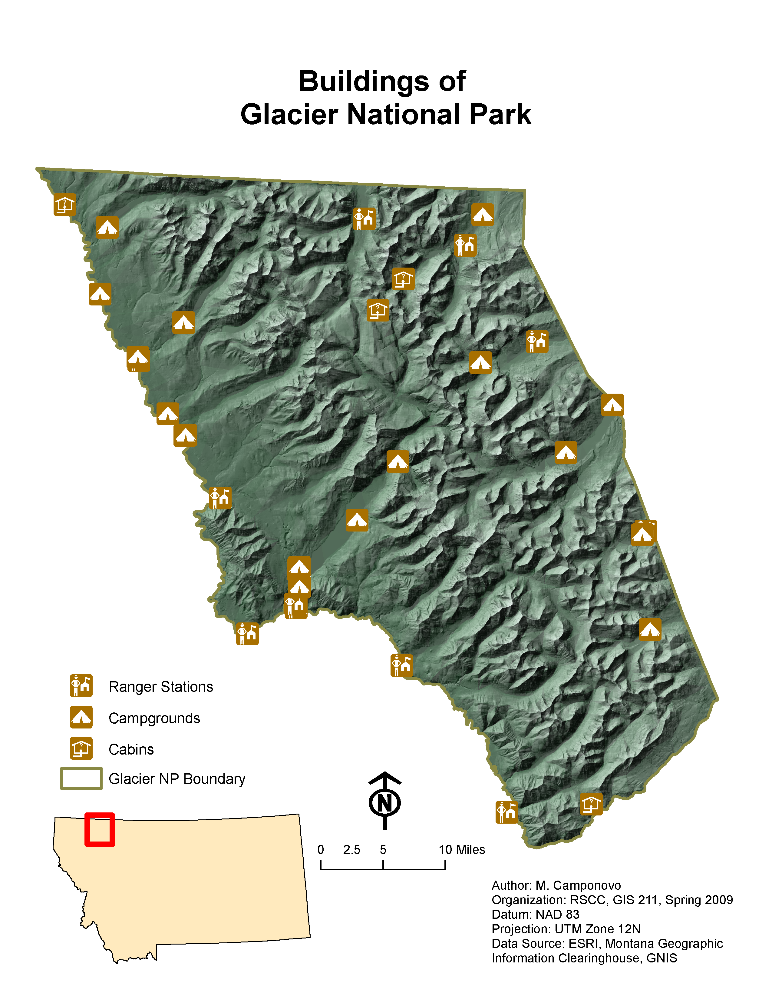{.lightbox group="glacier-project" fig-alt="Map of Glacier National Park showing ranger stations, campgrounds, cabins, the park boundary, and shaded relief."}

### Additional Raster Layouts

The color DOQQ, Digital Raster Graphic, and TIN-and-hillshade layouts documented the major raster and terrain products used by the project.

## ArcExplorer and ArcReader

The free Esri ArcExplorer Java Edition was tested as one possible delivery platform.

### Strengths

ArcExplorer and ArcReader could display many project datasets without requiring a full ArcGIS Desktop license.

Several advantages of these platforms:

- an intuitive interface;
- a useful Identify tool;
- access to full feature attributes;
- support for many raster and vector datasets;
- reasonable user control for a free application.

### Limitations

Loading all raster and feature layers made ArcExplorer slow and unresponsive.

Performance improved after raster datasets were removed.

Other issues included:

- reference scales were not carried over reliably;
- attempts to recreate reference-scale behavior reduced performance;
- some properly projected data occasionally appeared on the wrong side of the globe.

The report also noted that the experience may have differed if all data had first been converted to KML.

## Google Earth

Google Earth provided the most familiar and visually engaging platform for general users.

ArcMap’s export tools were used to create KML and KMZ files while retaining much of the layer organization and symbology.

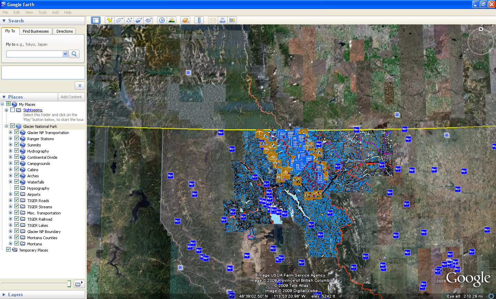{.lightbox group="glacier-project" fig-alt="Glacier National Park GIS layers displayed over satellite imagery in Google Earth, including hydrography, visitor facilities, transportation, and other features."}

### Strengths

Google Earth offered:

- high-quality imagery;
- a familiar interface;
- broad public adoption;
- existing geotagged photographs and other content;
- straightforward point and polygon identification;
- visually engaging regional context.

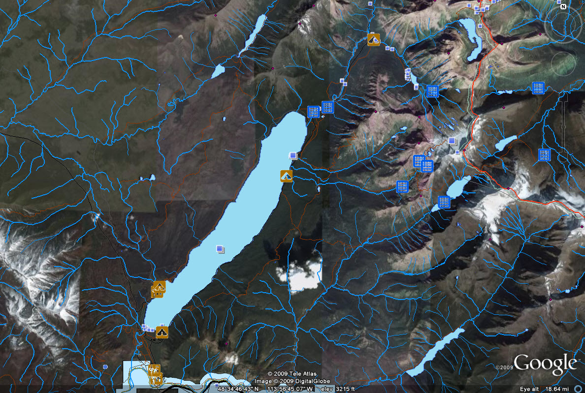{.lightbox group="glacier-project" fig-alt="Detailed Google Earth view of Glacier National Park showing lakes, streams, roads, trails, cabins, campgrounds, and other point features over satellite imagery."}

### Placemark Identification

Point features could be inspected and edited as placemarks.

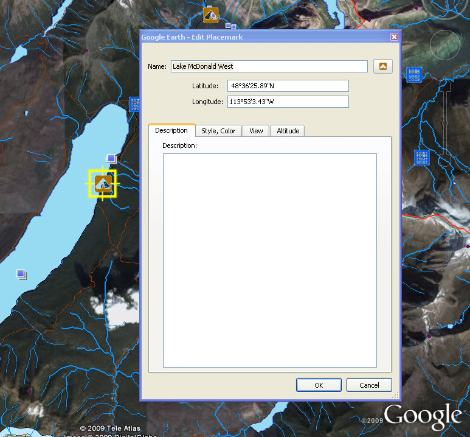{.lightbox group="glacier-project" fig-alt="Google Earth placemark editing window showing a named Glacier National Park feature and its latitude and longitude."}

### Limitations

Google Earth was less useful for advanced GIS interaction.

Some specific limitations included:

- line features such as trails and streams were difficult to identify;
- attribute information was limited;
- query tools were not apparent;
- GIS power users had less analytical control than in ArcIMS or ArcExplorer.

For casual users, those limitations may have mattered less than the visual quality and familiarity of the interface.

## ArcIMS Web Map

ArcIMS was Esri’s earlier web-map server technology.

The project used the **MXD to AXL converter** to build the initial ArcIMS configuration.

The resulting application included:

- a browser-based map;
- locator map;
- layer controls;
- active-layer selection;
- zoom and pan tools;
- Identify;
- selection tools;
- attribute queries;
- returned attribute tables.

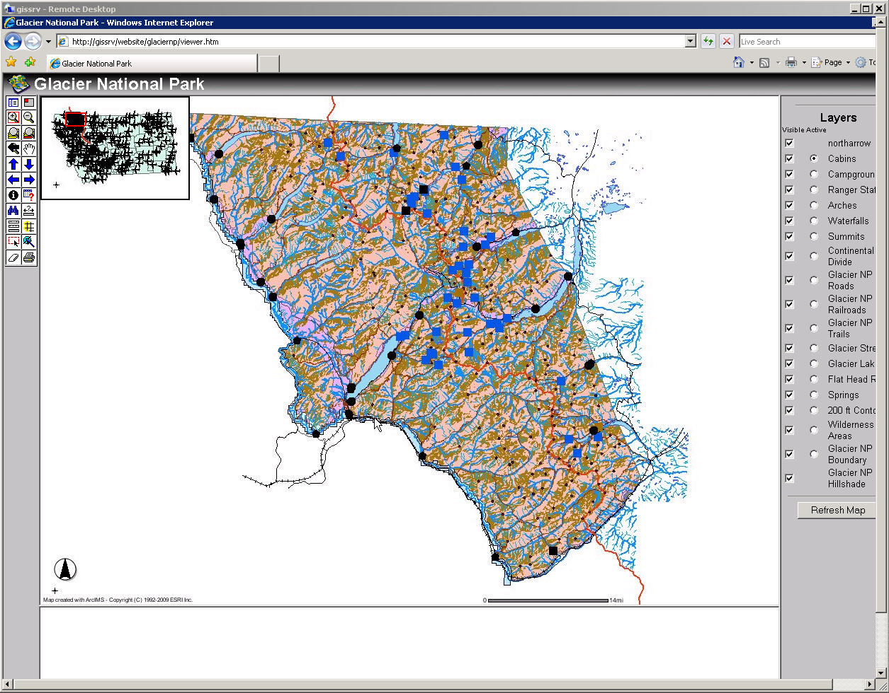{.lightbox group="glacier-project" fig-alt="Browser-based ArcIMS application showing Glacier National Park layers, a locator map, navigation tools, and selectable layer controls."}

### Layer Display and Navigation

The ArcIMS application supported views ranging from statewide context to detailed terrain and facility mapping.

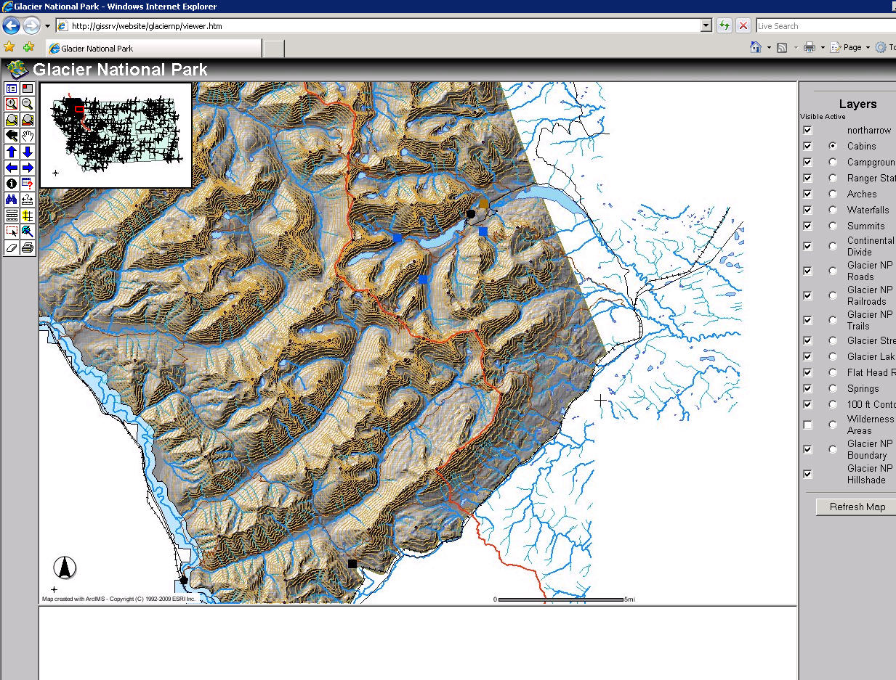{.lightbox group="glacier-project" fig-alt="Detailed ArcIMS view of Glacier National Park showing terrain, lakes, streams, roads, and closely spaced contour lines."}

A locator map helped users understand their position when zoomed into the park.

That feature was identified as an advantage over the other platforms.

### Feature Identification

ArcIMS retained feature attributes and supported identification of narrow or small features.

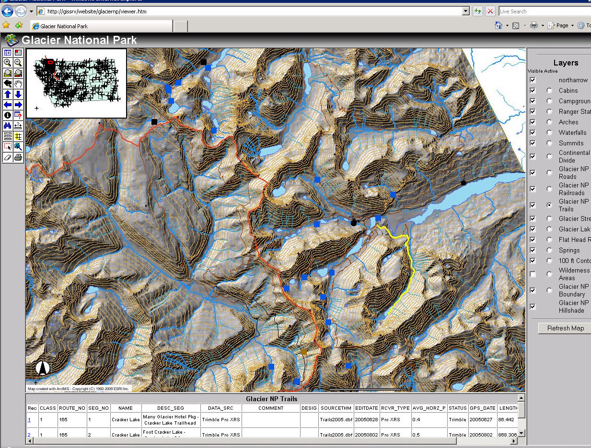{.lightbox group="glacier-project" fig-alt="ArcIMS map showing a selected trail segment and its returned attribute-table records."}

### Attribute Queries

ArcIMS allowed users to construct queries similar to **Select by Attribute** in ArcMap.

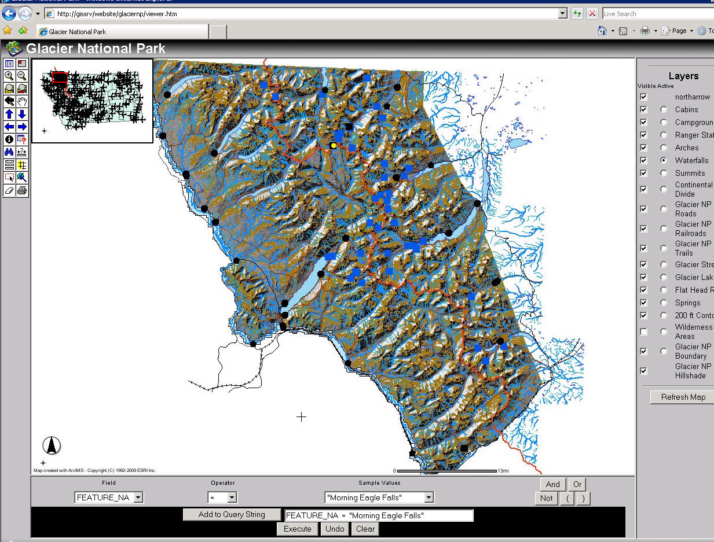{.lightbox group="glacier-project" fig-alt="ArcIMS query interface selecting a named waterfall from the feature-name field."}

The ability to choose an active layer and draw a box around features also made it easier to select roads, streams, and trails than in Google Earth.

### Limitations

ArcIMS had several technical and design limitations:

- the default interface appeared dated;
- special ArcMap symbology did not always convert successfully;
- the TIN did not import;
- large DOQQ and DRG datasets were not included because of file size;
- some configuration issues might have required additional work in ArcIMS Author.

Despite those limitations, ArcIMS provided the strongest GIS-oriented query and attribute functionality of the tested platforms.

## Comparing the Platforms

| Platform | Primary Strength | Main Limitation |
|---|---|---|
| ArcExplorer / ArcReader | Familiar GIS-style viewing and strong feature identification | Performance problems with large raster and vector collections |
| Google Earth | Visual appeal, imagery, public familiarity, and easy KML/KMZ sharing | Limited attribute access and querying |
| ArcIMS | Browser delivery, locator map, active layers, attribute queries, and feature selection | Older interface and more complicated configuration |

No single platform performed best in every category.

The comparison showed that platform choice depended on the intended audience:

- casual visitors benefited from Google Earth’s imagery and familiarity;
- GIS users benefited from ArcIMS querying and ArcExplorer attribute access;
- large raster collections created performance challenges across the available technology.

## Technical Challenges

Several difficulties became important parts of the project.

### Large Raster Files

DOQQ mosaics were too large to clip reliably, and the many DRGs required a display workaround.

The raster datasets also reduced ArcExplorer performance and were omitted from ArcIMS because of their size.

### Legacy Data Formats

National Park Service `.e00` files required conversion before use.

### Projection Consistency

All ArcIMS data had to be converted into one coordinate system to reduce display problems.

### Symbology Conversion

The MXD-to-AXL conversion worked better with default symbology than with specialized symbols.

### Platform Differences

The same dataset behaved differently across ArcMap, ArcExplorer, Google Earth, and ArcIMS.

Reference scales, attributes, queries, symbology, and raster performance did not transfer consistently.

## What I Learned

This project provided experience with:

- planning an individual internet-mapping project;
- acquiring data from multiple agencies;
- managing metadata and coordinate systems;
- converting legacy GIS formats;
- preparing GNIS point data;
- merging county datasets;
- mosaicking imagery and elevation data;
- troubleshooting raster collars;
- creating hillshade, TINs, and contours;
- designing consistent thematic layouts;
- exporting KML and KMZ;
- configuring an ArcIMS web application;
- comparing user interfaces and platform capabilities;
- evaluating technology for different audiences.

The most important lesson was that publishing GIS data is not simply a matter of moving an ArcMap document to another platform.

Each platform imposed its own requirements and tradeoffs involving:

- performance;
- symbology;
- attributes;
- interaction;
- data formats;
- scale behavior;
- user expectations.

## Looking Back

This project captures a transitional period in web GIS.

ArcIMS represented a server-based browser map with strong GIS interaction. ArcExplorer and ArcReader offered free desktop access to spatial data. Google Earth emphasized imagery, public accessibility, and KML-based sharing.

A modern version of the project would likely use hosted feature layers, vector tiles, responsive web maps, pop-ups, web-based filtering, and cloud-hosted imagery. Many of the conversion and performance problems would be approached differently.

Even so, the project addressed questions that remain relevant:

- Who is the intended user?
- How much GIS functionality does that user need?
- Which attributes must remain accessible?
- How should large raster datasets be delivered?
- What is lost when data move between platforms?
- How should interface design balance simplicity and analytical power?

Those questions make the project more than a collection of historical software screenshots. It documents an early effort to evaluate web GIS as a communication and data-delivery system.
