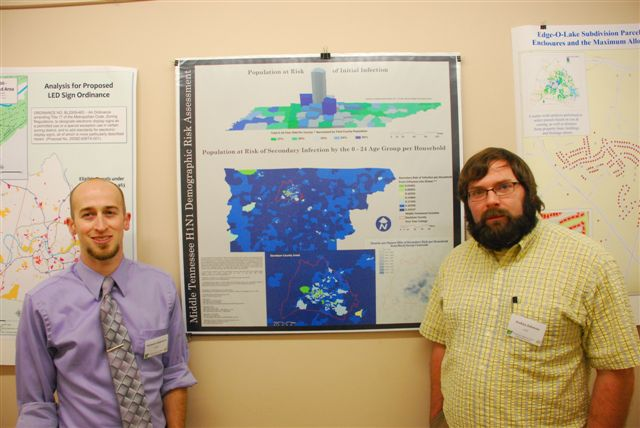
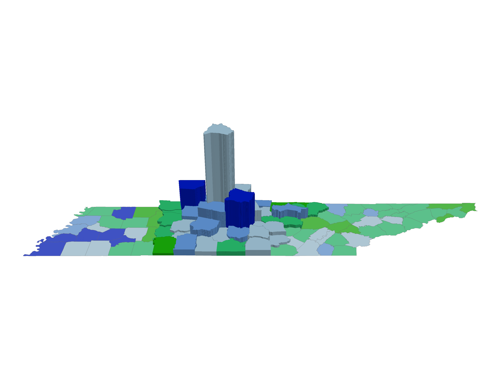
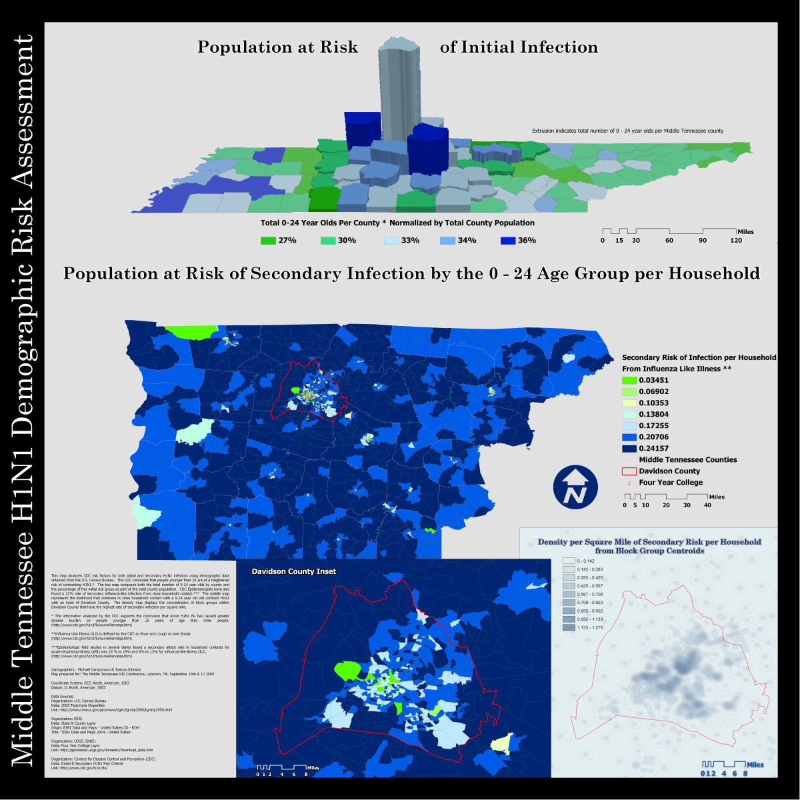

## Project Overview

This project was created independently outside regular class time for presentation in the poster competition at the **2009 Middle Tennessee GIS Users Group Forum** in Lebanon, Tennessee.

Joshua Johnson and I collaborated on a demographic risk-assessment poster related to the 2009 H1N1 outbreak. The project combined U.S. Census demographic data with risk criteria cited from the Centers for Disease Control and Prevention.

The poster included four related views:

1. a county-level assessment of the population potentially at risk of initial infection;
2. a block-group assessment of estimated secondary infection risk within households;
3. a detailed inset of Davidson County;
4. a density surface showing the concentration of estimated secondary risk within Davidson County.

ArcMap was used to prepare and analyze the data. ArcScene was used to create a 3D representation of county-level risk, and the exported maps were assembled into the final poster using image-editing software.

{.lightbox group="h1n1-project" fig-alt="Two student cartographers standing beside their H1N1 demographic risk-assessment poster at a GIS conference."}

## Why We Created the Poster

This project was not a required course assignment.

Joshua and I decided to develop it because we wanted to create a conference poster that responded to a current public-health concern while demonstrating GIS, demographic analysis, and 3D cartography.

The 2009 H1N1 outbreak was receiving significant public attention, and the CDC had identified people younger than 25 as experiencing a greater disease burden than older age groups.

Because the event was held in Middle Tennessee, the poster emphasized that region while still showing statewide context.

## Collaboration and Division of Work

This was a collaborative project. I completed the county-level initial-risk map, including the ArcScene extrusion of Middle Tennessee counties.

Joshua completed the block-group analysis used for the middle map, Davidson County inset, and density surface.

## Data Sources

The poster identifies several data sources:

- U.S. Census Bureau 2008 TIGER/Line shapefiles;
- Esri state and county data;
- USGS Geographic Names Information System data for four-year colleges;
- CDC information describing initial and secondary H1N1 risk criteria.

The analysis used demographic and geographic data available in 2009.

This page documents the original historical project. It should not be interpreted as current public-health guidance or a validated epidemiological model.

## Population at Risk of Initial Infection

The top map focused on people aged 0–24.

For each county, the number of residents aged 0–24 was normalized by the county’s total population.

The mapped value can be described as:

\[
\text{initial-risk population share}
=
\frac{\text{population age 0–24}}{\text{total county population}}
\]

The result represented the percentage of each county’s population that fell within the age group identified by the CDC as having experienced a greater H1N1 disease burden.

### 3D Emphasis on Middle Tennessee

The conference was held in Middle Tennessee, so the final map intentionally treated that region differently.

- East Tennessee and West Tennessee counties remained flat.
- Middle Tennessee counties were extruded vertically in ArcScene.
- Counties with a higher percentage of residents aged 0–24 appeared taller.

The vertical dimension therefore reinforced the choropleth classification.

{.lightbox group="h1n1-project" fig-alt="Draft 3D ArcScene map of Tennessee counties in which Middle Tennessee counties are extruded according to the percentage of residents aged 0–24."}

The map combined two related variables:

- color represented the normalized percentage of residents aged 0–24;
- extrusion height emphasized that same value for Middle Tennessee counties.

This approach made the regional focus visible without removing statewide context.

## Estimated Secondary Infection Risk

The middle map was titled **Population at Risk of Secondary Infection by the 0–24 Age Group per Household**.

It used block-group data for Middle Tennessee and incorporated a 12% secondary influenza-like infection rate cited in the original research.

The surviving files do not include the source data or field-calculation expression used to create this measure.

The most plausible reconstruction is that the calculation combined:

- the population aged 0–24;
- household counts or household-related demographic data;
- the cited 12% rate of secondary infection from close household contact.

> The middle map estimated potential secondary influenza-like infection associated with household contact involving people aged 0–24. The original analysis incorporated block-group demographic data and a 12% secondary-infection rate cited in the project research, but the exact field-calculation expression has not survived.

## Davidson County Inset

Davidson County was shown in greater detail because its high concentration of block groups made the regional pattern difficult to interpret at the full Middle Tennessee scale.

The inset enlarged the block-group analysis and made the local variation within the county more visible.

The inset also showed major transportation and institutional features that helped orient the reader.

## Density of Estimated Secondary Risk

The lower-right map displayed the **density per square mile of secondary risk per household** within Davidson County.

The map was created from block-group centroids weighted by the secondary-risk value.

The likely workflow was:

1. calculate or retain the estimated secondary-risk value for each block group;
2. convert block groups to centroid points;
3. use the secondary-risk field as a weighting variable;
4. create a density surface;
5. display the resulting concentration pattern within Davidson County.

This is a reconstruction based on the surviving poster and project description. The original processing model has not been recovered.

## Final Poster

The final poster combined the four analytical views into one coordinated layout.

{.lightbox group="h1n1-project" fig-alt="Final poster titled Middle Tennessee H1N1 Demographic Risk Assessment, including a 3D county map, a block-group risk map, a Davidson County inset, and a density surface."}

The poster’s main text explained that:

- the analysis used CDC risk factors for initial and secondary infection;
- people younger than 25 were treated as the initial higher-risk population;
- the top map compared both total and normalized county populations aged 0–24;
- the middle map represented estimated household secondary infection;
- the lower maps focused on Davidson County and the concentration of estimated risk.

The final printed version was produced at large format for the conference poster competition.

## Poster Development

Several draft versions survive.

These files document the visual-development process:

- early 3D extrusion experiments;
- alternate color and classification choices;
- evolving map placement;
- changes to legends and text;
- refinement of the final poster hierarchy.

{.lightbox group="h1n1-project" fig-alt="Draft version of the H1N1 demographic risk-assessment poster showing an earlier arrangement of maps, legends, and explanatory text."}

## Conference Presentation and Recognition

Joshua and I presented the completed poster at the Middle Tennessee GIS Users Group Forum in Lebanon, Tennessee, in September 2009. We earned 1st place at the conference poster competition.

## Historical and Analytical Limitations

This project should be interpreted as a student cartographic analysis created during the 2009 H1N1 outbreak.

Several limitations are important.

### Public-Health Guidance Has Changed

The poster used CDC information available in 2009.

It is not current guidance and should not be used to assess present-day influenza or infectious-disease risk.

### Demographic Risk Is Not Individual Risk

The maps used aggregated demographic data.

They did not model:

- individual health conditions;
- vaccination;
- behavior;
- exposure history;
- immunity;
- household structure in full detail;
- actual reported H1N1 cases;
- transmission over time.

### Ecological Interpretation

County and block-group values describe populations within geographic units.

They should not be interpreted as predictions for a specific person.

### Secondary-Risk Formula Is Incomplete

The exact field calculation used for the secondary-risk maps has not been recovered.

The surviving poster identifies the inputs and interpretation but not the complete mathematical expression.

### Density Surface Is an Estimate

The density map transformed block-group values into a continuous surface.

That visualization emphasized spatial concentration but did not represent directly observed infections at every location.

## What I Learned

This project provided experience with:

- identifying a current issue suitable for a GIS poster;
- collaborating outside formal class requirements;
- using public-health guidance to frame a spatial question;
- combining Census demographic data with county and block-group geography;
- normalizing population counts;
- using 3D extrusion to emphasize regional patterns;
- preparing ArcMap outputs for ArcScene;
- exporting maps for graphic composition;
- designing a large-format conference poster;
- refining a layout through repeated drafts;
- presenting technical work to a professional GIS audience.

The project also demonstrated the importance of preserving:

- calculation notes;
- intermediate datasets;
- field expressions;
- source documentation;
- final and draft layouts;
- photographs of conference participation.

The final poster survived, but the missing formula for the secondary-risk analysis shows how difficult it can be to reconstruct a project when the calculation workflow is not documented separately.

## Looking Back

This project is a strong example of initiative during the early stages of my GIS career.

Joshua and I were not completing a required assignment. We chose a timely topic, developed an analysis, created a professional poster, and presented it to the regional GIS community.

Several design choices clearly reflect the technology and cartographic conventions of 2009, especially the use of 3D county extrusion and a highly information-dense poster layout.

A modern version would likely:

- use clearer visual hierarchy;
- reduce the number of competing map elements;
- document every calculation in a reproducible notebook or model;
- distinguish more carefully between demographic vulnerability and epidemiological risk;
- use current public-health data;
- include uncertainty;
- use interactive web maps or dashboards for detailed block-group exploration.

Even with its limitations, the poster remains important because it documents an early effort to combine GIS, demographic data, public-health communication, conference participation, and collaborative cartographic design.
