## Course Overview

**GEOG 585: Internet Mapping** introduced the technical foundations needed to move GIS data and maps from desktop software to the web.

At the beginning of the course, I had experience creating GIS data, maps, and desktop projects, but very little knowledge of web development.

The course progressed from basic HTML and JavaScript into:

- interactive web maps;
- the Google Maps JavaScript API;
- Open Geospatial Consortium services;
- WMS, WFS, and WCS requests;
- KML overlays in Google Earth;
- QGIS as an open-source client;
- GDAL and OGR;
- coordinate conversion with PROJ;
- planning an end-to-end web-mapping application.

The surviving coursework is incomplete in places, but it documents a clear transition from simple web pages to standards-based web GIS.

## Starting with HTML and CSS

The earliest exercises focused on basic web-page structure.

Topics included:

- document structure;
- headings and paragraphs;
- links;
- embedded images;
- unordered and ordered lists;
- definition lists;
- line breaks;
- text emphasis;
- HTML entities;
- basic CSS styling.

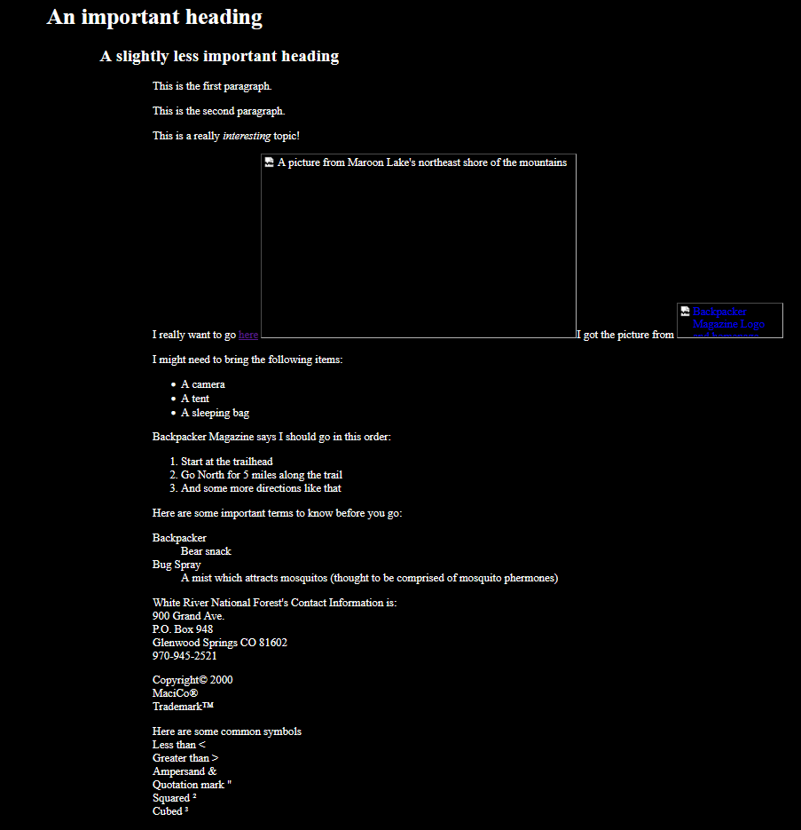{.lightbox group="internet-mapping" fig-alt="Early HTML page showing headings, paragraphs, links, images, lists, and basic styling."}

These assignments were simple, but they established the page structure required for later interactive maps.

## Introductory JavaScript

A series of small JavaScript exercises introduced:

- alerts;
- confirmation boxes;
- prompt boxes;
- event handling;
- variables;
- arithmetic;
- strings;
- conditional statements;
- `switch` statements;
- functions;
- return values;
- writing content into a page.

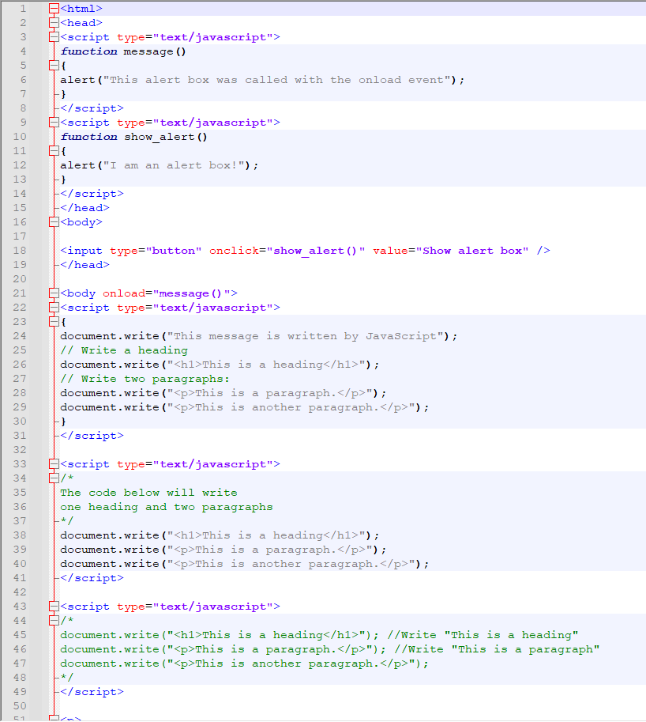{.lightbox group="internet-mapping" fig-alt="JavaScript code demonstrating alerts, variables, conditions, browser events, and simple functions."}

The exercises were not map applications by themselves. Their purpose was to establish enough programming logic to build interactive web pages and map interfaces.

## Course Website

I also created a basic course homepage that introduced my background, interests, previous GIS experience, and reasons for taking the class.

The page identified several interests that later became important in my graduate and professional work:

- crowdsourced GIS;
- volunteered geographic information;
- disaster planning and response;
- crime hotspot mapping;
- open-source geographic tools.

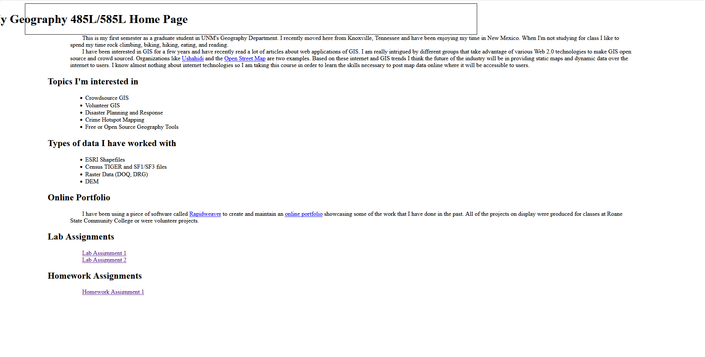{.lightbox group="internet-mapping" fig-alt="Original course homepage describing interests in crowdsourced GIS, volunteered geographic information, disaster response, crime mapping, and open-source GIS."}

The page also linked to the earlier student GIS portfolio I had created with RapidWeaver.

## New Mexico Rock-Climbing Map

The first substantial interactive-map exercise used the Google Maps JavaScript API to display climbing locations across New Mexico.

The initial version required decisions about:

- geographic extent;
- map center;
- zoom level;
- basemap type;
- marker locations.

I selected a hybrid basemap so viewers could see both transportation routes and surrounding terrain.

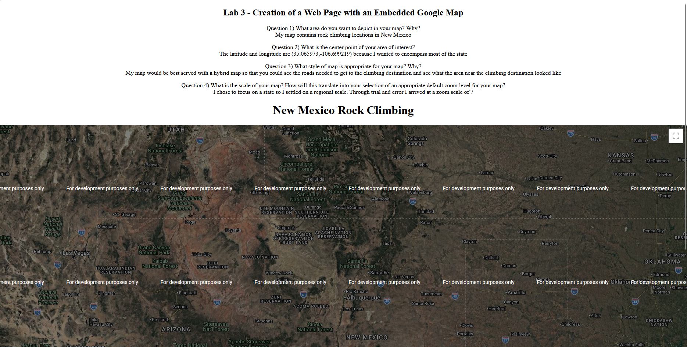{.lightbox group="internet-mapping" fig-alt="Google hybrid map of New Mexico displaying custom climbing-location markers."}

A later version expanded the map by adding:

- custom climbing symbols;
- clickable markers;
- information windows;
- descriptive text;
- links to external climbing resources;
- a safety and data-accuracy disclaimer.

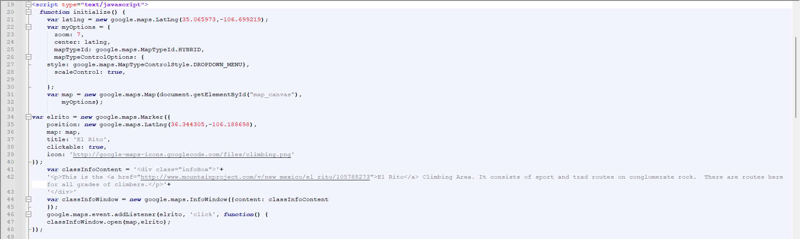{.lightbox group="internet-mapping" fig-alt="Interactive Google map of New Mexico climbing areas with custom markers and clickable information windows."}

The mapped locations included:

- El Rito;
- Tres Piedras;
- Diablo Canyon;
- Las Conchas;
- Palomas Peak;
- Enchanted Tower;
- Socorro Box Canyon.

This exercise marked the transition from general web development into a functioning thematic web map.

## OGC Web-Service Concepts

The course introduced the major Open Geospatial Consortium web-service models.

### Web Map Service

A **Web Map Service** returns rendered map images.

Important requests included:

- `GetCapabilities`;
- `GetMap`.

A `GetMap` request required information such as:

- service version;
- requested layers;
- styles;
- coordinate reference system;
- bounding box;
- image width and height;
- output format.

### Web Feature Service

A **Web Feature Service** returns vector features and their attributes.

Important requests included:

- `GetCapabilities`;
- `DescribeFeatureType`;
- `GetFeature`.

### Web Coverage Service

A **Web Coverage Service** returns raster or other coverage data rather than only a rendered image.

Important requests included:

- `GetCapabilities`;
- `DescribeCoverage`;
- `GetCoverage`.

This distinction was fundamental:

- WMS delivered map images;
- WFS delivered vector geometry and attributes;
- WCS delivered raster coverage data.

## Building WMS Requests

Several assignments required constructing WMS requests manually.

The work included:

- selecting layers;
- identifying supported coordinate systems;
- defining bounding boxes;
- calculating image dimensions;
- matching geographic and pixel aspect ratios;
- requesting transparent PNG images;
- interpreting service metadata;
- testing scale-dependent imagery.

### Bounding Boxes and Aspect Ratios

One exercise used McKinley County, New Mexico, to compare geographic and image aspect ratios.

The first request used a 600 × 257 pixel output that matched the original geographic bounding box.

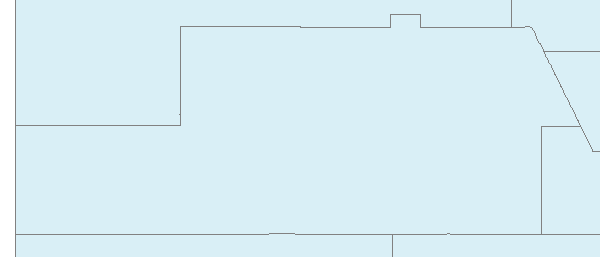{.lightbox group="internet-mapping" fig-alt="WMS map image of western New Mexico using dimensions matched to the geographic bounding-box aspect ratio."}

A second request used a 600 × 400 output and expanded the latitude extent so the image would preserve geographic proportions without stretching.

{.lightbox group="internet-mapping" fig-alt="WMS map image using an expanded north-south extent to match a 600 by 400 pixel display."}

This exercise demonstrated that output dimensions and geographic extent must be coordinated carefully.

## Scale-Dependent Imagery

The WMS exercises also compared imagery products intended for different map scales:

- Blue Marble 8 km;
- Blue Marble 2 km;
- Blue Marble 500 m;
- Landsat;
- DOQQ imagery;
- MRCOG imagery.

The service metadata included scale hints indicating when each layer was expected to return useful content.

The exercises showed that a technically valid WMS request could still return a blank or inappropriate image when:

- the requested scale was outside the layer’s intended range;
- the bounding box was incorrect;
- the output dimensions did not match the requested extent;
- the coordinate reference system was unsuitable.

## KML and Google Earth

Lab 6 connected WMS services to Google Earth through KML ground overlays and network links.

I created separate KML files for several imagery products, including:

- Blue Marble;
- Landsat;
- DOQQ;
- MRCOG imagery.

The KML files referenced WMS `GetMap` requests and allowed Google Earth to retrieve imagery for the current view.

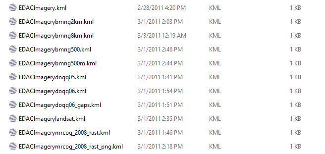{.lightbox group="internet-mapping" fig-alt="The Google Earth KML files I generated."}

The exercise demonstrated that Google Earth could refresh the requested imagery as the user stopped zooming and the visible extent changed.

It also illustrated the role of image format:

- PNG supported transparency;
- JPEG did not.

## WFS and WCS

Lab 7 focused on retrieving actual features and coverages.

### WFS Feature Access

The assignment examined a USGS framework WFS and required interpreting:

- service metadata;
- feature-type names;
- coordinate systems;
- geographic extents;
- supported output formats;
- `DescribeFeatureType`;
- `GetFeature`.

A downloaded GML response was inspected with `ogrinfo` to identify:

- layer name;
- geometry;
- feature count;
- extent;
- attribute fields.

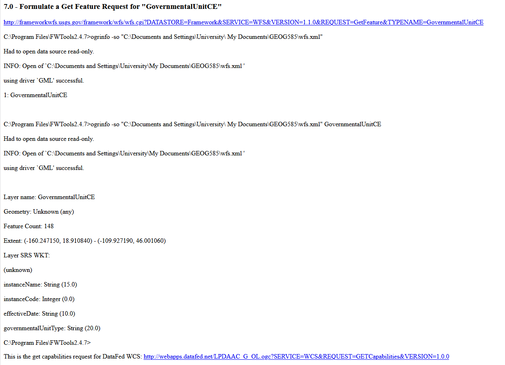{.lightbox group="internet-mapping" fig-alt="Command-line output from OGR showing a downloaded WFS layer's geometry, feature count, extent, and attributes."}

### WCS Raster Access

The WCS exercise required:

- examining temporal coverage;
- constructing a `DescribeCoverage` request;
- constructing a `GetCoverage` request;
- downloading a GeoTIFF;
- inspecting the result with `gdalinfo`.

The output documented:

- coordinate system;
- raster dimensions;
- pixel size;
- geographic extent;
- raster band information.

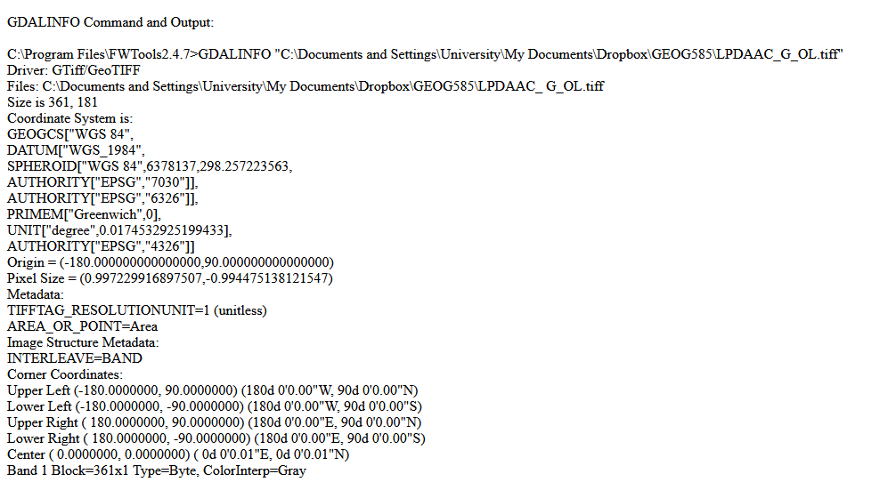{.lightbox group="internet-mapping" fig-alt="Command-line output from GDAL showing coordinate system, dimensions, pixel size, extent, and band information for a downloaded GeoTIFF."}

## Using WMS and WFS in QGIS

Lab 8 shifted from manually constructing service requests to consuming those services in QGIS 1.6.

The assignment required WMS connections to:

- EDAC imagery;
- FEMA’s National Flood Hazard Layer;
- the NRCS Soil Data Mart.

It also required WFS connections to:

- RGIS datasets;
- the USGS Gazetteer Framework service.

### WMS Imagery

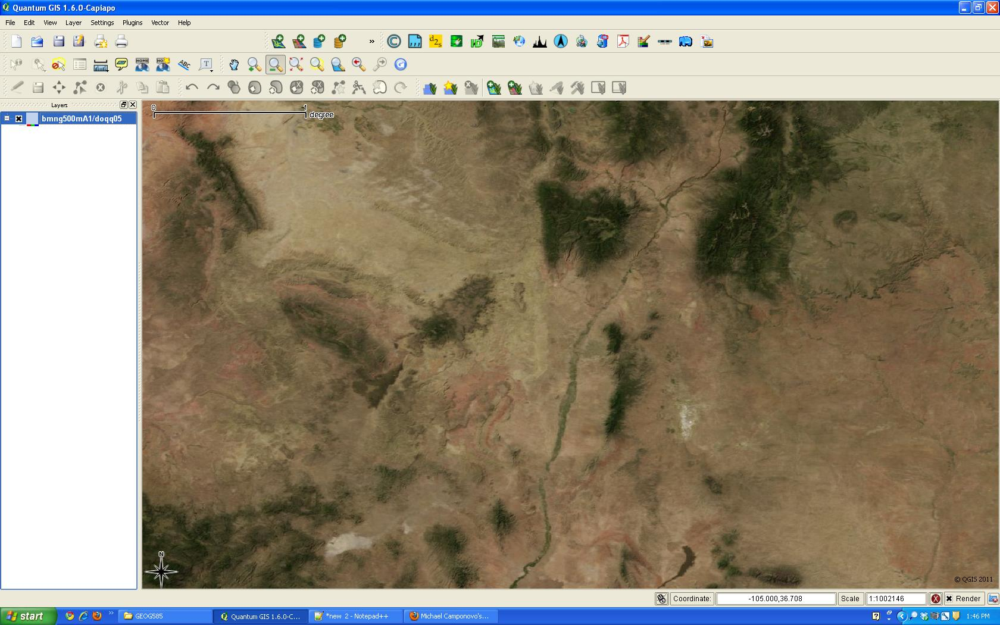{.lightbox group="internet-mapping" fig-alt="QGIS 1.6 displaying remote EDAC imagery loaded through a WMS connection."}

### National Park Boundaries

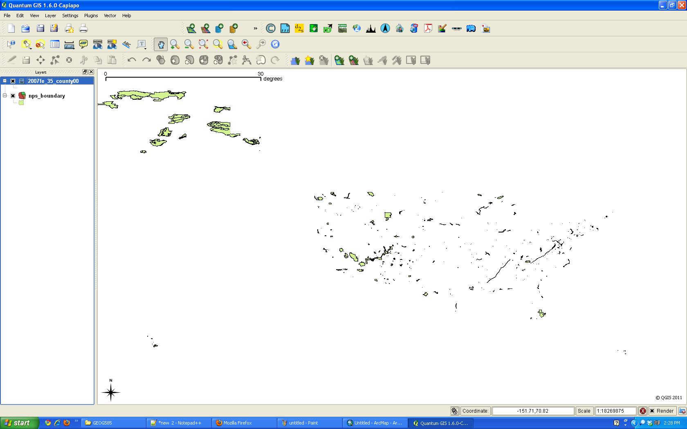{.lightbox group="internet-mapping" fig-alt="QGIS 1.6 displaying National Park Service boundary polygons loaded through a WFS connection."}

### USGS Gazetteer Features

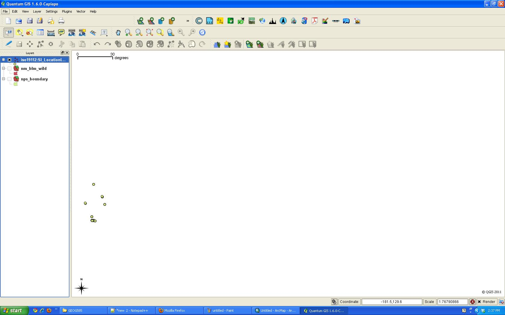{.lightbox group="internet-mapping" fig-alt="QGIS 1.6 displaying USGS Gazetteer point features at a broad geographic extent."}

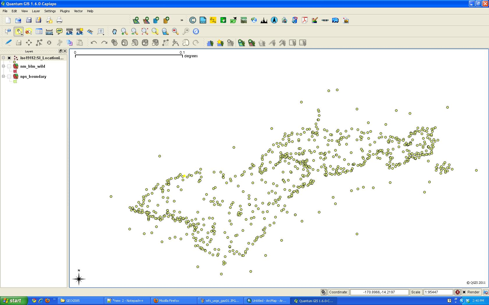{.lightbox group="internet-mapping" fig-alt="QGIS 1.6 displaying a dense cluster of USGS Gazetteer point features at a local scale."}

### Wilderness Areas

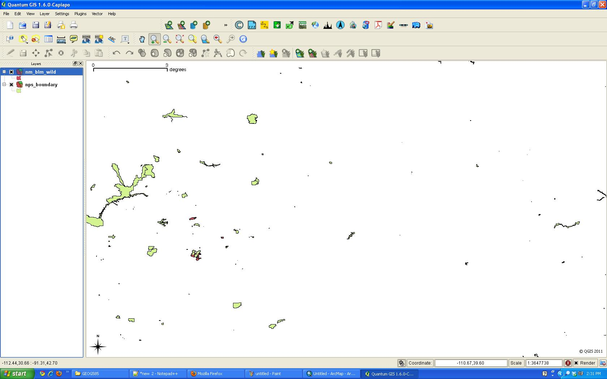{.lightbox group="internet-mapping" fig-alt="QGIS 1.6 displaying remotely loaded wilderness polygons at a regional scale."}

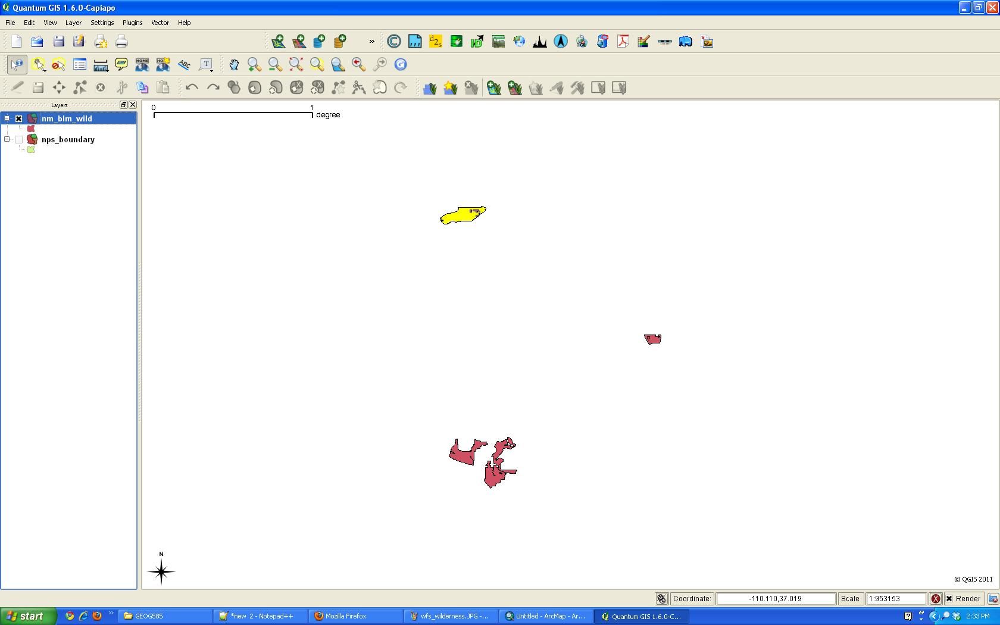{.lightbox group="internet-mapping" fig-alt="QGIS 1.6 displaying several wilderness-area polygons loaded from a remote WFS."}

These screenshots preserve several characteristics of early standards-based GIS services:

- remote layers often loaded with minimal default symbology;
- broad service extents could make local data difficult to locate;
- users had to understand the service’s geographic coverage;
- consuming data still required interpretation and navigation.

## GDAL, OGR, and Coordinate Tools

The course used the FWTools environment to introduce open-source geospatial command-line utilities.

### OGR

`ogrinfo` was used to inspect vector datasets and report:

- format;
- layer name;
- geometry type;
- feature count;
- extent;
- coordinate reference system;
- attribute schema.

### GDAL

`gdalinfo` was used to inspect raster datasets and report:

- format;
- raster dimensions;
- coordinate reference system;
- origin;
- pixel size;
- corner coordinates;
- NoData;
- bands;
- overviews.

### PROJ and CS2CS

The course also introduced:

- `proj` for converting geographic coordinates into a projected coordinate system;
- `cs2cs` for transforming coordinates from one coordinate system to another.

These tools reinforced that web GIS depends on more than visual design. It also depends on understanding formats, extents, projections, pixel dimensions, and service metadata.

## Santa Fe Gentrification Web-Mapping Project

The final sequence of assignments was designed to take one Internet-mapping problem from definition through data acquisition, service implementation, and a basic client interface.

I proposed a project examining possible gentrification in Santa Fe County.

The central question was whether changing housing costs and demographic conditions suggested that less-affluent, long-term residents were being displaced.

### Intended Audience

Potential audiences included:

- government agencies;
- research centers;
- nonprofit organizations;
- community groups;
- concerned residents;
- anyone interested in Santa Fe, Census data, or gentrification.

### Proposed Data

The project compared 1990 and 2000 Census data at several geographic levels.

Indicators included:

- median household income;
- median home value;
- median rent;
- county-level geography;
- census tracts;
- block groups;
- roads;
- streams;
- railroads.

The coordinate system was NAD83 geographic coordinates, EPSG:4269.

### Data Acquisition and Preparation

The workflow used:

- Census TIGER data;
- Census demographic tables;
- GISTools;
- ArcMap;
- `ogrinfo`;
- GDAL/OGR-compatible formats.

The project-planning page documents:

- problem definition;
- study area;
- intended audience;
- geographic extent;
- coordinate system;
- source data;
- technical barriers;
- initial dataset inspection.

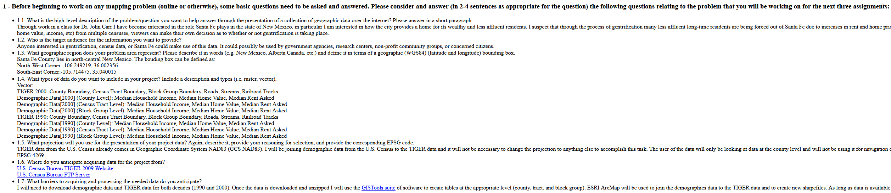{.lightbox group="internet-mapping" fig-alt="HTML project-planning page describing a proposed web map of gentrification indicators in Santa Fe County."}

A screen capture from the completed web map survives and is shown below. The application presented socioeconomic and physical characteristics of Santa Fe County as part of the broader investigation of possible gentrification.

{.lightbox group="internet-mapping" fig-alt="Screen capture of the completed Santa Fe County web map displaying socioeconomic and physical geographic information."}

## Preserved Topographic Map Outputs

Two small topographic image fragments also survive from the course files.

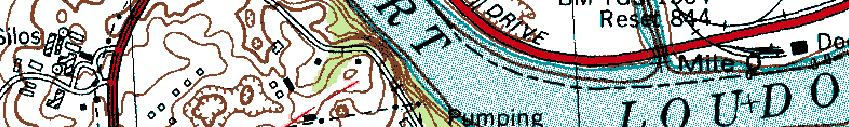{.lightbox group="internet-mapping" fig-alt="Topographic map fragment showing transportation, water, buildings, and contour information near a developed area."}

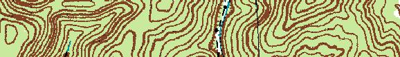{.lightbox group="internet-mapping" fig-alt="Topographic map fragment showing dense contour lines and terrain features."}

The surviving files do not clearly identify which assignment produced these images, so they are preserved here as examples of web-delivered map imagery without assigning them to a specific lab.

## What I Learned

This course introduced several concepts that became increasingly important in later GIS work:

- web maps are applications, not only images;
- HTML and CSS provide structure and presentation;
- JavaScript provides interaction;
- APIs simplify access to map platforms;
- OGC standards allow different systems to exchange geographic information;
- WMS, WFS, and WCS serve different purposes;
- coordinate systems and bounding boxes affect every web-map request;
- pixel dimensions and geographic extents must be coordinated;
- scale dependencies affect whether imagery is useful;
- KML can connect Google Earth to remote map services;
- QGIS can consume standards-based services from many organizations;
- GDAL and OGR provide direct access to geospatial formats and metadata;
- service interoperability still requires technical understanding;
- successful web GIS begins with a clearly defined problem and audience.

## Looking Back

The technology shown here is unmistakably from 2011.

The course used:

- XHTML;
- early JavaScript;
- Google Maps API conventions that are now obsolete;
- Google Earth network links;
- QGIS 1.6;
- FWTools;
- early WMS, WFS, and WCS implementations;
- web services that are no longer online.

A modern version would likely use:

- semantic HTML;
- modern CSS;
- JavaScript modules;
- Leaflet, MapLibre, or current Google Maps APIs;
- GeoJSON;
- vector tiles;
- cloud-hosted feature services;
- modern QGIS;
- Python environments;
- Git and GitHub;
- responsive and accessible design.

Even so, the conceptual foundations remain relevant.

The course taught me that Internet mapping connects:

- data;
- services;
- standards;
- projections;
- software clients;
- programming;
- interface design;
- user needs.

It also introduced the open and interoperable GIS environment that later became central to my work with RGIS, FEMA Risk MAP, NMFlood, StoryMaps, and public-facing geospatial communication.
