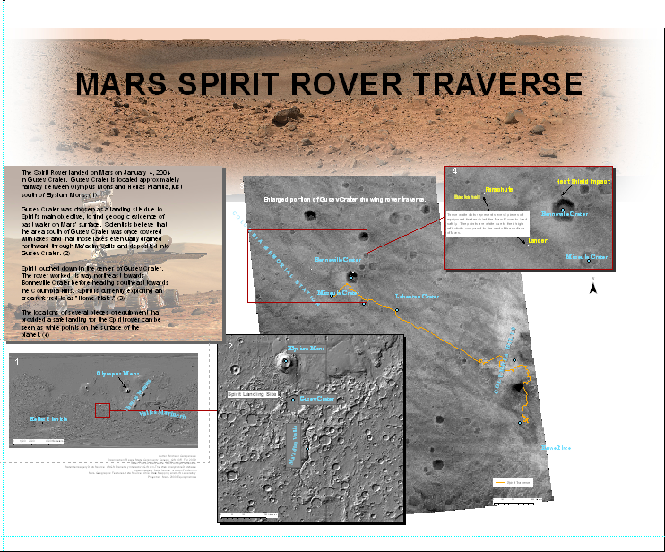
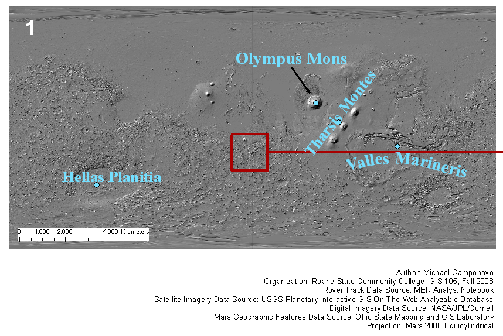
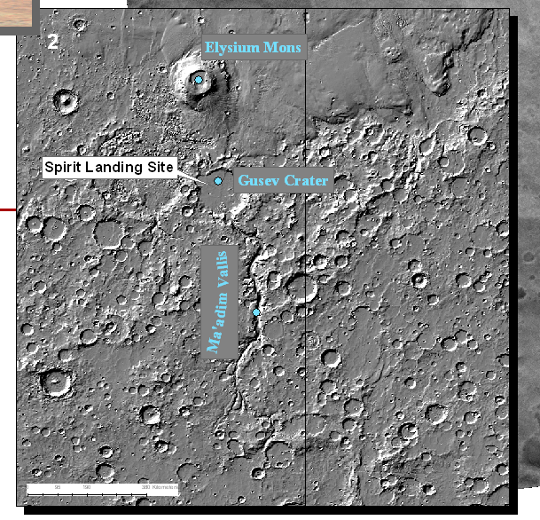
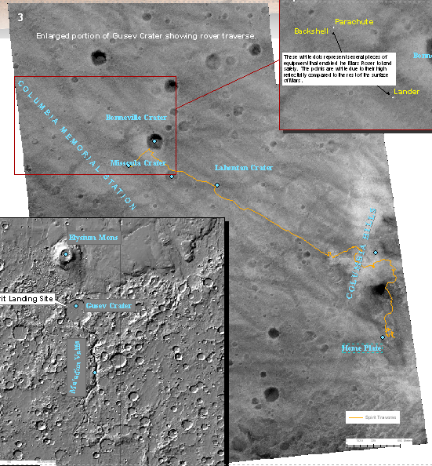
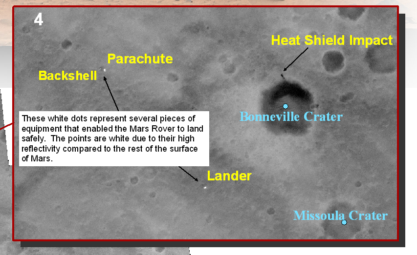
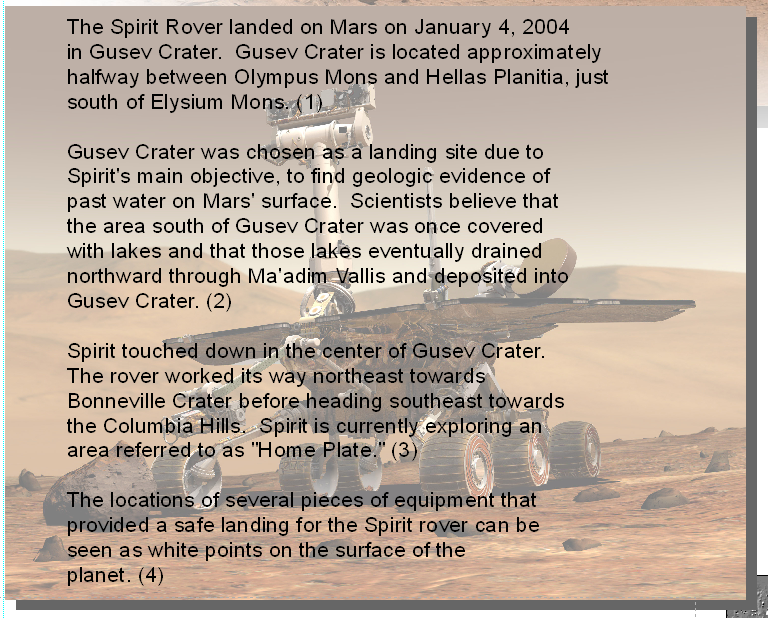

## Project Overview

This map was my first substantial cartographic project using ArcMap. I completed it as an individual project in **GIS 105: Computer Cartography** at Roane State Community College during fall 2008.

The poster follows the traverse of NASA's **SPIRIT rover** across the surface of Mars within Gusev Crater. It combines maps at several scales, moving from the rover's location on Mars to a detailed view of the landing site, rover path, and associated spacecraft components.

{.lightbox group="mars-spirit-gallery" fig-alt="Complete student cartography poster showing the location of Gusev Crater and the traverse of NASA's SPIRIT rover on Mars."}

## Project Context

The assignment provided an opportunity to practice cartographic design while working with an unusual geographic setting and data source. Rather than mapping a location on Earth, I used planetary imagery and rover-position information to document SPIRIT's movement after landing in Gusev Crater.

The completed poster included:

- a small-scale locator map showing Gusev Crater on Mars;
- a regional map relating Gusev Crater to Elysium Mons and Ma'adim Vallis;
- an enlarged view of Gusev Crater;
- a detailed map of the rover traverse;
- the locations of the lander, backshell, parachute, and heat-shield impact;
- descriptive text explaining the mission and mapping process.

## Solving the Coordinate Problem

The most significant technical challenge was correctly placing the rover path on the Martian surface.

The rover-position data from the Mars Exploration Rover Analyst's Notebook used x- and y-values measured in meters from a local origin at the landing site. Those values did not use the origin of the map's coordinate system, so importing them directly would have placed the traverse in the wrong location.

I addressed this by:

1. determining the mapped coordinates of the SPIRIT landing site in ArcMap;
2. importing the rover's original x- and y-values into Microsoft Excel;
3. adding the landing-site coordinate offsets to the rover-position values;
4. importing the adjusted coordinates into ArcMap;
5. checking the resulting traverse against the landing site and surrounding imagery.

Applying those offsets moved the rover track into its correct mapped position and allowed me to complete the poster.

## Exploring the Map at Multiple Scales

The poster used a sequence of locator and detail maps to help readers move from the entire planet to the immediate landing area.

::: {layout-ncol=2}

{.lightbox group="mars-spirit-gallery" fig-alt="Map of the entire surface of Mars with Gusev Crater identified."}

{.lightbox group="mars-spirit-gallery" fig-alt="Regional map of Mars showing Gusev Crater relative to Elysium Mons and Ma'adim Vallis."}

:::

::: {layout-ncol=2}

{.lightbox group="mars-spirit-gallery" fig-alt="Enlarged map of Gusev Crater showing the path traveled by the SPIRIT rover."}

{.lightbox group="mars-spirit-gallery" fig-alt="Detailed map of the SPIRIT landing area showing the rover lander, backshell, parachute, and heat-shield impact locations."}

:::

## Original Project Description

The original poster included a written explanation of the project, the rover mission, and the coordinate adjustment used to place the traverse correctly.

{.lightbox group="mars-spirit-gallery" fig-alt="Original text panel from the student poster describing the SPIRIT rover mapping project and coordinate-adjustment process."}

The information from this original text panel has been incorporated into the accessible webpage text above so visitors do not need to read the explanation from an image.

## From Class Project to Conference Submission

My instructor and advisor, **Pat Wurth**, encouraged students to attend professional GIS events and submit work to conference map galleries. Following her recommendation, I entered this poster in the map gallery at the **November 2008 Northeast Tennessee GIS User Group Conference in Kingsport, Tennessee**.

This was the first map I submitted at a GIS conference. Attending the meeting allowed me to see professional and student GIS work, reconnect with one of my earlier GIS professors, meet people working in the field, and begin participating in Tennessee's professional GIS community.

{.lightbox group="mars-spirit-gallery" fig-alt="Michael Camponovo standing beside his Mars SPIRIT Rover traverse poster at a regional GIS conference in Kingsport, Tennessee, in 2008."}

## What I Learned

This project taught me several lessons that extended beyond the finished poster:

- GIS data may use a local coordinate origin that must be reconciled with the map's coordinate system.
- Spreadsheet calculations can support GIS data preparation and coordinate adjustment.
- Locator maps at multiple scales can help readers understand an unfamiliar geographic setting.
- A course project can become a professional-development opportunity when it is shared beyond the classroom.
- Presenting work publicly helped me begin building confidence as a member of the GIS community.

## Looking Back

This map reflects my skills, the available software, and common cartographic practices at an early point in my GIS education. Some design choices are different from those I would make today, but I have preserved the original poster rather than redesigning it.

Its value lies not only in the finished map, but also in what it represents: an early technical challenge, my first substantial ArcMap project, and my first experience sharing student GIS work at a professional conference.