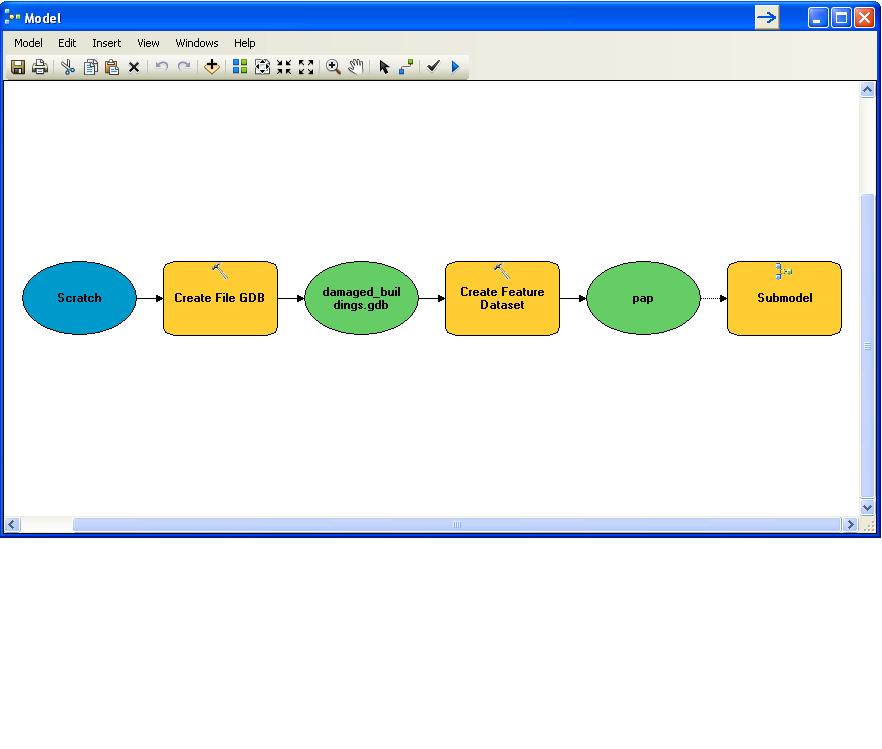
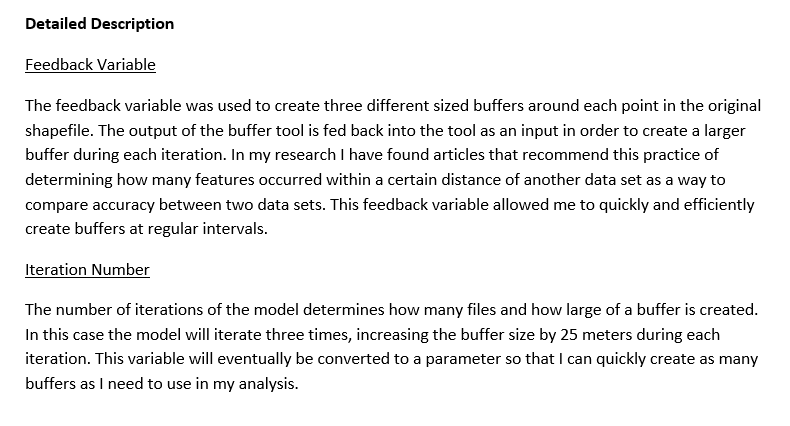
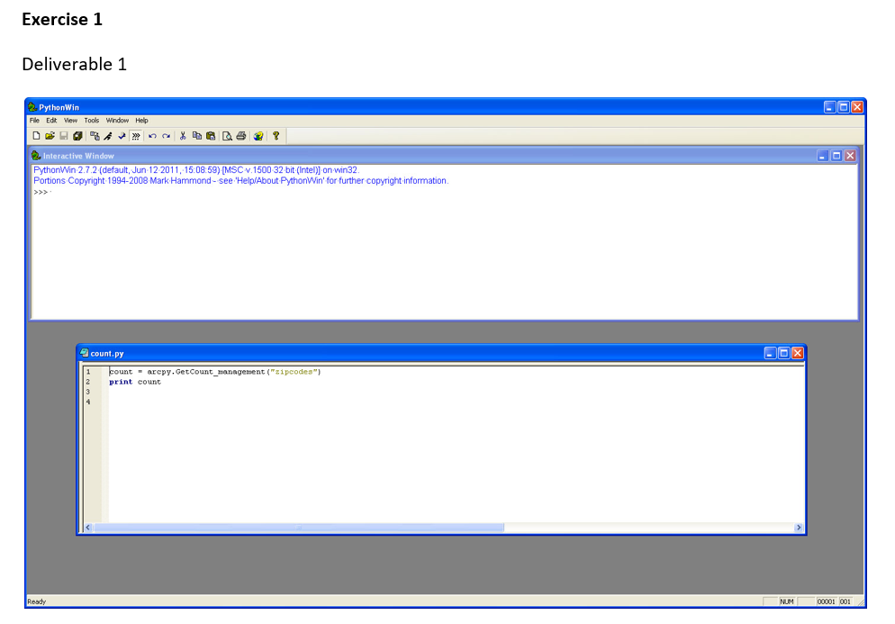
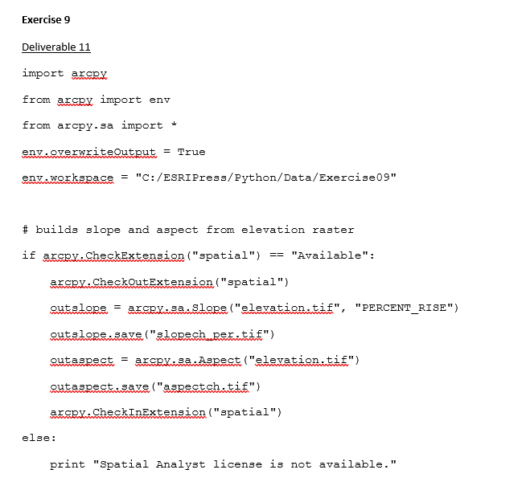
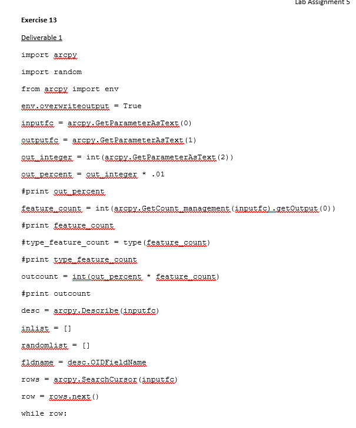
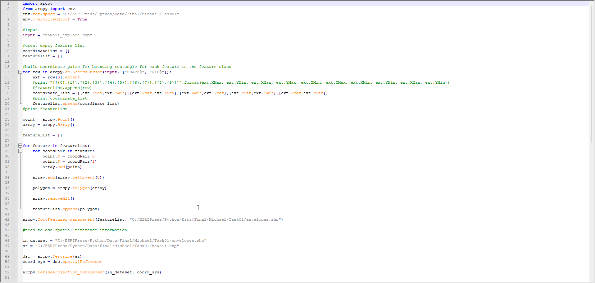
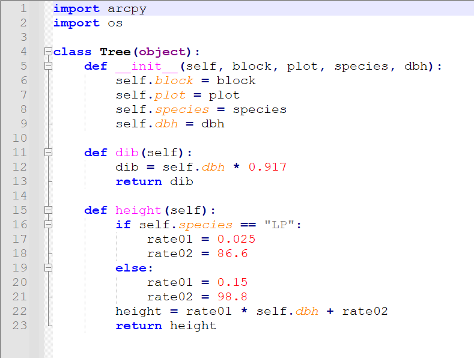
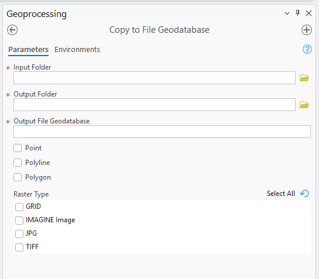

## Course Overview

This page documents work completed in **GEOG 599: Special Topics — Python Programming for GIS** at the University of New Mexico during fall 2012.

The course began with advanced ModelBuilder techniques and then progressed through Python fundamentals, ArcPy geoprocessing, geometry processing, map automation, reusable functions and classes, and custom script tools.

The surviving materials include five lab assignments, an advanced ModelBuilder project, a midterm examination, a final examination, several original Python scripts, and a custom ArcGIS toolbox.

The course was delivered with very limited instructor feedback. Because of that, this page presents the work as a **retrospective review of my learning process**, not as a claim that every script was fully validated or production ready.

## Learning Progression

The course followed a clear technical progression:

1. advanced ModelBuilder;
2. Python syntax and programming fundamentals;
3. ArcPy geoprocessing;
4. iteration, conditions, and cursors;
5. geometry and raster processing;
6. map automation;
7. debugging and error handling;
8. reusable functions and classes;
9. custom script tools;
10. independent midterm and final programming tasks.

That sequence marked an important transition in my GIS education: from running tools manually to thinking about how workflows could be automated, repeated, parameterized, and shared.

## Advanced ModelBuilder

The first assignment required students to create an original model using at least three advanced ModelBuilder techniques.

I developed a model related to my graduate research on positional differences among Haiti earthquake damage datasets.

The model created a file geodatabase and a Port-au-Prince feature dataset, used an earthquake-damage point layer as input, and generated repeated buffers for later positional comparisons.

{.lightbox group="python-course" fig-alt="ArcGIS ModelBuilder diagram showing creation of a file geodatabase and feature dataset followed by a submodel that creates repeated buffers around earthquake damage points."}

### Feedback Variable

A feedback variable returned the output of the Buffer tool as the next input. This allowed the model to create progressively larger buffers around the same points.

The original model ran three times, increasing the buffer distance by 25 meters during each iteration.

{.lightbox group="python-course" fig-alt="ArcGIS ModelBuilder submodel showing a buffer output connected back into the tool as a feedback variable."}

### Preconditions

The geodatabase and Port-au-Prince feature dataset had to exist before the buffer model could run. A precondition enforced that dependency and kept output data separate from the source data.

### Research Connection

The model was intended to automate preparation of distance-based comparison layers for later analysis of positional agreement among multiple datasets depicting earthquake-damaged buildings in Port-au-Prince.

## Python Fundamentals

The second assignment introduced the PythonWin editor, the Python window in ArcGIS, variables, data types, strings, lists, slicing, conditional statements, sorting, and duplicate removal.

Early scripts included:

- checking whether a character appeared in a string;
- finding the second-largest number in a list;
- identifying and removing duplicate values;
- correcting conditional syntax;
- assembling parameter strings;
- renaming output files through slicing and concatenation.

{.lightbox group="python-course" fig-alt="PythonWin interface displaying an introductory Python script from a graduate GIS programming course."}

These exercises were simple, but they established the syntax and logic needed for later ArcPy work.

## ArcPy Geoprocessing

The third lab moved into GIS automation with ArcPy.

The assignments included scripts that:

- copied feature classes;
- added XY coordinates;
- dissolved features using common attributes;
- checked extension availability;
- listed feature classes and geometry types;
- copied selected feature classes into a geodatabase;
- selected and buffered airport features;
- added and populated fields with update cursors;
- created polygons from coordinate text files;
- calculated geometry values;
- processed slope, aspect, and land-cover rasters;
- copied rasters into a file geodatabase.

### Listing and Processing GIS Data

One script iterated through every feature class in a workspace and reported its name and geometry type.

Another created a new file geodatabase and copied only polygon feature classes into it.

These exercises introduced `arcpy.ListFeatureClasses()`, `arcpy.Describe()`, loops, conditional statements, and dynamic output paths.

### Updating Attributes with Cursors

A later script created a text field and populated it with `YES` or `NO` depending on whether a road feature represented a ferry crossing.

This used an ArcPy data-access update cursor and helped establish the relationship between Python loops and row-by-row attribute editing.

### Raster Suitability Automation

One longer script calculated slope and aspect, reclassified slope, aspect, and land cover, combined the reclassified rasters, and produced a final Boolean suitability surface.

{.lightbox group="python-course" fig-alt="ArcGIS raster-processing workflow showing slope, aspect, land-cover reclassification, and a final suitability raster."}

## Specialized Scripting Tasks

The fourth lab focused on map scripting, debugging, error correction, functions, classes, and reusable modules.

### Map Automation

One script opened an ArcMap document, located three data frames, found a parks layer, and added that layer to two additional data frames.

This introduced `arcpy.mapping`, including `MapDocument`, `ListDataFrames`, `ListLayers`, `AddLayer`, and saving map-document changes.

### Debugging and Correction

Other exercises required correcting scripts that listed feature attributes and described raster cell dimensions and spatial-reference units.

### Reusable Functions

I created a function that counted the number of string fields in a table. A second script imported that function as a module and called it using a shapefile as input.

### Classes

Another exercise used a custom parcel class to calculate tax-assessment values for records in a parcel dataset.

## Creating Script Tools

The fifth lab focused on converting Python scripts into ArcGIS script tools that could be shared with other users.

### Random-Selection Tool

I created a script that accepted an input feature class, output feature class, and user-defined percentage; counted the input features; randomly selected the requested proportion; and wrote the selected features to a new output.

{.lightbox group="python-course" fig-alt="ArcGIS script tool dialog for selecting a random percentage of features from an input feature class."}

### Reviewing a Shared Toolbox

The assignment also required a detailed review of the Raster Slope Toolbox. I examined its folder structure, documentation, tool help, parameter design, code organization, error handling, environment settings, license checking, and input validation.

## Midterm Examination

The midterm combined conceptual questions with original programming tasks.

Conceptual topics included ModelBuilder iterators, feedback loops, list iteration, conditional logic, control structures, and differences between ModelBuilder and Python automation.

Programming tasks included:

- removing duplicates from a list;
- inventorying shapefiles and rasters;
- adding editor and timestamp fields;
- copying rasters into a geodatabase;
- calculating the mean center of polygon centroids.

### A Useful Example of Incomplete Work

The mean-center script successfully converted polygons to centroids, counted the features, summed centroid coordinates, calculated mean X and Y values, and created an output point feature class.

However, the final insertion step appears incomplete. The surviving script calls `insertRow(row)` without first constructing a point geometry from the calculated mean coordinates.

Because no meaningful feedback survives, I cannot determine whether this was identified or corrected during grading.

## Final Examination

The final examination required three independent programming tasks.

### Envelope Polygons

The first task required a script that created one rectangular envelope polygon for every input feature using geometry properties rather than the built-in Minimum Bounding Geometry tool.

My script read each feature extent, extracted minimum and maximum coordinates, assembled the rectangle corners, created polygon geometry, wrote the results to a new shapefile, and applied the source spatial reference.

{.lightbox group="python-course" fig-alt="Input polygon features shown with rectangular envelope polygons generated around each feature."}

### Forestry Data Class

The second task required an object-oriented workflow for forestry records.

I created a `Tree` class with properties for block, plot, species, and diameter at breast height. The class included methods to calculate diameter inside bark and estimated tree height.

A separate reporting script read tab-delimited records, created one `Tree` object per record, calculated derived values, and printed a formatted report.

{.lightbox group="python-course" fig-alt="Python code defining a Tree class and a separate reporting script that reads forestry records and prints calculated values."}

### Copy to File Geodatabase Tool

The third task required a custom script tool that created a file geodatabase, created point, polyline, and polygon feature datasets, copied shapefiles into the correct feature dataset, copied only user-selected raster formats, and accepted user parameters through an ArcGIS tool dialog.

{.lightbox group="python-course" fig-alt="ArcGIS script-tool dialog allowing the user to select input and output folders, a geodatabase name, geometry types, and raster formats."}

The submitted script demonstrates parameter input with `GetParameterAsText`, geodatabase creation, feature-dataset creation, geometry filtering, raster-format filtering, conditional execution, and dynamic output paths.

### Known Limitations

The surviving version has several limitations:

- the spatial reference is hard-coded to a Yellowstone projection file;
- the raster multivalue parameter may not be parsed correctly when several formats are selected;
- feature-class lists are generated repeatedly rather than reused;
- error handling is minimal;
- path construction relies on string concatenation rather than `os.path.join`.

## What Worked Well

The strongest aspects of the coursework were:

- connecting ModelBuilder automation to graduate research;
- using meaningful GIS data;
- progressing from short scripts to reusable tools;
- working with vector and raster data;
- learning cursors and geometry tokens;
- creating reusable functions and classes;
- exposing scripts through ArcGIS tool interfaces;
- recognizing the importance of parameters and user interaction.

## What Needed Improvement

The retrospective review identified areas that needed more development:

- testing every output carefully;
- avoiding hard-coded paths;
- preserving and applying spatial reference consistently;
- validating user parameters;
- parsing multivalue inputs correctly;
- writing stronger error handling;
- documenting assumptions;
- separating configuration from processing logic;
- using more concise and reusable code;
- confirming that scripts produced the intended spatial outputs.

## What I Learned

This course introduced several ideas that became increasingly important in later GIS work:

- repetitive workflows should be automated;
- GIS tools can be treated as programmable building blocks;
- loops and conditions allow workflows to respond to changing inputs;
- cursors connect Python logic to feature attributes and geometry;
- functions and classes make code reusable;
- script tools make code accessible to non-programmers;
- code that runs once is not necessarily production-ready;
- testing, documentation, and feedback are essential parts of programming.

## Looking Back

This was not a polished learning experience, and the surviving code should not be presented as though it received complete technical review.

Even so, the course represents an important stage in my development. It moved me from manually running tools and building visual models toward designing automated workflows, writing geoprocessing scripts, handling GIS geometry directly, creating reusable modules, and building custom ArcGIS tools.

A modern version would use Python 3, ArcGIS Pro, notebooks, improved data-access patterns, unit tests, clearer packaging, and source control.

The most important lesson remains unchanged: automation is not only about making GIS faster. It is also about making workflows more consistent, repeatable, explainable, and shareable.
