## Course Overview

**GEOG 587: Spatial Analysis and Modeling** was one of the most challenging and rewarding courses in my graduate program at the University of New Mexico.

The course covered a broad range of analytical methods, including:

- network analysis;
- raster analysis;
- suitability modeling;
- distance and allocation;
- zonal and focal operations;
- terrain and surface analysis;
- viewshed analysis;
- interpolation;
- land-cover change;
- point-pattern analysis;
- spatial autocorrelation;
- Local Moran’s I;
- spatial-data quality.

The work required more than completing technical procedures. Assignments regularly asked me to explain assumptions, compare methods, verify results, interpret patterns, and identify limitations.

This page presents the course as a collection of related analytical themes rather than as a sequence of isolated labs.

## Network Analysis

The course introduced network datasets and several Network Analyst solvers.

Topics included:

- route analysis;
- closest facility;
- service areas;
- origin-destination cost matrices;
- facility allocation;
- network restrictions;
- travel time versus distance;
- turn restrictions;
- hierarchy;
- barriers.

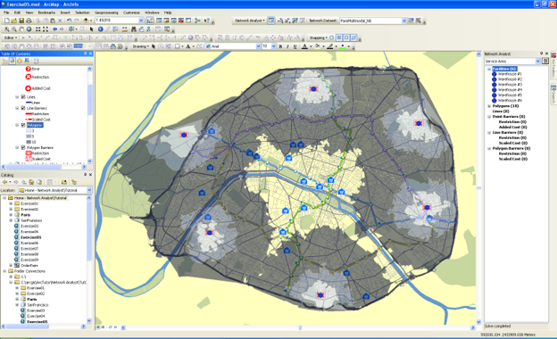{.lightbox group="spatial-analysis" fig-alt="ArcMap Network Analyst display showing overlapping service-area polygons around multiple facilities."}

### Distance to Psychiatric Hospitals

One exercise examined county-level access to psychiatric hospitals in Georgia.

The final map summarized the distance from each county to the nearest psychiatric hospital.

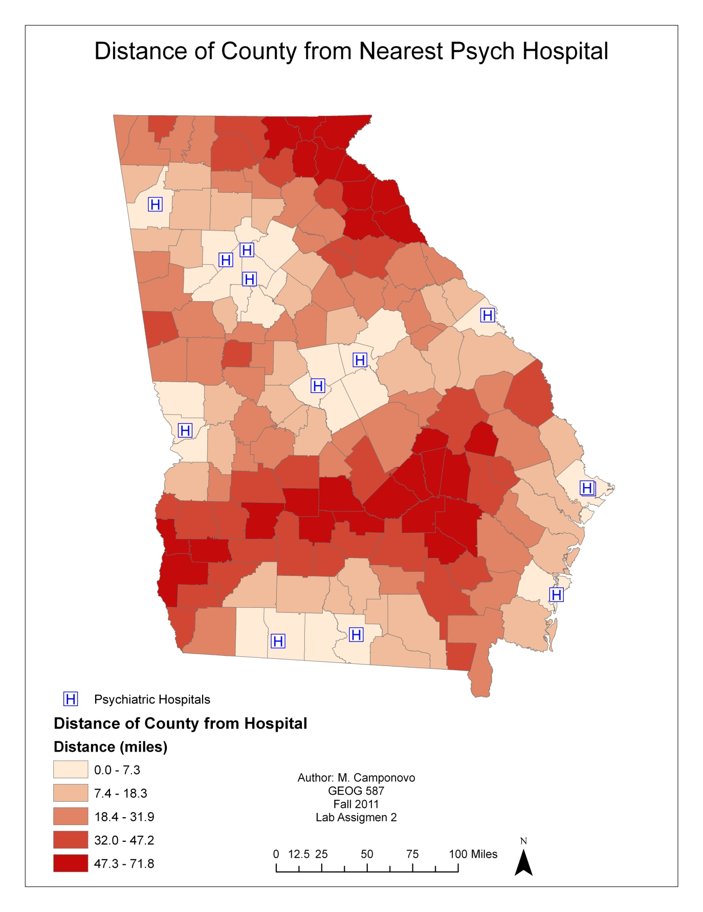{.lightbox group="spatial-analysis" fig-alt="Choropleth map of Georgia counties symbolized by distance from the nearest psychiatric hospital, with hospital locations shown as point symbols."}

This exercise reinforced the difference between straight-line distance and travel through a network.

## Post Office Closure Scenario

The midterm included a more substantial network-analysis problem involving a hypothetical post-office closure in Travis County, Texas.

The workflow:

1. assigned census blocks to their nearest post office;
2. summarized the population served by each facility;
3. identified a candidate facility for closure;
4. removed that facility from the network;
5. reassigned affected blocks;
6. compared travel times before and after closure;
7. examined the added demand placed on nearby facilities.

The selected facility served 19,695 residents across 254 blocks.

After closure:

- average travel time increased from 9.9 to 13.9 minutes;
- the shortest trip increased from 0.7 to 4.6 minutes;
- the longest trip increased from 25.4 to 28.2 minutes;
- Southeast Station experienced the largest increase in assigned population.

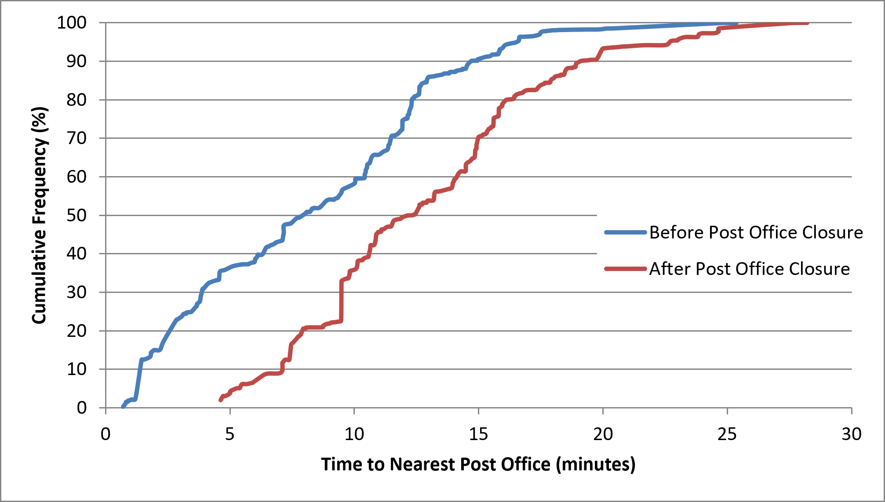{.lightbox group="spatial-analysis" fig-alt="Line chart comparing cumulative travel-time distributions before and after a hypothetical post-office closure."}

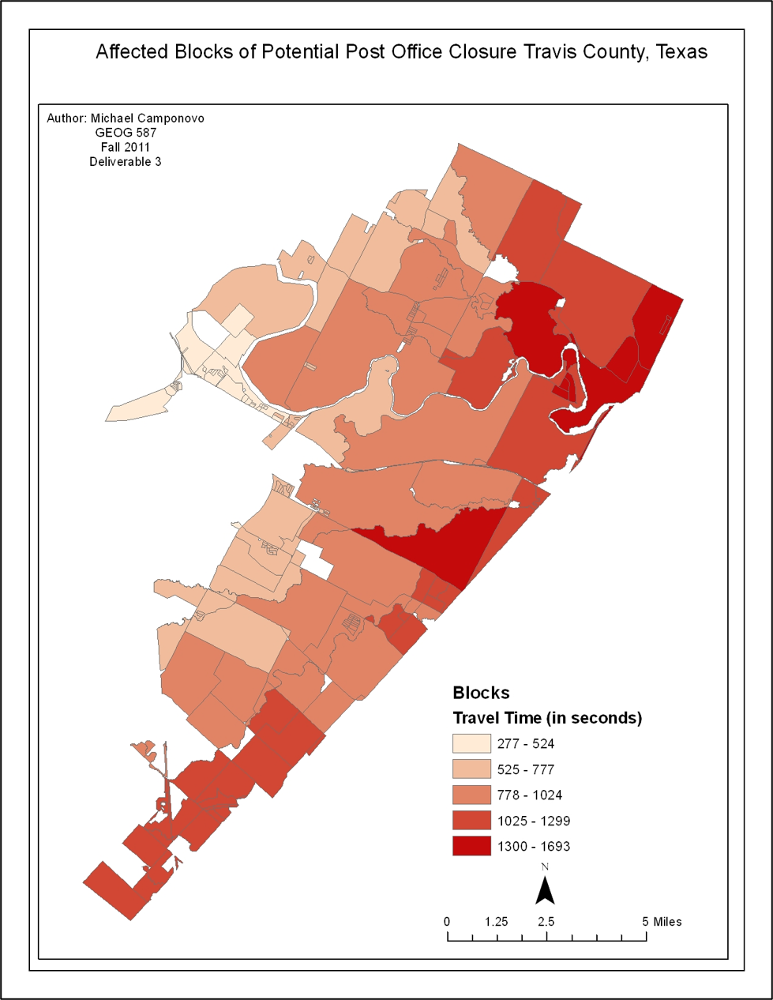{.lightbox group="spatial-analysis" fig-alt="Choropleth map of affected census blocks symbolized by travel time to a post office after a hypothetical facility closure."}

This analysis demonstrated that selecting a facility for closure based only on the smallest customer population could still create meaningful service and capacity consequences elsewhere in the network.

## Suitability Modeling

Lab 4 focused on raster suitability modeling.

The first exercise combined several criteria to identify suitable areas for a new school.

The workflow included:

- converting source data to raster;
- creating distance surfaces;
- reclassifying criteria;
- combining inputs;
- ranking suitability;
- using ModelBuilder to document the process.

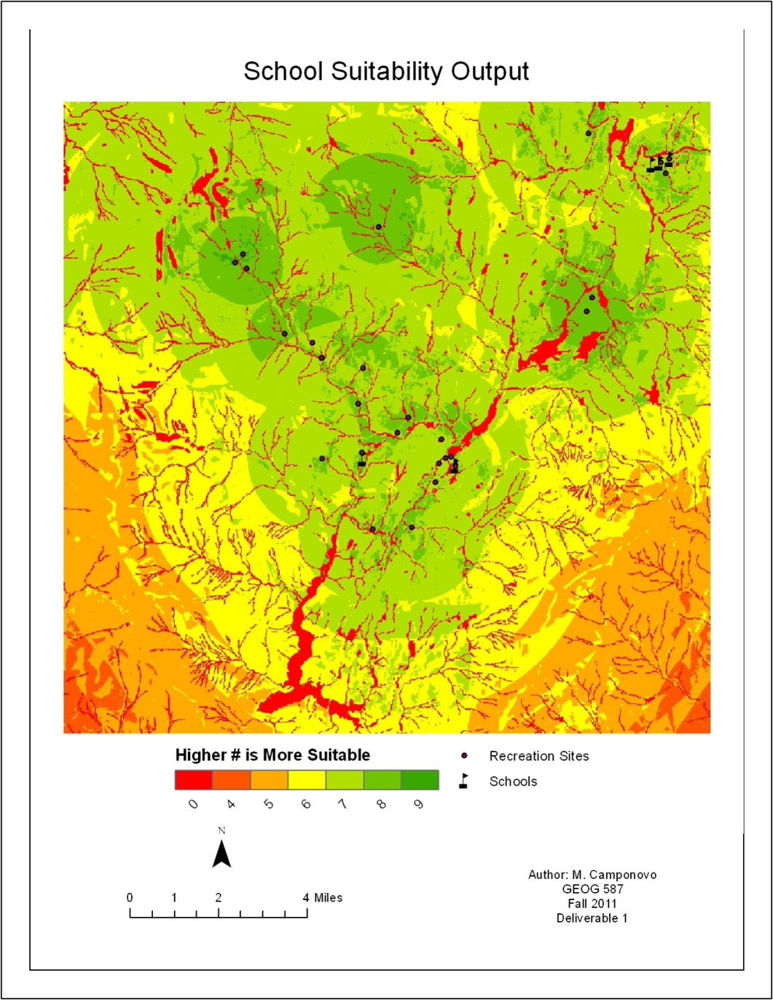{.lightbox group="spatial-analysis" fig-alt="Raster suitability map showing higher and lower suitability for a proposed school, with existing schools and recreation sites displayed."}

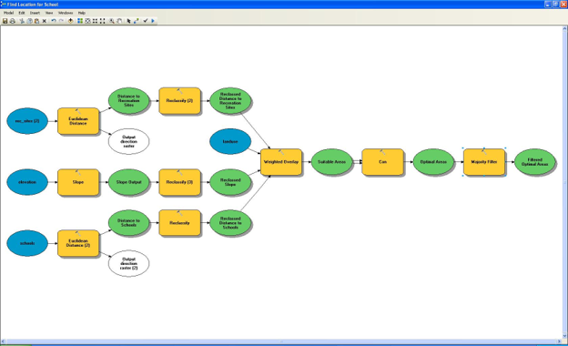{.lightbox group="spatial-analysis" fig-alt="ArcGIS ModelBuilder workflow combining reclassified distance and terrain criteria into a final school suitability surface."}

A second suitability exercise evaluated potential locations for a new tourist facility near Lake Tahoe.

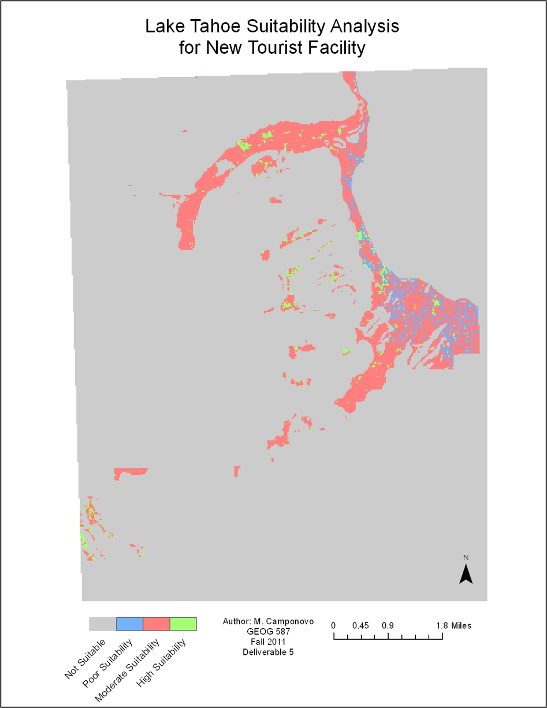{.lightbox group="spatial-analysis" fig-alt="Suitability map classifying potential locations for a tourist facility near Lake Tahoe from unsuitable to highly suitable."}

These exercises helped establish the importance of:

- selecting meaningful criteria;
- choosing defensible classification thresholds;
- distinguishing classification from reclassification;
- documenting how individual criteria contribute to a final result.

## Raster Analysis

The course covered the major categories of raster operations:

- local;
- focal;
- zonal;
- global.

It also covered:

- raster extraction;
- Boolean logic;
- map algebra;
- Euclidean distance;
- allocation;
- cell statistics;
- neighborhood statistics;
- raster generalization;
- resampling;
- resolution and alignment.

### Zonal and Focal Analysis

Assignments used zonal statistics and Tabulate Area to summarize continuous and categorical rasters within meaningful zones.

One Yellowstone exercise compared land-cover classes across elevation bands and used focal variety to examine local ecological diversity.

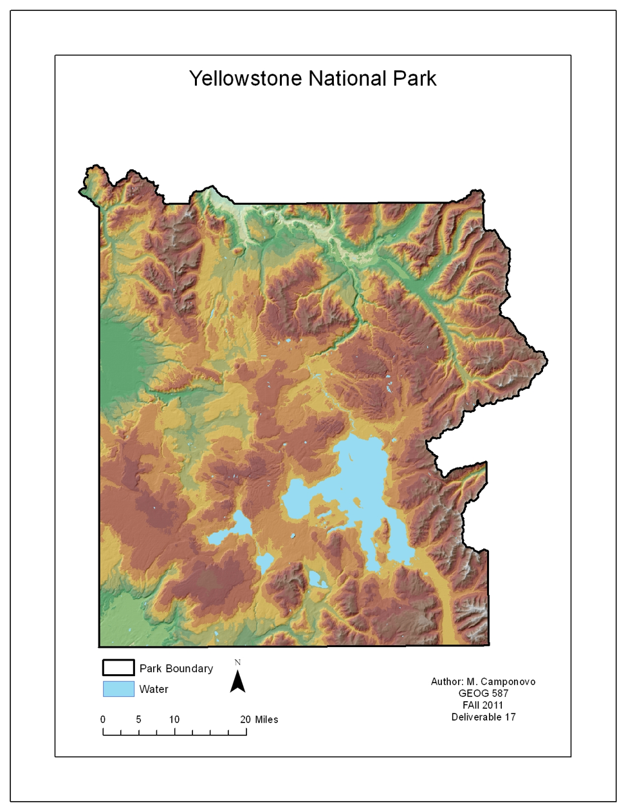{.lightbox group="spatial-analysis" fig-alt="Map of Yellowstone National Park showing terrain, water, and vegetation-related raster information."}

The exercise emphasized that zones should be analytically meaningful. Treating every unique elevation value as a separate zone produced results that were technically valid but difficult to interpret.

## Land-Cover Change

The hands-on final included a land-cover transition analysis comparing 1985 and 2006 data.

The workflow used:

- raster extraction;
- Tabulate Area;
- a transition matrix;
- conversion of cell areas;
- county-level summaries;
- percent-change calculations.

The analysis estimated:

- the percentage of forest converted to developed land;
- the percentage of wetlands converted to developed land;
- growth in developed land by county.

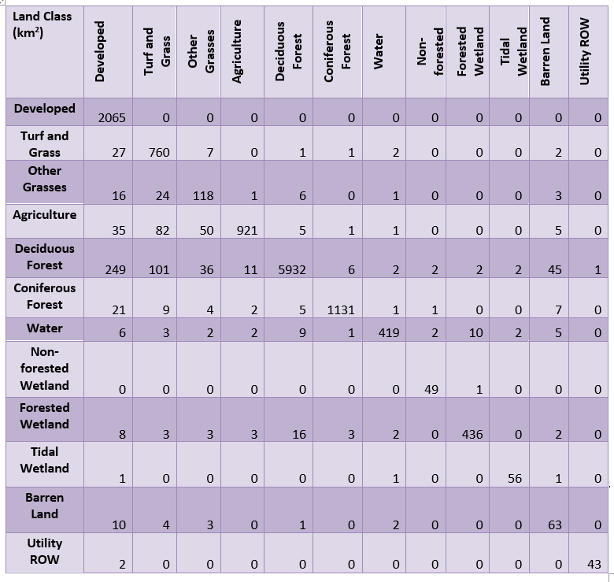{.lightbox group="spatial-analysis" fig-alt="Transition matrix showing areas converted among developed land, agriculture, forest, wetland, water, and other land-cover classes between 1985 and 2006."}

The transition matrix made it possible to distinguish not only how much development increased, but which previous land-cover classes were converted.

## Terrain and Surface Analysis

The course included extensive work with:

- digital elevation models;
- slope;
- aspect;
- hillshade;
- contours;
- triangulated irregular networks;
- breaklines;
- viewsheds;
- raster and TIN surfaces.

## Yellowstone Road Visibility

A viewshed exercise calculated which parts of Yellowstone National Park were visible from the road network.

The resulting raster recorded how many observation locations could see each cell.

Approximately 53% of the park area was not visible from any of the modeled road observation locations.

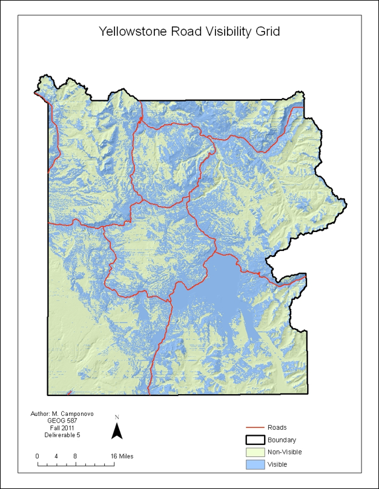{.lightbox group="spatial-analysis" fig-alt="Viewshed map of Yellowstone National Park showing areas visible and not visible from roads."}

The exercise also prompted consideration of practical applications such as scenic-route assessment, visual-resource management, wildfire effects, and proposed facility development.

## TINs and Contours

Another exercise compared contours derived from:

- original elevation points;
- a TIN constructed from those points.

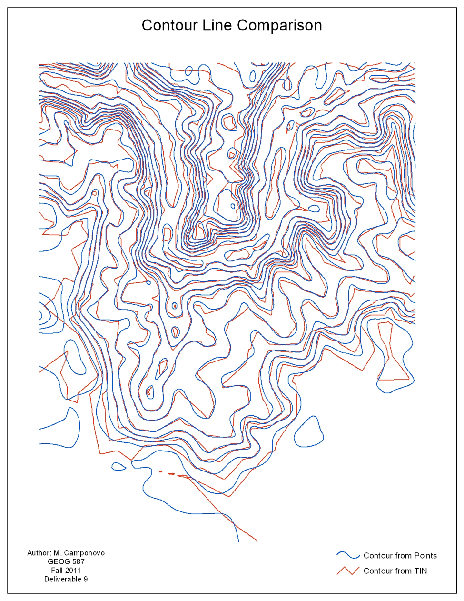{.lightbox group="spatial-analysis" fig-alt="Map comparing two sets of contour lines, one generated directly from points and one generated from a TIN."}

The comparison showed that TIN-derived contours could appear angular where the elevation-point density was low.

The course also examined the use of polygon boundaries as hard breaks. Editing a TIN with a lake polygon prevented triangles from crossing the shoreline and assigned a consistent elevation to the lake surface.

## Surface Interpolation

Lab 5 compared several interpolation methods:

- Thiessen polygons;
- inverse distance weighting;
- regularized spline;
- tension spline;
- kriging.

The work examined:

- local versus global methods;
- exact versus inexact methods;
- interpolation versus extrapolation;
- boundary effects;
- overshoot and undershoot;
- point density;
- search neighborhoods;
- cross-validation.

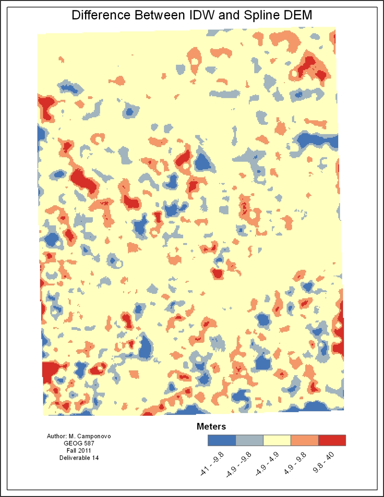{.lightbox group="spatial-analysis" fig-alt="Raster map showing positive and negative elevation differences between IDW and spline interpolation surfaces."}

### Comparing Interpolation Methods

A water-quality exercise compared interpolation surfaces for biological oxygen demand.

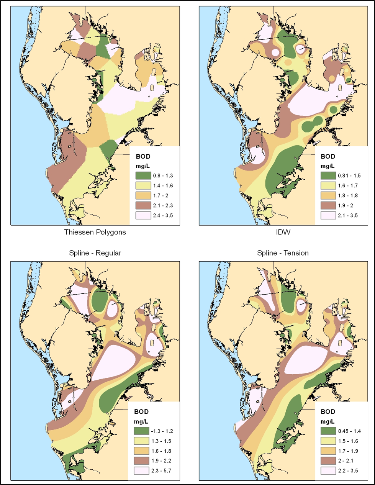{.lightbox group="spatial-analysis" fig-alt="Four-panel map comparing Thiessen polygons, IDW, regularized spline, and tension spline surfaces for biological oxygen demand."}

The exercise showed that:

- Thiessen polygons were simple and interpretable but imposed abrupt boundaries;
- IDW remained within the sampled range;
- regularized spline could produce unrealistic negative values and strong overshoots;
- tension spline reduced, but did not eliminate, those problems;
- sample placement near the study-area boundary strongly affected the surface.

### Cross-Validation

A separate comparison withheld a percentage of elevation points, interpolated values using IDW, spline, and kriging, and compared the estimated values with the withheld observations.

For that particular sample, spline produced the lowest average absolute difference, followed by IDW and kriging.

The broader lesson was more important than the specific ranking: interpolation methods must be evaluated against the phenomenon, the sampling design, and independent observations.

## Ecological Analysis

The hands-on final included an analysis of Sitka spruce distribution.

The questions included:

- minimum and maximum elevation;
- percentage of Sitka spruce within one kilometer of the coast;
- distribution among ownership classes.

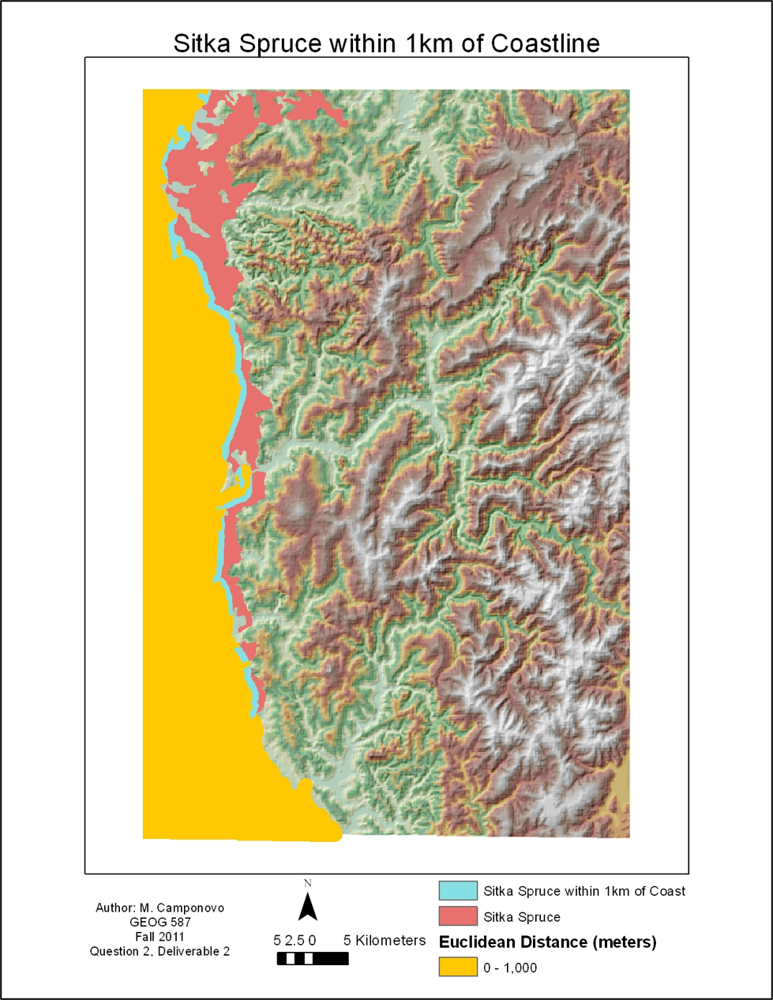{.lightbox group="spatial-analysis" fig-alt="Terrain map showing Sitka spruce distribution and the subset located within one kilometer of the coastline."}

The analysis found that approximately 19% of the mapped Sitka spruce area occurred within one kilometer of the coast.

## Landslide Analysis

Another final-exam problem examined whether:

- larger landslides occurred on steeper slopes;
- landslides were more common on north-facing terrain.

The workflow calculated:

- landslide area;
- mean slope within each landslide;
- majority aspect;
- grouped aspect classes;
- scatterplots;
- frequency summaries.

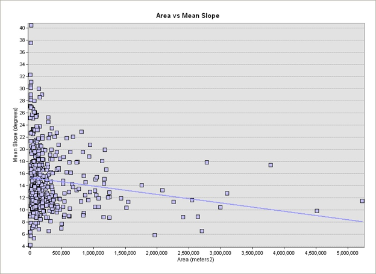{.lightbox group="spatial-analysis" fig-alt="Scatterplot comparing landslide area with mean slope and showing a downward trend line."}

The results did not support the expectation that larger landslides occurred on steeper slopes.

The aspect result depended on how “north-facing” terrain was classified, illustrating how analytical conclusions can change with classification decisions.

## Spatial Statistics

The course covered descriptive and inferential spatial statistics, including:

- mean center;
- median center;
- central feature;
- standard distance;
- standard deviational ellipse;
- directional mean;
- nearest-neighbor analysis;
- quadrat analysis;
- Ripley’s K;
- Moran’s I;
- Local Moran’s I;
- spatial weights.

The study materials emphasized that spatial statistics require attention to:

- study-area boundaries;
- spatial scale;
- normalization;
- neighborhood definitions;
- distance thresholds;
- statistical significance.

## Narcotics Arrests in Las Vegas

The midterm included a spatial-statistical analysis of narcotics arrests in Las Vegas.

The workflow:

1. counted arrests by census tract;
2. normalized arrest counts per 10,000 residents;
3. compared rates with median income;
4. calculated percent change from 2007 to 2008;
5. mapped increases and decreases;
6. used Local Moran’s I to identify statistically significant clusters.

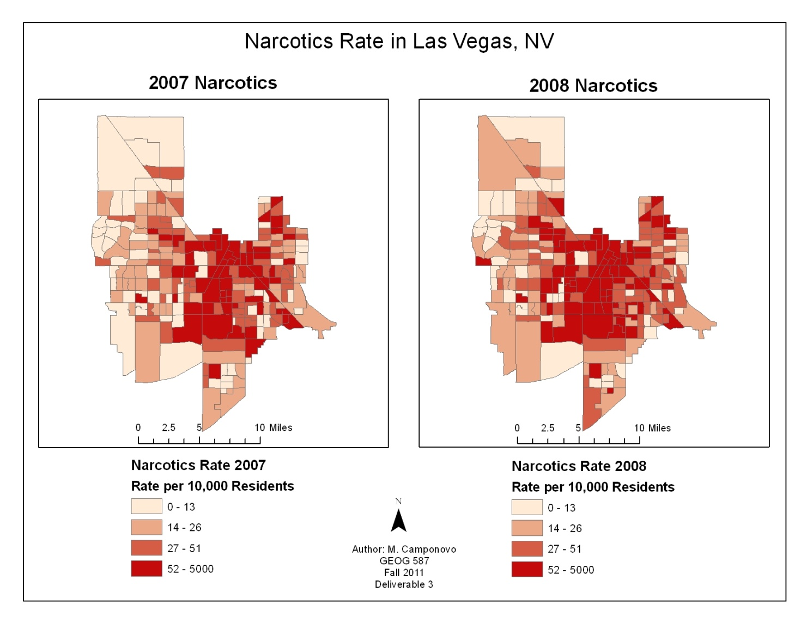{.lightbox group="spatial-analysis" fig-alt="Side-by-side choropleth maps comparing narcotics arrest rates per 10,000 residents in Las Vegas in 2007 and 2008."}

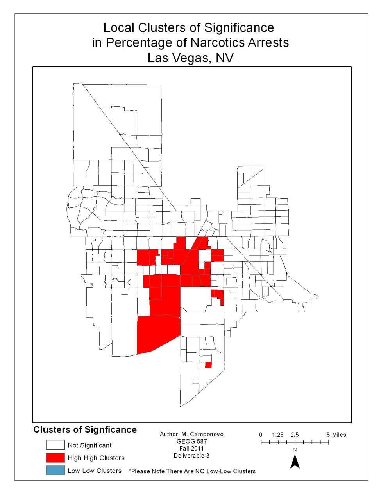{.lightbox group="spatial-analysis" fig-alt="Map of Las Vegas census tracts showing statistically significant high-high clusters in the percentage change of narcotics arrests."}

The analysis identified high-high clusters but no statistically significant low-low clusters under the selected spatial-weights settings.

## Research Paper: Assessing VGI Accuracy

The final paper was titled:

> *Measurement Techniques to Assess Accuracy of Volunteered Geographic Information*

The paper reviewed methods used to evaluate traditional and volunteered geographic information.

Topics included:

- positional accuracy;
- attribute accuracy;
- completeness;
- semantic accuracy;
- logical consistency;
- temporal quality;
- lineage;
- relative versus absolute accuracy;
- point, line, and polygon comparisons.

The review examined methods such as:

- buffer-based comparison of linear features;
- Euclidean distance between corresponding points;
- Hausdorff and average-distance measures;
- comparison of network length within grids;
- feature and attribute completeness;
- topology and connectivity;
- source-tag analysis.

The paper also reviewed early studies comparing OpenStreetMap with authoritative and commercial datasets.

[Download the final paper](documents/vgi-accuracy-final-paper.pdf)

## What I Learned

This course changed how I thought about GIS analysis.

The strongest lessons were:

- selecting a tool is not the same as selecting an appropriate method;
- data type and measurement scale determine which operations are meaningful;
- resolution and alignment affect raster results;
- zones and classification thresholds must have analytical meaning;
- network accessibility cannot be represented adequately by straight-line distance;
- interpolation requires understanding both the data and the phenomenon;
- spatial patterns must be tested rather than assumed;
- statistical significance depends on neighborhood and weighting decisions;
- verification should be part of every workflow;
- analytical limitations should be documented alongside results.

## Looking Back

This course represents a transition from procedural GIS to analytical GIScience.

Earlier coursework often focused on learning what individual tools did. GEOG 587 required me to ask more difficult questions:

- Why is this method appropriate?
- What assumptions does it make?
- How can the result be verified?
- How sensitive is it to scale or classification?
- What does the output actually mean?
- What conclusions are not supported?

That combination of technical challenge and interpretation is why I remember the course so positively.

Many of the maps reflect the software and cartographic conventions of 2011, but the analytical questions remain highly relevant. A modern version would use ArcGIS Pro, Python or R notebooks, reproducible workflows, formal cross-validation, and more explicit uncertainty reporting.

The most important outcome was learning that spatial analysis is not simply a collection of tools. It is a process of matching methods, data, assumptions, and evidence to a geographic question.
