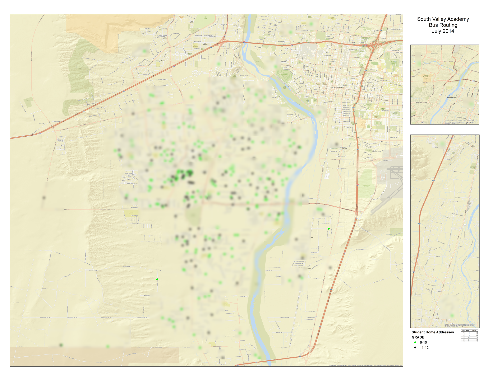
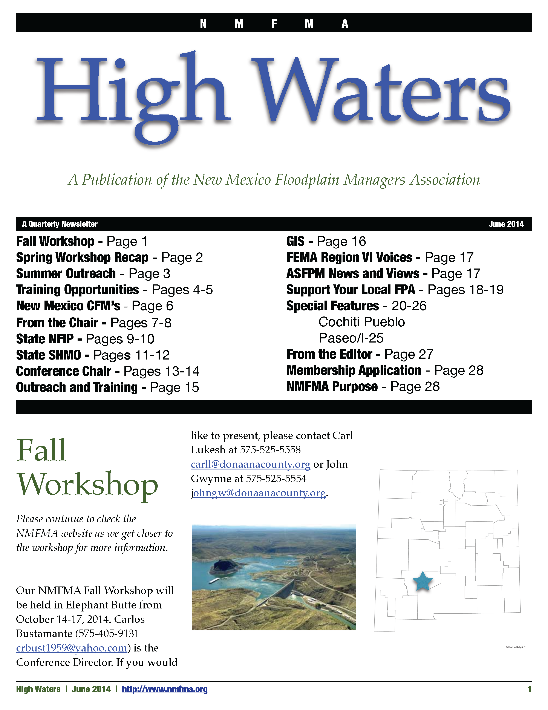
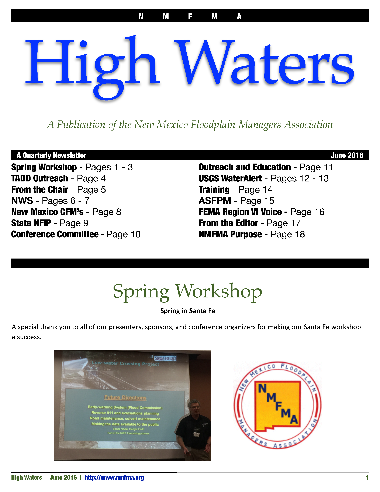
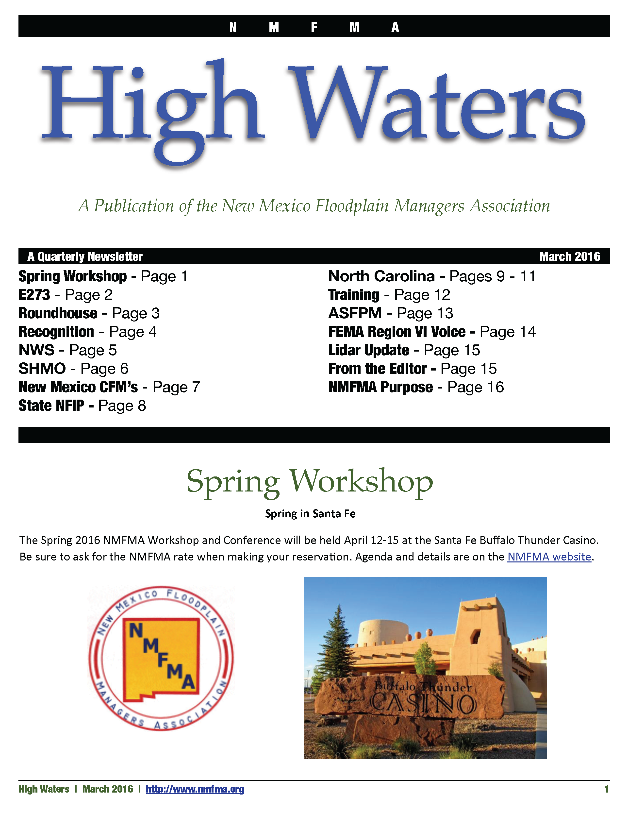
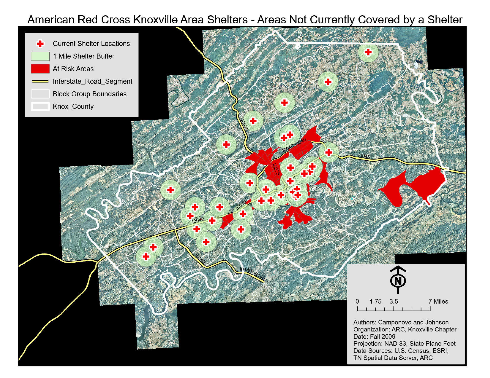
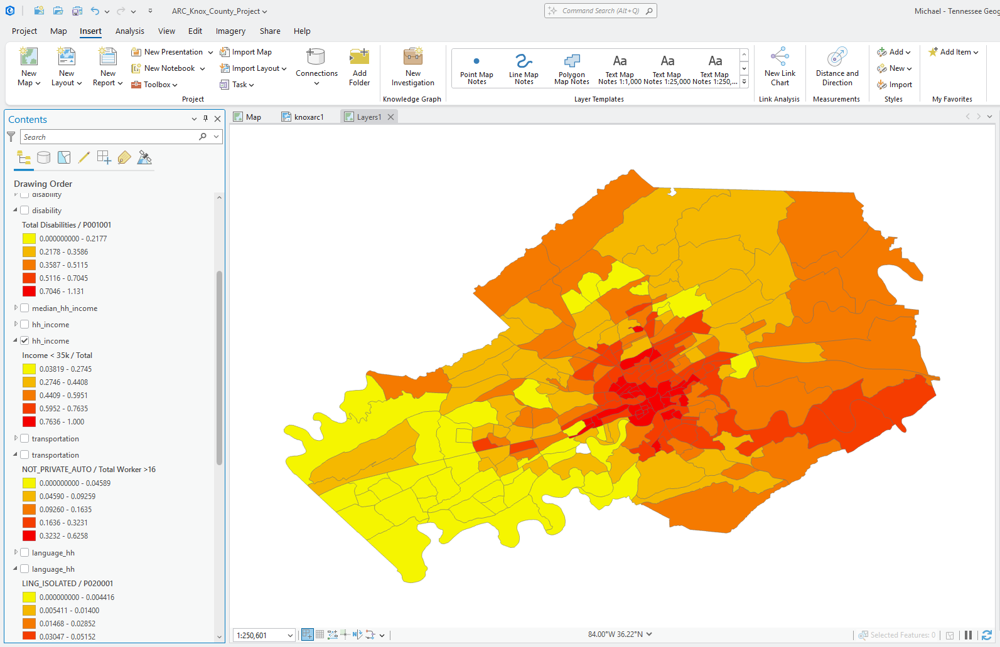
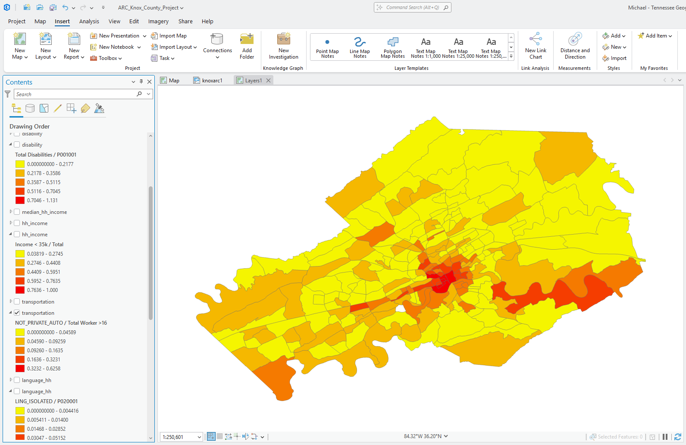

## Overview

These projects represent three different ways I used geospatial and communication skills in service to schools, nonprofit organizations, and professional associations.

The work included mapping student locations to support school-bus planning, producing a statewide floodplain-management newsletter, and developing a shelter-accessibility analysis for the American Red Cross. Some projects were highly technical, while others centered on communication, coordination, and relationship building.

Together, these experiences helped me move beyond completing classroom assignments and begin responding to the needs of real organizations. They also showed me that effective service does not always depend on advanced analysis. Sometimes the most valuable contribution is organizing information, making a process visible, protecting sensitive data, or helping people communicate across institutional boundaries.

## South Valley Academy Bus Route Planning

### Community Need

As a new GIS professional in Albuquerque, I was approached by a neighbor who worked for **South Valley Academy** and asked whether GIS could help with school-bus route planning for its middle- and high-school students.

As a magnet school, South Valley Academy did not have access to the same district transportation-planning resources available to many other schools. The people responsible for bus routing relied largely on institutional knowledge, driver experience, and historical routes when planning future service.

We decided to test a more data-driven approach.

### GIS Workflow

The project began by geocoding the home addresses of enrolled middle-school and high-school students. The student locations were symbolized by grade level so staff could see the geographic distribution of the two groups.

The teacher coordinating the project then worked with bus drivers to verify that the mapped locations were represented in the routes and that no enrolled students had been overlooked. Staff used that review to update the school’s historical routes with current enrollment information.

{.lightbox group="south-valley-academy" fig-alt="Map of the Albuquerque area with deliberately blurred student home locations, symbolized by middle-school and high-school grade levels, used for bus-route planning."}

### Privacy and Data Protection

The operational map contained student home addresses and was never intended for public distribution. For this portfolio, the individual locations have been deliberately blurred so they cannot be readily identified or reverse engineered.

The redacted image documents the geographic scale and purpose of the project without publishing student-level information.

### Outcome

The project gave school staff and drivers a common geographic reference for reviewing their routes. Rather than relying only on historical practice and memory, they could compare current enrollment locations with the existing transportation network and revise service where needed.

### What I Learned

This project reinforced several lessons:

- relatively simple GIS methods can improve an established planning process;
- local operational knowledge remains essential for validating mapped results;
- a map can create a shared frame of reference among people with different responsibilities;
- sensitive location data require deliberate protection, even when the project itself is old;
- useful community GIS does not always require a complex model or sophisticated analysis.

## NMFMA *High Waters* Newsletter

### Why I Took on the Role

When I joined the **New Mexico Floodplain Managers Association (NMFMA)**, I was still developing my knowledge of emergency management, floodplain administration, hazard mitigation, and risk communication in New Mexico.

My director at the University of New Mexico’s Earth Data Analysis Center, **Shirley Baros**, volunteered me to organize and produce NMFMA’s quarterly newsletter, *High Waters*. What began as a way to accelerate my own learning became a substantial professional-service role that continued for several years.

### Editorial and Coordination Work

Producing each issue required regular communication with stakeholders across New Mexico. I contacted people such as:

- the State Floodplain Administrator;
- the State Hazard Mitigation Officer;
- NMFMA officers and committee chairs;
- local floodplain managers;
- emergency-management professionals;
- FEMA and other federal partners;
- researchers, engineers, and GIS professionals;
- members leading mitigation, education, and outreach projects.

I requested updates, gathered short articles, edited submissions, organized photographs and graphics, designed the publication, and assembled the material into a coherent quarterly issue.

### What the Newsletter Covered

*High Waters* documented a wide range of association and statewide activity, including:

- floodplain-management workshops and conferences;
- Certified Floodplain Manager information;
- National Flood Insurance Program updates;
- FEMA Risk MAP activities;
- hazard-mitigation grants and projects;
- flood-awareness and school-outreach programs;
- weather and preparedness information;
- lidar, GIS, and mapping updates;
- local community projects;
- professional recognition;
- state and federal program news.

The newsletter served as both a member communication tool and an informal archive of flood-risk reduction work occurring across New Mexico.

### Selected Issues

The portfolio includes selected covers from 2014 through 2016. Together, they show the range of material I coordinated and the evolution of the newsletter over several years.

::: {layout-ncol=3}

{.lightbox group="nmfma-newsletters" fig-alt="Cover of the June 2014 High Waters newsletter published by the New Mexico Floodplain Managers Association."}

{.lightbox group="nmfma-newsletters" fig-alt="Cover of the June 2016 High Waters newsletter published by the New Mexico Floodplain Managers Association."}

{.lightbox group="nmfma-newsletters" fig-alt="Cover of the March 2016 High Waters newsletter published by the New Mexico Floodplain Managers Association."}

:::

### Selected Complete Issue

- [June 2016](documents/nmfma/nmfmaJune2016-compressed.pdf)

### Professional Growth

Editing *High Waters* made me a central point of contact within the state’s floodplain-management community. The role kept me informed about mitigation planning, outreach, training, mapping, and Risk MAP work across New Mexico.

That broader awareness made me more effective in my professional responsibilities at EDAC. It helped me understand how individual projects fit within statewide and federal programs, strengthened my relationships with partners, and improved my ability to manage and communicate complex work.

### What I Learned

This volunteer role taught me that professional service can produce knowledge and relationships that are difficult to gain through assigned project work alone.

I learned to:

- request and coordinate contributions from busy stakeholders;
- translate technical and programmatic information for a broad professional audience;
- maintain a recurring publication schedule;
- organize material from many organizations into a consistent product;
- recognize connections among mitigation, mapping, outreach, policy, and training;
- use communication as a form of risk reduction and professional capacity building.

## Knox County American Red Cross Shelter Accessibility Analysis

### Understanding the Need

As I completed my GIS certificate at Roane State Community College, I was looking for volunteer opportunities that combined my technical skills with my interest in natural hazards.

I contacted the director of the Knox County American Red Cross office and arranged a meeting to learn how the organization identified and recruited emergency shelters. As she described the existing process, I realized that the problem could be approached as a GIS suitability analysis.

The Red Cross initially wanted a map of existing shelters and the communities they served. From that starting point, we developed a workflow to identify areas where future shelter recruitment might improve coverage.

### Mapping Existing Shelter Coverage

We geocoded the existing shelter locations and created one-mile buffers around them. That distance was selected using organizational experience indicating that people generally seek emergency shelter close to home.

The service areas established which parts of Knox County were already covered and provided a basis for identifying communities outside the existing network.

{.lightbox group="american-red-cross" fig-alt="Map of Knox County showing current American Red Cross shelter locations, one-mile shelter buffers, major roads, and block groups identified as at risk outside existing coverage areas."}

[View the recovered full-resolution shelter coverage map](documents/american-red-cross/knoxarc1.pdf)

### Identifying Populations Likely to Need Additional Support

The next stage focused on block groups outside the existing shelter service areas. Census and American Community Survey data were used to examine characteristics associated with additional support needs during an emergency.

The analysis included indicators such as:

- lower household income;
- limited access to a private automobile;
- disability;
- language isolation;
- older residents;
- households with children.

These indicators were not intended to suggest that every person in a selected area would require assistance. They were used to identify communities where transportation, communication, mobility, or caregiving needs might complicate emergency response.

::: {layout-ncol=2}

{.lightbox group="american-red-cross" fig-alt="ArcGIS Pro screenshot showing the share of households earning less than 35,000 dollars by Census block group in Knox County."}

{.lightbox group="american-red-cross" fig-alt="ArcGIS Pro screenshot showing the share of workers without access to a private automobile by Census block group in Knox County."}

:::

### Supporting Future Shelter Recruitment

The final map combined:

- existing shelter locations;
- one-mile service areas;
- Census block-group boundaries;
- major transportation corridors;
- identified at-risk areas outside current shelter coverage.

The Red Cross used the maps as an initial planning resource for future shelter expansion and recruitment across Knox County.

### Recovering the Historical Project

For this portfolio, I imported the original ArcMap document into ArcGIS Pro so I could recover and review the historical analysis layers.

I preserved the original results rather than recalculating them with current demographic data. The maps therefore document the project as it was completed in 2009 and should not be interpreted as a current assessment of shelter coverage or social vulnerability in Knox County.

### What I Learned

This project was especially important because it was the first time I recognized an organization’s informal planning process as a GIS suitability problem and translated that process into a repeatable spatial workflow.

It taught me to:

- begin with a partner’s operational knowledge rather than with a preferred GIS technique;
- distinguish between existing service coverage and unmet need;
- combine proximity with demographic indicators;
- explain suitability results carefully and avoid treating model outputs as certainties;
- design analysis around a practical organizational decision;
- preserve enough documentation that older work can be understood and responsibly revisited.

## Shared Lessons

Although these three projects served different organizations, they shared several important characteristics.

### Start With the Partner’s Process

Each project began by listening to how people were already doing their work. GIS and communication tools were useful because they clarified, organized, or strengthened an existing process, not because the technology itself was the goal.

### Match the Method to the Need

The South Valley Academy project needed geocoding, verification, and a shared map. The American Red Cross project required a more structured suitability analysis. NMFMA needed consistent communication and coordination rather than a new spatial model.

The appropriate level of technical complexity differed, but each project benefited from a clear understanding of the audience and intended use.

### Protect Sensitive Information

Student home addresses and emergency-planning data required care. The public versions of these projects emphasize the workflow and lessons while withholding or obscuring information that should not be distributed.

### Communication Is Part of GIS Practice

The NMFMA work showed that maps and analyses do not create impact on their own. Programs also need documentation, outreach, stakeholder coordination, and accessible explanations.

### Volunteer Work Can Build Professional Capacity

These projects helped me develop technical experience, subject-matter knowledge, confidence, and professional relationships before I had accumulated a long record of paid GIS work.

## Looking Back

These projects established a pattern that continued throughout my career: using GIS and communication not only as technical tools, but also as ways to support communities, educators, public agencies, nonprofit organizations, and professional networks.

They also changed how I think about service. Effective volunteer work is not defined by the complexity of the technology. Its value comes from understanding a real need, producing something people can use, protecting those affected by the work, and following through reliably.
